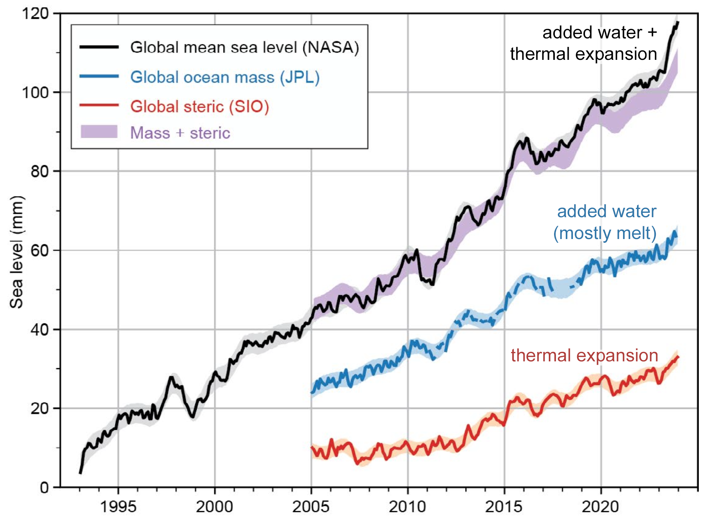

# Introduction To Derivatives

## Learning Objectives

By the end of this chapter, you will be able to:

- Distinguish between **average** and **instantaneous** rates of change.  
- Interpret the meaning of a derivative from **graphs, data, and equations**.  
- Apply derivative notation and connect it to environmental contexts.  
- Solve practice problems and apply derivatives to real-world examples.  

---

## Understanding The Speed Of Change

Imagine you're a marine biologist monitoring the population of a reef-dwelling fish species in a protected area. Over the past five years, the fish population has started to rebound after a ban on commercial fishing. But the key question isn't just how many fish are there now?—it's how fast is the population recovering?

Or picture a team of conservationists tracking the spread of an invasive plant through a national park. The plant’s total coverage increases each month—but is that rate speeding up, slowing down, or holding steady?

These are not just ecological observations. They're questions about change. And answering them requires calculus.

## Why We Need New Math Tools

Environmental systems are dynamic. They change in space and time, often unpredictably. To understand them, we don't just need to measure things—we need to describe how those things change:

-   How fast is a species’ population growing or shrinking?
-   At what rate is temperature increasing in alpine ecosystems?
-   How steeply is oxygen concentration decreasing with depth in a lake?
-   When does the tide rise the fastest?

These are all examples of rates of change, and they are the foundation of the derivative.


## What You’ll Learn in This Chapter

In this chapter, you'll build your intuition for what a derivative represents. We’ll explore:

-   The difference between average and instantaneous change
-   How to interpret a derivative from a graph
-   Real examples where rates of change matter
-   The mathematical notation that lets us describe and work with change

You’ll also work with data—like fish populations, temperature profiles, and environmental time series—to see how derivatives emerge from patterns and graphs.

By the end of the chapter, you’ll be able to look at a system and say not just what is happening, but how fast is it happening—and in which direction?

That’s the power of the derivative.

## What Is A Derivative? 

You’ve probably seen derivatives before—even if you didn’t call them that. If you've ever looked at how fast something was growing, declining, or shifting in space or time, you've already been thinking about derivatives.


```{r derivative-terms-table2, echo=FALSE}
knitr::kable(
  data.frame(
    `Math / Physics / Data / Context` = c(
      "Rate of change",
      "Slope of the tangent line",
      "Instantaneous rate",
      "Velocity",
      "Acceleration",
      "Gradient",
      "Marginal change",
      "Slope at a point",
      "Rise over run",
      "Delta Y / Delta X"
    ),
    `Environmental / Applied / Context` = c(
      "Growth rate",
      "Decay rate",
      "Reaction rate",
      "Flux",
      "Turnover rate",
      "Loss rate / Gain rate",
      "Change per unit time",
      "Response rate",
      "Uptake rate",
      "First difference"
    )
  ),
  caption = "Terms Across Disciplines That Represent Derivatives",
  booktabs = TRUE
)
```

Mathematically, the derivative describes the **instantaneous rate of change**—the slope of the tangent line to a curve at a given point.


### Derivative Notation: Speaking the Language of Change

In calculus, there are several common notations used to represent the **derivative**—the instantaneous rate of change of a function. Understanding these notations is key to reading and writing mathematics fluently, especially when interpreting real-world problems in environmental science.

---

#### Common Derivative Notations

Let’s say we have a function, we could right this as:

$$
f(x) = something\ with\ x's \ in\ it \\
y= something\ with\ x's \ in\ it
$$

We can then write the notation of the derivative  with respect to \( x \) in several ways, all of which mean exactly the same thing:

| Notation | Spoken As | Description |
|:----------:|:-----------:|:-------------:|
| \( f'(x) \) | "f prime of x" | Most compact form; often used in textbooks |
| \( \frac{dy}{dx} \) | "dee y over dee x" | Emphasizes that \( y \) is a function of \( x \); Leibniz notation |
| \( \frac{d}{dx} f(x) \) | "dee by dee x of f of x" | Shows that differentiation is an operation |
| \( D_x f(x) \) | "D sub x of f of x" | Operator form used in some texts |
| \( y' \) | "y prime" | Used when \( y = f(x) \), common in applied settings |


- **Prime notation**: e.g., \( f'(x) \), \( g'(t) \)
- **Leibniz notation**: e.g., \( \frac{dy}{dx} \), \( \frac{d}{dt} \)
- **Operator notation**: e.g., \( \frac{d}{dx}(f(x)) \), applying \( \frac{d}{dt} \) to an expression

---

#### The Derivative as an Operator

The notation \( \frac{d}{dx} \) is not just a symbol—it’s an **operator**. That means it **acts on** a function to produce another function: the derivative.

Think of it this way:

> The symbol \( \frac{d}{dx} \) is a command: 
> “Take the derivative of whatever comes after this with respect to \( x \).”

So if you write:

$$
\frac{d}{dx} \left(3x^2 + 2x\right)
$$

You are instructing the reader (or yourself!) to **differentiate** the expression \( 3x^2 + 2x \) with respect to \( x \). The result:

$$
\frac{d}{dx} \left(3x^2 + 2x\right) = 6x + 2
$$

---


## Average Rate of Change

::: activity
**Discussion Prompt**\
Think about a population of salmon in a river system. Suppose the number of salmon increases steadily over a migration season. How could we describe how fast the population is changing?
:::

The **average rate of change** of a quantity tells us how much that quantity changes per unit of time (or distance, or any other input variable). It's a way to summarize how something is increasing or decreasing over an interval, even if the actual change isn't perfectly steady throughout.

Mathematically, the average rate of change of a function $f(x)$ between two points $x = a$ and $x = b$ is:

$$
\text{Average Rate of Change} = \frac{f(b) - f(a)}{b - a}
$$

This is the **rise over run** formula you've likely used in algebra. It gives us the **slope** of the **secant line** connecting the two points on a graph.

### Environmental Example: Ocean Temperature

Let’s say ocean surface temperature is modeled by a function $T(t)$, where $t$ is time in months and $T(t)$ is the temperature in degrees Celsius.

Suppose: 

- In June ($t = 6$), the temperature is $T(6) = 13^\circ C$ 
- In September ($t = 9$), the temperature is $T(9) = 16^\circ C$

The average rate of temperature change from June to September is:

$$
\frac{T(9) - T(6)}{9 - 6} = \frac{16 - 13}{3} = 1^\circ C \text{ per month}
$$

**Interpretation:** On average, the ocean surface temperature increased by 1°C per month during this time.

### More Examples from Environmental Science

::: activity

**Goal:** Practice identifying real-world situations where *average rate of change* is meaningful.  

---

**Step 1: Review Examples Together**  
Here are some examples of average rate of change in environmental contexts:  

- *Carbon Emissions*: Change in CO₂ levels over decades.  
- *Glacier Retreat*: How much a glacier's area changes per year.  

---

**Step 2: Small Group Brainstorm (5 minutes)**  
In groups of 2–3:  

- Come up with two additional examples of average rate of change from your own experiences, interests, or fields of study.  
- Be sure to state:  
  1. *What is changing?* (the variable)  
  2. *With respect to what?* (time, distance, depth, etc.)  
  3. *What are the units?*  

---

**Step 3: Share and Discuss**

- As a class, compare:  
  - Which variables appear most often?  
  - Which contexts involve rapid change vs. slow change?  
  - Which examples could also benefit from looking at the change over shorter periods?  

---

**Reflection Prompt (Individual, 2 minutes):**

Think about your major or area of interest. Write down *one rate of change* you might realistically measure or model in your field. 

:::


::: activity
**A Visual View**

{fig.alt='Line graph showing changes in global mean sea level from 1993 to 2023. The black line (NASA) shows total sea level rise, increasing from near 0 mm in 1993 to over 110 mm in 2023. Two contributing factors are plotted: blue line (JPL) shows added ocean mass from mostly land ice melt, rising steadily from about 20 mm in 2003 to over 60 mm in 2023; red line (SIO) shows thermal expansion, rising from near 0 mm in 2003 to about 40 mm in 2023. The purple shaded region (Mass + steric) closely matches the black line. Together, the figure shows that sea level rise is explained by added water plus thermal expansion.'}

**Discussion Questions**

1.  **Describe the Trend**

-   What does the plot tell you about how global sea level has changed since 1993?
-   Is the trend linear, exponential, or something else?

2.  **Estimate the Average Rate of Change**

-   Pick two points on the black line (e.g., between 1993 and 2025) to estimate:

    $$
       \text{Average Rate} = \frac{\text{Change in Sea Level (mm)}}{\text{Change in Time (years)}}
       $$

-   What units does your answer have?


3.  **Interpret in Context**

-   What does your calculated rate tell you about sea level rise?
-   Why is knowing the *average rate* important for cities, communities, and planners?

4.  **Explore Acceleration**

-   Estimate the average rate of change over each 5-year interval below by reading approximate values from the graph.

-   Use the formula:

    $$
       \text{Avg. Rate} = \frac{\Delta \text{Sea Level}}{\Delta \text{Time}} \quad \text{(in mm/year)}
       $$

    -   Fill in the table:

| Time Interval | Sea Level at Start (mm) | Sea Level at End (mm) | Avg. Rate (mm/year) |
|---------------|--------------------------|-----------------------|---------------------|
| 1995–2000     |                          |                       |                     |
| 2000–2005     |                          |                       |                     |
| 2005–2010     |                          |                       |                     |
| 2010–2015     |                          |                       |                     |
| 2015–2020     |                          |                       |                     |
| 2020–2025     |                          |                       |                     |


-   What do you notice about how the average rate changes over time?
-   What does that suggest about the *acceleration* of sea level rise?

5.  **Connect to Derivatives**

-   If this were a smooth function $S(t)$ representing sea level at year $t$, what would the *derivative* $S'(t)$ represent?
-   What would a plot of the average rate of change look like?
-   What would happen if we looked at the average rate of change over shorter and shorter periods? How would this chang the way a plot of the rate of change look like?

**Reflection Prompt**
Describe a situation in your area of interest (marine biology, forestry, climate science, etc.) where an average rate of change is used. What does it tell you, and what might it leave out?
:::

## Instantaneous Rate of Change: Zooming In

In the last section, you estimated the **average rate** of sea level rise over several 5-year periods. But what if we want to know how fast sea level was rising at one *specific moment*—say, in the year 2010?

That’s where the **instantaneous rate of change** comes in. It answers the question:

> *How fast is something changing right now?*

This is the essence of what we mean by the **derivative** in calculus.

---

### From Averages to Instants

Think back to the graph of sea level rise:  

- The **average rate** over a time interval is the slope of a *secant line* connecting two points.  
- The **instantaneous rate** at a single point is the slope of the *tangent line* at that point.  
You can imagine drawing shorter and shorter secant lines—where the two points move closer together. As the interval shrinks, the slope of the secant approaches the slope of the tangent.  

This limiting process—zooming in on a curve until the “average” becomes the “instant”—is the central idea of the derivative.

---

### Environmental Meaning

In sea level terms, the instantaneous rate tells us:  

- How fast sea level is rising at a specific year (e.g., 2010).  
- Whether that rate is **speeding up** (acceleration) or **slowing down**.  

Similar questions appear across environmental science:  

- How fast is a glacier front retreating *today*?  
- How quickly is a species’ population growing *right now* compared to 10 years ago?  
- What is the current rate of deforestation in a region?  

Understanding these **instantaneous rates of change** allows scientists to:  

- Model dynamic systems more accurately.  
- Make predictions about future change.  
- Take action at the moments when it matters most.

::: activity

### Activity: Environmental Meaning of Instantaneous Change

Goal: Connect the mathematical idea of instantaneous rate of change to an animal’s life history — and begin to think about how that rate itself can change.

---

**Step 1: Predict Together (2 minutes)**

Imagine tracking the *weight of a bear over its entire lifetime*.  

- Sketch or imagine what you think the *weight vs. age graph* might look like.  
- Where do you think the curve is steepest? Flat? Could it ever slope downward?  

---

**Step 2: Small Group Brainstorm (5 minutes)**  

In groups of 2–3 discuss 
  1. *What does the instantaneous rate of weight change represent biologically at different stages?*  
  2. *Where is the bear gaining weight faster and faster (accelerating)?*  
  3. *Where is the bear still gaining weight, but more slowly (decelerating)?*  
  4. *Why might wildlife managers care about not only the rate of change, but whether that rate itself is increasing or decreasing?*  

---

**Step 3: Share & Compare (5 minutes)** 

Each group shares one insight.  

- Compare across groups: At which ages would the rate of weight gain likely be *accelerating*? When would it be *slowing down*? When might the rate even become *negative*? 
- Discuss: Why does knowing the *rate of change of the rate of change* add more insight than the rate alone?  

---

**Step 4: Individual Reflection (2 minutes)**  

Think of another *lifetime pattern* in an organism:

- *What is changing across the lifetime?*  
- *At what stage is growth accelerating?*  
- *At what stage is growth decelerating?*  
- *What decisions or actions could this second layer of information support (e.g., timing of reproduction, monitoring health decline, conservation priorities)?*  
:::


## The Limit Definition of a Derivative

In calculus, a **limit** is a tool we use to understand what happens to a function as we get *closer and closer* to a specific point—even if we can’t plug in that point directly.  

Don’t worry if limits feel abstract at first—we’ll build the idea step by step with words, graphs, and formulas.  

---

### Intuition
Suppose you were camping on the beach next to the Pacific Ocean on the 4th of July. You may not know the exact rate of sea level change **on** that day, but you *could* estimate the average rate of change nearby—for example, by comparing the sea level on July 3rd and July 4th.  

A **limit** takes this idea even further. Instead of looking at an average over whole days, we imagine shrinking the time interval smaller and smaller—so small that the “average period” is *tending toward zero*. In that process, we arrive at the **instantaneous rate of change**: how fast sea level is changing at that exact moment.  

---

### Why Do We Need Limits?

Environmental systems are often **continuous and messy** for example air temperature, pollution levels, or population growth. To explore questions such as:

- How fast is a glacier melting **right now**?  
- What is the rate of deforestation **at the edge** of a forest?  
- How quickly is sea level rising **at a given year**?  

…we need a mathematical tool that captures behavior as we “zoom in.” That tool is the **limit**.  

---

### Visual Intuition

As you zoom in on a curve—say, sea level rise over time—it begins to look straight. The **slope** of that straight line is the instantaneous rate of change. The **limit** formalizes this process of zooming in infinitely close.

::: activity
**Activity: Zooming in on a Curve**

*Goal:* Explore how zooming in around a single point makes any curve begin to look like a straight line.

---

**Step 1: Observe the Panels (2 minutes)**  
Look at the 4-panel figure:  

- Panel 1 shows the full curve.  
- Panels 2–4 zoom in closer and closer around a single point.  

**Question:**  

- What changes as we zoom in?  
- What stays the same?  

---

```{r zoom-panels-curve-to-line, echo=FALSE, fig.align='center', out.width='100%'}
# --- Setup a smooth "sea level" curve and its derivative (for the tangent) ---
f      <- function(x) 0.02*(x - 2000)^2 + 5
fprime <- function(x) 0.04*(x - 2000)

# Focal point for zooming/tangent
x0 <- 2010
y0 <- f(x0)
m0 <- fprime(x0)

# Windows for the 4 panels: full -> zoom1 -> zoom2 -> zoom3
wins <- list(
  c(1995, 2025),
  c(2005, 2015),
  c(2008, 2012),
  c(2009.5, 2010.5)
)

# Helper: y-limits with a little padding for a given x-window
ylims_for_window <- function(w) {
  xs <- seq(w[1], w[2], length.out = 400)
  ys <- f(xs)
  pad <- 0.05 * diff(range(ys))
  c(min(ys) - pad, max(ys) + pad)
}

# Base plotting layout
op <- par(mfrow = c(1, 4), mar = c(4, 4, 2, 1))

for (i in seq_along(wins)) {
  xr <- wins[[i]]
  yr <- ylims_for_window(xr)

  # Plot curve
  plot(NA, xlim = xr, ylim = yr, xlab = "Year", ylab = "Sea Level (mm)",
       main = paste("Zoom", i - 1))
  xs <- seq(xr[1], xr[2], length.out = 800)
  lines(xs, f(xs), col = "blue", lwd = 2)
  points(x0, y0, pch = 19)

  # Add tangent line for panels 2-4
  if (i >= 2) {
    abline(a = y0 - m0 * x0, b = m0, col = "darkgreen", lwd = 2)
    legend("topleft",
           legend = c("Curve", "Tangent at x=2010"),
           col = c("blue", "darkgreen"),
           lty = c(1, 1), lwd = c(2, 2), bty = "n", cex = 0.8)
  } else {
    legend("topleft",
           legend = c("Curve"),
           col = c("blue"),
           lty = c(1), lwd = c(2), bty = "n", cex = 0.8)
  }

  # Draw a "zoom box" pointing to the next panel's window (for panels 1-3)
  if (i < length(wins)) {
    next_xr <- wins[[i + 1]]
    # Choose y-range of the box based on curve over the next x-range,
    # but clamp to current panel's y-range
    xs_box <- seq(next_xr[1], next_xr[2], length.out = 200)
    ys_box <- f(xs_box)
    y_min <- max(min(ys_box), yr[1])
    y_max <- min(max(ys_box), yr[2])
    rect(next_xr[1], y_min, next_xr[2], y_max,
         border = "gray40", lty = 2, lwd = 2)
    text(mean(next_xr), y_max, labels = "Next zoom →", pos = 3, cex = 0.8)
  }
}

par(op)
```

**Step 2: Compare the Curve and the Line (5 minutes)**  
In Panels 2–4 you see both the *curve* and the *tangent line* at the chosen point.  

- How do the curve and tangent look different in Panel 2?  
- By Panel 4, what do you notice about how closely the curve and the tangent overlap?  

---

**Step 3: Make a Prediction (3 minutes)**  

- If we zoomed in *even further* (say, Panel 5, Panel 6…), what would you expect to see?  
- Would you still be able to tell the difference between the curve and the line?  

---

**Step 4: Generalize the Idea (5 minutes)**  
Discuss in pairs or small groups:  

- Do you think this would only work for this one curve, or for *any* smooth (continuous) curve?  
- What does this suggest about the nature of curves when we zoom in enough?  

---

**Step 5: Reflection (2 minutes)**  
Write down your own words to complete this sentence:  

> *When you zoom in close enough on any smooth curve, it starts to look like a ________.*  

---

**Takeaway:**  
This activity shows that *every smooth curve looks linear when you zoom in far enough*. That’s why we use *tangent lines* and *derivatives* in calculus—to capture the local linear behavior of a curve.  

:::

### Mathematical Notation

A limit is written as:

$$
\lim_{x \to a} f(x)
$$

Read aloud: *“The limit of $f(x)$ as $x$ approaches $a$.”*  

It asks: **What value does $f(x)$ get closer and closer to as $x$ gets closer and closer to $a$?**  
Notice: this may or may not equal $f(a)$ or in other words, we closer to $a$ but never actually get there.

---

### Example: A hole in a function

Let’s say we have a function below and are interested at what the value of the function is at $x=1$:

$$
f(x) = \frac{x^2 - 1}{x - 1}
$$

At first glance, if we try to plug in $x = 1$, we get:

$$
f(1) = \frac{1^2 - 1}{1 - 1} = \frac{0}{0}
$$

This is undefined! But we can still ask:

$$
\lim_{x \to 1} \frac{x^2 - 1}{x - 1}
$$

Factoring the numerator:

$$
\frac{x^2 - 1}{x - 1} = \frac{(x - 1)(x + 1)}{x - 1}
$$

As long as $x \ne 1$, the $x - 1$ cancels out:

$$
f(x) = x + 1
$$

So as $x \to 1$, $f(x) \to 2$. Even though $f(1)$ is undefined, the **limit** exists:

$$
\lim_{x \to 1} \frac{x^2 - 1}{x - 1} = 2
$$

                        

```{r limit-hole-plot, echo=FALSE, fig.height=5, fig.width=7}
# Define the function
f <- function(x) {
  (x^2 - 1) / (x - 1)
}

# Create x values avoiding x = 1 to prevent division by zero
x_vals <- seq(0.5, 1.5, length.out = 100)
x_vals <- x_vals[x_vals != 1]

# Evaluate the function
y_vals <- f(x_vals)

# Plot the function
plot(x_vals, y_vals, type = "l", lwd = 2, col = "blue",
     xlab = "x", ylab = "f(x)",
     main = expression("Plot of " * f(x) == frac(x^2 - 1, x - 1)))

# Add a dashed horizontal line for the limit value
abline(h = 2, col = "gray", lty = 2)

# Add the hole at x = 1
points(1, 2, pch = 1, col = "red", cex = 1.5, lwd = 2)
text(1, 2.2, labels = "Hole at x = 1", pos = 3, cex = 0.8)
```

Graphically we can see the function doesn't exist at $x=1$, which we depict as an open circle. But we can still ask, what function value do we approach as we get close to 2.

### Estimating a limit
In some cases it may not be possible to factor like the example above. So how could you get an idea of the limit. 

Lets introduce the idea of **estimating** the limit. If we write the limit again adn ask ourselves what is this mathematical statement asking:
$$
\lim_{x \to 1} \frac{x^2 - 1}{x - 1}
$$
If is asking, what it the value of the function as x gets closer and closer to $1$. So what if we let $x$ get really really close. Let x= 0.9
$$
\lim_{x \to 1} \frac{x^2 - 1}{x - 1} \approx \frac{0.9^2-1}{0.9-1} \approx \frac{-0.19}{-0.1} \approx 1.9 
$$
Notice we are using the approximate symbol ($\approx$) to show that we are estimating. 
What is we get closer still to $x=1$. Let x= 0.99
$$
\lim_{x \to 1} \frac{x^2 - 1}{x - 1} \approx \frac{0.99^2-1}{0.99-1} \approx \frac{-0.0199}{-0.01} \approx 1.99 
$$
We seem to be getting closer and close to the the value we expect.

Lets get really small now. Let x= 0.999999
$$
\lim_{x \to 1} \frac{x^2 - 1}{x - 1} \approx \frac{0.999999^2-1}{0.999999-1} \approx \frac{-0.00000199}{-0.000001} \approx 1.999999 
$$
Note: Be careful when doing this on your calculator, it is easy to forget a digit on the numerator or a denominator, and if you do your answer may be too big or too small.

### One-Sided Limits

Sometimes, its helpful to examine what is happening as we approach a point fomr both directions directios. In the previous example we apprach from the left (or the negative) side of the point. 

-   Left-hand limit: $$
    \lim_{x \to a^-} f(x)
    $$ — from values *less than* $a$

-   Right-hand limit: $$
    \lim_{x \to a^+} f(x)
    $$ — from values *greater than* $a$

You can think about this as what is the value of the function a little bit to the left and right of the point we are approaching.

Extending the example above if we approached from the right
$$
\lim_{x \to 1} \frac{x^2 - 1}{x - 1} \approx \frac{1.000001^2-1}{1.000001-1} \approx \frac{0.000002000001}{0.000001} \approx 2.000001
$$

If the left-hand and right-hand limits agree, then the overall limit *exists*. So in the previous example a limit exists at $x=1$ and that limit is 2.

$$
  \lim_{x \to a^-} f(x) = \lim_{x \to a^+} f(x)
$$

### When Does a Limit Exist?

For a limit to **exist** at a point, the function’s behavior must be predictable and consistent as we approach that point. We say:

$$
\lim_{x \to a} f(x) = L
$$

only if **all three** of the following conditions are true:

1.  The Left-Hand Limit Exists

$$
\lim_{x \to a^-} f(x)
$$

As $x$ approaches $a$ from values less than $a$, the function values must approach a real number.

2.  The Right-Hand Limit Exists

$$
\lim_{x \to a^+} f(x)
$$

As $x$ approaches $a$ from values greater than $a$, the function values must also approach a real number.

3.  The Left- and Right-Hand Limits Are Equal

$$
\lim_{x \to a^-} f(x) = \lim_{x \to a^+} f(x)
$$

If the two one-sided limits are not equal, the **two-sided limit does not exist**.

                        

### When a Limit Does *Not* Exist

A limit fails to exist if any of the following happen:

| Type of Breakdown      | What Happens                                           |
|------------------------|--------------------------------------------------------|
| Jump discontinuity     | Left and right limits are different                     |
| Infinite discontinuity | One or both sides approach $\infty$ or $-\infty$        |
| Oscillating behavior   | Function fluctuates wildly near the point (e.g., $\sin(1/x)$) |


                        

### Environmental Example: Stream Temperature at a Dam Outlet

Suppose a river's temperature is modeled as a piecewise function:

$$
T(x) = 
\begin{cases}
15, & x < 0 \quad \text{(upstream)} \\\\
10, & x > 0 \quad \text{(downstream near a cold water dam release)}
\end{cases}
$$

At $x = 0$, the left-hand and right-hand limits **do not match**, so:

$$
\lim_{x \to 0} T(x) \quad \text{does not exist}
$$

This kind of jump is common in natural or engineered boundaries and reminds us that limits describe **approaching behavior**, not necessarily the value *at* a point.

                        

### Plot the Discontinuity

```{r dam-limit, echo=FALSE}
plot(NULL, xlim = c(-5, 5), ylim = c(8, 17), 
     xlab = "Distance from dam (km)", ylab = "Temperature (°C)", 
     main = "Temperature Discontinuity at Dam Outlet")

# Upstream: constant 15°C for x < 0
segments(-5, 15, 0, 15, col = "steelblue", lwd = 2)

# Downstream: constant 10°C for x > 0
segments(0, 10, 5, 10, col = "forestgreen", lwd = 2)

# Open circles at x = 0
points(0, 15, pch = 1, cex = 1.5, col = "steelblue")
points(0, 10, pch = 1, cex = 1.5, col = "forestgreen")

text(-2.5, 15.5, "Upstream (15°C)", col = "steelblue")
text(2.5, 9.5, "Downstream (10°C)", col = "forestgreen")
abline(v = 0, col = "gray70", lty = 2)
```

## From Average to Instantaneous: The Role of Limits

In environmental science, we often need to understand **how fast** something is changing *right now* — not just on average. Whether it's the rate at which a glacier melts or how quickly CO₂ levels rise, we need a precise way to describe **instantaneous change**.

But how do we go from a **change over time** (average) to a **momentary change** (instantaneous)?

### Recap: Average Rate of Change

We define the **average rate of change** of a function $f(t)$ between two times $t=a$ and $t=b$ as:

$$
Ave = \frac{f(b) - f(a)}{b-a}
$$

This tells us how much the function changes over the interval — for example, how much sea level rose on average over a 10-year window.

To find the function values in the numerator, we would substitute $a$ and $b$ into the original function $f(t)$. The denominator is just the difference in time between $a$ and $b$, or the interval we are calculating this average.

Another form of this equation (which will be useful in a few sections) is achieved by doing a substitution. If we let $h$ be the interval of interest. Then $h=b-a$

The average equation now becomes:
$$
Ave = \frac{f(b) - f(a)}{h}
$$
We can go a little further and rearrange the expression for $h$ in terms of $b$
$$
h=b-a \\
b=a+h
$$
Substituting this expression for $b$ into the average equaiton gives us
$$
Ave = \frac{f(a+h) - f(a)}{h}
$$
So lets think about this in words. The numerator is the difference in the function value at $a$ and some value at $a+h$. The denominator now just becomes the interval over which we are taking the average. We'll get some practice with this form a little later. 

### Instantaneous Rate of Change

But what if we want to know the rate of change **at a single moment**, like exactly at year 2020?

We can't plug $h = 0$ directly into the formula — we’d be dividing by zero. Instead, we **take the limit** as $h \to 0$:

$$
f'(t) = \lim_{h \to 0} \frac{f(a + h) - f(t)}{h}
$$

This is the **limit definition of a derivative** — and it gives us the **instantaneous rate of change $f'$** at time $a$.

                        

### Environmental Interpretation

Let’s say we have a function $S(t)$ that gives **sea level (in mm)** at year $t$. The **instantaneous rate of sea level rise** at $t = 2020$ is:

$$
S'(2020) = \lim_{h \to 0} \frac{S(2020 + h) - S(2020)}{h}
$$

This tells us how quickly sea level is rising **at that exact year**, in **mm/year**.

                        

### Visualizing the Transition

::: activity
**Activity: From Average Change to Instantaneous Change**

> *Goal:* Connect the graph of lake level changes with the equations for average rate of change (secant slope) and instantaneous rate of change (derivative).

---

**Step 1: Observe the Graphs (2 minutes)**  

Look at the three panels:  

- Left: secant line from 2005 to 2015  
- Middle: secant line from 2005 to 2010  
- Right: secant line from 2005 to 2006  

**Questions:**  

- How does the red secant line change as the interval gets smaller?  
- How does it compare to the green tangent line?  

```{r forward-secant-3panels, echo=FALSE, fig.align='center', out.width='100%'}
# Smooth "Lake level" curve and derivative (for tangent)
f      <- function(x) 0.02*(x - 2000)^2 + 5
fprime <- function(x) 0.04*(x - 2000)  # derivative of f

# Focal point for forward approximations
x0 <- 2005
y0 <- f(x0)
m_tan <- fprime(x0)

# Forward secant endpoints for each panel
xR_list <- c(2015, 2010, 2006)  # 10-year, 5-year, 1-year forward intervals

# Common plot window
xr <- c(1996, 2024)
xs <- seq(xr[1], xr[2], length.out = 1000)
ys <- f(xs)
yr <- range(ys); pad <- 0.05 * diff(yr); yr <- c(yr[1]-pad, yr[2]+pad)

op <- par(mfrow = c(1, 3), mar = c(4,4,2,1))
for (i in seq_along(xR_list)) {
  xR <- xR_list[i]
  yR <- f(xR)

  # Forward secant slope (average rate on [x0, xR])
  m_sec <- (yR - y0) / (xR - x0)

  # Panel title text
  title_txt <- paste0("Forward secant: [", x0, ", ", xR, "]")

  # Plot curve
  plot(NA, xlim = xr, ylim = yr, xlab = "Year", ylab = "Lake Level (mm)",
       main = title_txt)
  lines(xs, ys, col = "blue", lwd = 2)

  # Tangent line at x0
  abline(a = y0 - m_tan * x0, b = m_tan, col = "darkgreen", lwd = 2)

  # Forward secant line through (x0,y0) and (xR,yR)
  abline(a = y0 - m_sec * x0, b = m_sec, col = "firebrick", lty = 2, lwd = 2)

  # Mark points
  points(c(x0, xR), c(y0, yR), pch = 19)


  # Legend only on the first panel
  if (i == 1) {
    legend("topleft",
           legend = c("Curve", "Tangent at 2005", "Forward secant (avg rate)"),
           col = c("blue", "darkgreen", "firebrick"),
           lty = c(1,1,2), lwd = c(2,2,2), bty = "n", cex = 0.9)
  }
}
par(op)
```


**Step 2: Recall the Equations (3 minutes)**

- *Average rate of change (secant):*  
  $$
  \frac{f(a+h) - f(x)}{h}
  $$
- *Instantaneous rate of change (derivative):*  
  $$
  \lim_{h \to 0} \frac{f(a+h) - f(a)}{h}
  $$

---

**Step 3: Explain in Your Own Words (5 minutes)**  
With a partner, explain:

- What does the average rate of change represent for the lake level between 2005 and 2015? Between 2005 and 2006?  
- How does shrinking the interval $h$ change the meaning of the secant line?  
- Why does the limit as $h \to 0$ give us the tangent line?  

---

**Step 4: Environmental Meaning (5 minutes)** 

- In the context of lake levels: What does the *tangent slope at 2005* represent in words?  
- Why might scientists care about the *instantaneous rate* instead of just average changes over long intervals?  

---

**Step 5: Reflection (2 minutes)**  
Complete the sentence in your notes:  

> *As $h$ gets smaller, the secant slope $\frac{f(x_0+h)-f(x_0)}{h}$ gets closer to the tangent slope. In my own words, this means…*  
:::


## Finding the Derivative Using the Limit Definition of a Derivative

In this section we will use the limit definition of a derivative to find a function that represents the derivative.

Let's consider the following function:
$$
f(x) = x^2
$$
Note the function here is a function in $x$

Now let's consider the function at some point on the function where $x=a$. We can re-write the limit definition of a derivative as:

$$
f'(a)=\lim_{h \to 0} \frac{f(a + h) - f(a)}{h}
$$
Let's now interpret what the math is telling us:

- $f'(a)$ is the derivative of the function $f$ at $x=a$
- $\lim_{h \to 0}$ tells us we are going to approach $x=a$ but not quite get there
- $f(a+h)$ is the function evaluation at $x=a+h$
- $f(a)$ is the function evaluated at $x=a$

Now considering these definitions, we can see that if $h$ was greater than zero, this expression would be the *average* of the function between $x=a$ and $x=a+h$.

However, the limit operator allows h to approach zero. If were to simply plug $h=0$ into the above expression we would get

$$
f'(a)=\frac{f(a + 0) - f(a)}{0} = \frac{0}{0}
$$

If you divide anything by zero, your calculator will give you an undefined error. This is why we use the limit, it gets us *really really* close to zero without actually getting there.

Let's consider the derivative of the function $f(x)=x^2$ and try to find the derivative at $x=2$.

```{r tangent-example, echo=FALSE}
# Define the function and its derivative
f <- function(x) x^2
f_prime <- function(x) 2 * x  # Derivative of f(x) = x^2

# Point of tangency
x0 <- 2
y0 <- f(x0)
slope <- f_prime(x0)

# Tangent line function
tangent <- function(x) slope * (x - x0) + y0

# Plot the function with custom axes and ticks
curve(f(x), from = 0, to = 4, lwd = 2,
      xlab = "x", ylab = "f(x)",
      main = expression("Plot of " ~ f(x) == x^2 ~ " with Tangent Line at " ~ x == 2),
      ylim = c(0, 20), yaxt = "n")
axis(2, at = seq(0, 20, by = 4))  # Custom y-axis ticks
grid()

# Add the tangent line
curve(tangent(x), from = 0, to = 4, add = TRUE, col = "red", lwd = 2, lty = 1)

# Mark the point of tangency
points(x0, y0, pch = 19)
text(x0, y0 + 1, labels = "(2, 4)", pos = 3)
text(3, y0 - 1, labels = "Tangent at x = 2", pos = 3, col = "red")
```

We are in search of the derivative at $x=2$, this is the same as the slope of the tangent line at same point. The graph above has sketched in the tangent line. We can graphically calculate the slope of the line by looking at the *rise over the run*. From $x=1$ to $x=2$ we have a *run* of 1 and a *rise* of 4. Therefore the slope would be $\frac{4}{1}=4$. This is the derivative of this function at $x=2$.

We don't always have the ability to solve derivatives graphically, so now that we know the answer we are looking for lets see if we can use the limit definition to get to the same place.

$$
f'(a)=\lim_{h \to 0} \frac{f(a + h) - f(a)}{h}
$$
Let's practice letting the mathematical expression tell us what to do. We know we are interested at the point $x=2$ so therefore $a=2$. Substituting $a=2$ into the limit definition of a derivative gives us:
$$
f'(2)=\lim_{h \to 0} \frac{f(2 + h) - f(2)}{h}
$$
Let's now look at the numerator the right hand side. It tells us we are looking for the difference between the function evaulated at $f(2+h)$ and $f(2)$. So lets find those expressions.

We were given the function as $f(x)=x^2$. So to find $f(2+h)$ and $f(2)$ we subsitute the $x$ in the original function with the points we are interested in.

$f(2)$ becomes:
$$
f(x)=x^2\\
f(2)= (2)^2=4
$$

$f(2+h)$ becomes:
$$
f(x)=x^2\\
f(2+h)= (2+h)^2\\
f(2+h)= (2+h)(2+h) = h^2+4h+4
$$
Its best to expand the result so that we can manipulate the function a little easier down the road.

We don't want to substitute anything in for $h$ just yet, we'll be using the limit operator to deal with the $h$ in a few steps.

So now lets combine these two results to get an expression for the numerator:
$$
f(2+h)-f(2)\\
(h^2+4h+4)-(4)\\
h^2+4h
$$

Lets put this back into our limit definition of a derivative:
$$
f'(2)=\lim_{h \to 0} \frac{f(2 + h) - f(2)}{h}\\
f'(2)=\lim_{h \to 0} \frac{h^2+4h}{h}
$$
We could now try to see what happens if we push $h$ to its limit $h \to 0$:
$$
f'(2)=\lim_{h \to 0} \frac{h^2+4h}{h}\\
f'(2)=\lim_{h \to 0} \frac{(0)^2+4(0)}{0}=\frac{0}{0}
$$

This is undefined, and didn't solve our original issue of dividing by zero. But if we look at the last expression we created, we can see that $h$ could be factored out of the numerator. This would then allow the $h$ in the denominator to be cancelled out. 

$$
f'(2)=\lim_{h \to 0} \frac{h^2+4h}{h}\\
f'(2)=\lim_{h \to 0} \frac{h(h+4)}{h}\\
f'(2)=\lim_{h \to 0} (h+4)\\
$$

Now if we take the limit as $h$ approaches zero, think of if as a extremely small number. Then we would have $4$ plus a very very small number. Which is effectively $4$.

$$
f'(2)=\lim_{h \to 0} (h+4)=0+4=4
$$

We have now found the derivative of the function $f(x)=x^2$ at $x=2$. Or in other words the instantaneous rate of change at that point.

### What if we wanted to find the derivative at any point?

If the function is **smooth** and **continuous** (more on what this means later). Then rather than solving the definition of a function in terms of $a$ we can solve it with respect to any $x$.
$$
f'(x)=\lim_{h \to 0} \frac{f(x + h) - f(x)}{h}
$$
Let's redo the example but this time instead of $a=2$ let $a=x$.

Let's now look at the numerator the right hand side. It tells us we are looking for the difference between the function evaluated at $f(x+h)$ and $f(x)$. So lets find those expressions.

We were given the function as $f(x)=x^2$. So to find $f(x+h)$ and $f(x)$ we subsitute the $x$ in the original function with the points we are interested in.

$f(x)$ becomes:
$$
f(x)=x^2\\
f(x)= (x)^2=x^2
$$

$f(x+h)$ becomes:
$$
f(x)=x^2\\
f(x+h)= (x+h)^2\\
f(x+h)= (x+h)(x+h) = x^2+2xh+h^2
$$
Again, we don't want to substitute anything in for $h$ just yet.

So now lets combine these two results to get an expression for the numerator:
$$
f(x+h)-f(x)\\
(x^2+2xh+h^2)-(x^2)\\
h^2+2xh
$$

Lets put this back into our limit definition of a derivative:
$$
f'(x)=\lim_{h \to 0} \frac{f(x + h) - f(x)}{h}\\
f'(x)=\lim_{h \to 0} \frac{h^2+2xh}{h}
$$
Once again we can see that $h$ could be factored out of the numerator. This would then allow the $h$ in the denominator to be cancelled out. 

$$
f'(x)=\lim_{h \to 0} \frac{h^2+2xh}{h}\\
f'(x)=\lim_{h \to 0} \frac{h(h+2x)}{h}\\
f'(x)=\lim_{h \to 0} (h+2x)\\
$$

Now if we take the limit as $h$ approaches zero:

$$
f'(x)=\lim_{h \to 0} (h+2x)=0+2x=2x\\
f'(x)=2x
$$

We have now found the **derivative function** of the function $f(x)=x^2$ for all $x$. Or in other words the instantaneous rate of change at **any** point.

Note we can see if we look at $x=2$, the derivative becomes 4 - which was what we got when we looked at the derivative at a point.

Lets check it graphically. Using the above function, we could find the derivative of $f(x)=x^2$ at $x=1$.
$$
f'(x)=2x\\
f'(1)=2(1)=2
$$
Looking at the graph of the tangent at $x=1$ we can calculate the slope. Using rise over run be can see that the tangent goes from $(1,1)$ to $(3,5)$, this is a rise of $4$ over a run of $2$. Rise over run gives us a slope of $2$. 

```{r tangent-example2, echo=FALSE}
# Define the function and its derivative
f <- function(x) x^2
f_prime <- function(x) 2 * x  # Derivative of f(x) = x^2

# Point of tangency
x0 <- 1
y0 <- f(x0)
slope <- f_prime(x0)

# Tangent line function
tangent <- function(x) slope * (x - x0) + y0

# Plot the function with custom axes and ticks
curve(f(x), from = 0, to = 4, lwd = 2,
      xlab = "x", ylab = "f(x)",
      main = expression("Plot of " ~ f(x) == x^2 ~ " with Tangent Line at " ~ x == 1),
      ylim = c(0, 20), yaxt = "n")
axis(2, at = seq(0, 20, by = 5))  # Custom y-axis ticks
grid()

# Add the tangent line
curve(tangent(x), from = 0, to = 4, add = TRUE, col = "red", lwd = 2, lty = 1)

# Mark the point of tangency
points(x0, y0, pch = 19)
text(x0, y0 + 0.5, labels = "(1, 1)", pos = 3)
points(3, 5, pch = 19)
text(3, 5.5, labels = "(3, 5)", pos = 3)
text(3, y0 - 1, labels = "Tangent at x = 1", pos = 3, col = "red")
```

---

### When Does a Derivative Exist? (Differentiability Conditions)

Before we use derivatives, we need to know **when they exist**.  
In other words, under what conditions is a function *differentiable* at a point?

---

#### Requirements for Differentiability

At a point \(x = a\), a function \(f\) is **differentiable** if its **instantaneous rate of change** (the derivative) exists and is **finite**.

Formally:
\[
f'(a) = \lim_{h \to 0} \frac{f(a + h) - f(a)}{h}
\]
exists and is a real number.

For that limit to exist, three conditions must hold:

| Requirement | Meaning | What Can Go Wrong |
|--------------|----------|------------------|
| **1. Function is defined** | \(f(a)\) exists | Hole, asymptote |
| **2. Function is continuous** | \(\lim_{x \to a} f(x) = f(a)\) | Jump or removable discontinuity |
| **3. Slope changes smoothly** | The left- and right-hand difference quotients approach the same finite value | Corner, cusp, vertical tangent, oscillation |

Put simply:

> A function is **differentiable** if it is **defined**, **continuous**, and **smooth** (no sharp turns or infinite slopes).

---

#### **Three Conditions for Continuity at a Point**

A function \( f(x) \) is **continuous at a point** \( x = a \) if all three of the following conditions are satisfied:

---

**1. The function is defined at \(a\)**
\[
f(a) \text{ exists.}
\]

→ *In practice:* Check that there’s a real number assigned to \( f(a) \); the point is not a hole, asymptote, or gap.

---

**2. The limit exists as \(x \to a\)**
\[
\lim_{x \to a} f(x) \text{ exists.}
\]

→ *In practice:* Approach \(a\) from both the left and right.  
If the left-hand and right-hand limits agree and are finite, the limit exists.

---

**3. The limit equals the function value**
\[
\lim_{x \to a} f(x) = f(a)
\]

→ *In practice:* Compare the numerical (or graphical) limit you found with the actual value of \( f(a) \).  
If they match, the function is continuous at that point.

---

**Summary:**  
A function is continuous at \(x=a\) if:
1. \(f(a)\) exists,  
2. \(\lim_{x\to a} f(x)\) exists, and  
3. \(\lim_{x\to a} f(x) = f(a)\).


#### **Smoothness: When Is a Function “Nice Enough” to Differentiate?**

Continuity alone is **not enough** for differentiability.  
A function can be continuous but still have sharp corners, cusps, or vertical tangents where the slope suddenly changes or becomes infinite.  
To take a derivative, the function must also be **smooth** — meaning its slope changes gradually.

---

**What “Smoothness” Means**

A function \( f(x) \) is **smooth at a point** \( x = a \) if:

1. It is **continuous** at \( a \).  
2. Its **derivative exists** and is **finite** at \( a \).  
3. The **slope** changes continuously (no sudden jumps or sharp turns).

In other words, a smooth function has no corners, cusps, breaks, or infinite slopes near that point.

---

**How to Test for Smoothness**

To check whether a function is smooth at \(x = a\):

1. **Confirm continuity:**  
   \[
   \lim_{x \to a} f(x) = f(a)
   \]
   → The graph is unbroken at \(a\).

2. **Check the slopes from both sides:**  
   \[
   \lim_{h \to 0^-}\frac{f(a+h)-f(a)}{h}
   \quad \text{and} \quad
   \lim_{h \to 0^+}\frac{f(a+h)-f(a)}{h}
   \]
   → If both limits exist, are finite, and equal each other, the function is smooth at that point.

3. **Look for visual cues:**  
   - A **corner** or **cusp** means slopes differ → not smooth.  
   - A **vertical tangent** means infinite slope → not smooth.  
   - A **continuous curve** with gentle slope change → smooth.

---

**Why Smoothness Matters**

Smoothness tells us that the system changes **gradually**, without abrupt shifts.  
In environmental modeling, this matters because:

- Temperature, population, or nutrient levels that change *smoothly* can be modeled with differential equations.  
- Processes with *jumps* or *discontinuities* (like dam releases or landslides) require piecewise or non-differentiable models.

---

**Examples**

| Function | Smooth? | Why |
|:-----------:|:----------:|:-----:|
| \(f(x) = x^2\) | ✅ Yes | Continuous and derivative exists everywhere |
| \(f(x) = |x|\) | ❌ No | Corner at \(x=0\) — left and right slopes differ |
| \(f(x) = \sqrt[3]{x}\) | ❌ No | Vertical tangent at \(x=0\) (infinite slope) |
| \(f(x) = x\sin(1/x)\) (define \(f(0)=0\)) | ❌ No | Oscillating slope near \(x=0\) |
| \(f(x) = e^{-x^2}\) | ✅ Yes | Infinitely smooth everywhere |

---

**Summary:**  
> A function must be **continuous and smooth** (no corners, cusps, or infinite slopes) for its derivative to exist at a point.


#### How to Test for Differentiability

To test whether \(f\) is differentiable at \(x=a\):

1. **Check definition:** Make sure \(f(a)\) exists.  
   → If not, derivative automatically fails.

2. **Check continuity:**  
   \[
   \lim_{x \to a} f(x) = f(a)
   \]
   → If there’s a jump or hole, \(f'(a)\) cannot exist.

3. **Compare slopes from both sides:**  
   \[
   \lim_{h \to 0^-}\frac{f(a+h)-f(a)}{h}
   \quad \text{and} \quad
   \lim_{h \to 0^+}\frac{f(a+h)-f(a)}{h}
   \]
   → If they’re equal and finite, \(f'(a)\) exists.  
   → If they differ or blow up, \(f'(a)\) does **not** exist.

> **Key relationship:**  
> If \(f\) is differentiable at \(a\), then \(f\) is **continuous** at \(a\).  
> However, the converse is not always true —  
> \( \text{continuous} \not\Rightarrow \text{differentiable}. \)

---

#### Common Ways Differentiability Fails

| Type of Failure | Description | Example |
|-----------------|--------------|----------|
| **Discontinuity** | Jump or hole at the point | Step in dam outlet temperature |
| **Corner or cusp** | Left and right slopes differ | \( f(x) = |x| \) at \(x=0\) |
| **Vertical tangent** | Slope tends to \( \pm\infty \) | \( f(x) = (x)^{1/3} \) at \(x=0\) |
| **Oscillating slope** | No single limiting slope | \( f(x) = x \sin(1/x) \) at \(x=0\) |

---

#### One-Sided and Endpoint Differentiability

At the **endpoints** of a domain (e.g., \(t \ge 0\)), only **one** side of the function exists.  
In this case, we use a **one-sided derivative**:

\[
f'_+(a) = \lim_{h \to 0^+} \frac{f(a+h) - f(a)}{h}
\]

The derivative exists at the endpoint if this **one-sided limit** exists and is finite.

---

#### Environmental Examples

| Scenario | What’s Happening | Differentiability Outcome |
|-----------|------------------|---------------------------|
| **Dam outlet temperature step** | Sudden jump between upstream and downstream water | Derivative does **not** exist (discontinuous) |
| **Piecewise linear rating curve** | Continuous but with a sharp corner | Derivative does **not** exist at the corner |
| **Sharp flood peak** | Slope becomes extremely steep | Derivative may tend to \(\infty\), so does **not** exist |
| **Smooth glacier retreat curve** | Continuous and smooth change in slope | Differentiable |


---

## Practice: Conceptual Warm-Up

These questions will help you review and reinforce key ideas before we dive into graphs and calculations. You’ve already seen how derivatives appear across different fields, now let’s make sure you understand what they mean.

---

**1. Match the Concept to the Context**

Match each mathematical concept with its real-world environmental interpretation:

| **Math Concept**            | **Environmental Interpretation**               |
|         -|               --|
| A. Instantaneous rate      | 1. Rate of photosynthesis at a specific time  |
| B. Slope of tangent line   | 2. Steepest increase in glacier melt curve    |
| C. Average rate of change  | 3. Temperature increase over a season         |
| D. Derivative              | 4. A general tool for describing change       |

**Your Answer**: A → ___, B → ___, C → ___, D → ___

<details>
<summary><strong>Click to reveal solution</strong></summary>

- **A → 1**  
- **B → 2**  
- **C → 3**  
- **D → 4**

Instantaneous rates and tangent slopes describe behavior at a specific moment, while average rates summarize change over an interval. The derivative is the general mathematical tool for describing change.
</details>

---

**2. Which of the following situations describes an _instantaneous_ rate of change?**  
*(Select all that apply)*

- [ ] A glacier retreats 10 meters per year between 2000 and 2010.  
- [ ] The temperature of a lake at exactly noon is rising at 0.2°C per hour.  
- [ ] Annual rainfall increased by 12 mm from 2015 to 2020.  
- [ ] The rate of CO₂ uptake by a forest on July 4th at 2:00 PM.

<details>
<summary><strong>Click to reveal solution</strong></summary>

Correct selections:

- ✅ The temperature of a lake at exactly noon is rising at 0.2°C per hour.  
- ✅ The rate of CO₂ uptake by a forest on July 4th at 2:00 PM.

Instantaneous rates refer to change at a specific moment, not an average over many years.
</details>

---

**3. True or False**

The derivative of a function always tells us whether a quantity is increasing or decreasing.

- [ ] True  
- [ ] False

*Explain:*

<details>
<summary><strong>Click to reveal solution</strong></summary>

**Correct answer:** False

The derivative tells both the **direction** (increasing or decreasing) and the **rate** of change. A zero derivative indicates no change at that moment.
</details>

---

**4. Fill in the Blank**

A **derivative** is a measure of how a quantity changes with respect to **_______**.

<details>
<summary><strong>Click to reveal solution</strong></summary>

A derivative measures how a quantity changes with respect to **another variable** (often time or space).
</details>

---

**5. Explain It Like You're Teaching a Friend**

In your own words, explain the difference between **average** and **instantaneous** rate of change. Use an environmental example if you can.

<details>
<summary><strong>Click to reveal solution</strong></summary>

The average rate of change describes how much something changes over a time interval, like glacier loss over 10 years. The instantaneous rate of change describes how fast it’s changing at one exact moment, such as how quickly the glacier is retreating today.
</details>

---

**6. Multiple Choice: What Does a Derivative Tell You?**

What does the derivative of a function represent?

- [ ] The total change of a quantity over time  
- [ ] The slope of the secant line  
- [ ] The rate of change at a specific instant  
- [ ] The area under the curve

<details>
<summary><strong>Click to reveal solution</strong></summary>

✅ **The rate of change at a specific instant**

The derivative gives the slope of the tangent line, which represents instantaneous change.
</details>

---

**7. Thinking Spatially**

Suppose the oxygen concentration in a lake decreases as depth increases. What would the **sign** of the derivative be?

- [ ] Positive  
- [ ] Negative  
- [ ] Zero  
- [ ] Cannot be determined

*Explain your reasoning:*

<details>
<summary><strong>Click to reveal solution</strong></summary>

✅ **Negative**

As depth increases (input increases), oxygen concentration decreases (output decreases), giving a negative derivative.
</details>

---

**8. Choose the Best Description**

Which of the following best describes a **tangent line**?

- [ ] A line connecting two points on a curve  
- [ ] A line that cuts through the curve multiple times  
- [ ] A line that just touches the curve at one point and matches its slope there  
- [ ] A line that’s always horizontal

<details>
<summary><strong>Click to reveal solution</strong></summary>

✅ **A line that just touches the curve at one point and matches its slope there**

A tangent line represents the instantaneous rate of change at that point.
</details>

---

**9. Real-World Framing**

Which of the following is **not** typically modeled with derivatives?

- [ ] Rate of nitrogen runoff into a river  
- [ ] Average fish population over a decade  
- [ ] Change in ice thickness per day  
- [ ] Speed of wind at a given moment

<details>
<summary><strong>Click to reveal solution</strong></summary>

✅ **Average fish population over a decade**

Derivatives describe rates of change, not long-term averages.
</details>

---

**10. Reflect**

Describe a situation in your field (e.g., climate, marine, ecological, or urban systems) where understanding how fast something is changing could be important. What would the **derivative** tell you, and how might that help in decision making?

<details>
<summary><strong>Click to reveal solution</strong></summary>

**Example response:**  
In climate science, the derivative of atmospheric CO₂ concentration tells us how fast CO₂ levels are increasing at a given time. This helps identify acceleration and informs policy decisions about mitigation.
</details>

---

## Practice: Interpreting Derivatives from Graphs

In this section, you'll strengthen your visual intuition about what derivatives represent. We'll explore how to read increasing/decreasing behavior, slope, and curvature from graphs—and what those features tell us about the underlying system.


**1.Identify Slope Behavior from a Graph**

Below is a sketch of a function representing streamflow over time. Without doing any calculations, answer the following:

```{r slope-behavior-curve, echo=FALSE, fig.width=6, fig.height=4}
curve(-0.1*(x - 5)^3 + 2*(x - 5), from = 0, to = 10, 
      xlab = "Time (days)", ylab = "Streamflow (m³/s)", 
      main = "Streamflow Over Time", col = "steelblue", lwd = 2)
grid()
```

- During which intervals is the function increasing?  
- During which intervals is it decreasing?  
- Find the steepest positive tangent slope and negative tangent slope. Interpret what is physically happening at these moments.   
- Where does the slope of the tangent line appear to be zero? Interpret what is physically happening at these moments.

<details>
<summary><strong>Solution to Question 1</strong></summary>

- The function is **increasing** where the graph slopes upward from left to right (early times and again after the minimum).  
- The function is **decreasing** where the graph slopes downward from left to right (between the peak and the trough).  
- The **steepest positive tangent slope** occurs where the curve rises most sharply, representing the most rapid increase in streamflow (e.g., intense rainfall or snowmelt).  
- The **steepest negative tangent slope** occurs where the curve falls most sharply, representing rapid recession or drainage of streamflow.  
- The slope of the tangent line appears to be **zero** at the local maximum and local minimum, representing moments when streamflow briefly stops increasing or decreasing before changing direction.
</details>

---
 

**2.Estimate the Sign of the Derivative**

For each marked point on the graph below, estimate whether the derivative is:

- Positive  
- Negative  
- Zero

Briefly explain why you came to your conclusion

```{r, echo=FALSE}
curve(-0.1*(x - 5)^3 + 2*(x - 5), from = 0, to = 10, 
      xlab = "Time (days)", ylab = "Streamflow (m³/s)", 
      main = "Sign of the Derivative at Key Points", col = "black", lwd = 2)
points(c(1, 2.41801, 5, 9), 
       -0.1*(c(1, 2.41801, 5, 9) - 5)^3 + 2*(c(1, 2.41801, 5, 9) - 5), 
       pch = 19, col = "red")
text(c(1, 2.41801, 5, 9), c(-3, -3, 1, 1.8), labels = c("A", "B", "C", "D"), pos = 3)
grid()
```

Complete the table:

| Point | Behavior of Function        | Estimated Sign of Derivative |
|-------|-----------------------------|------------------------------|
| A     |                             |                              |
| B     |                             |                              |
| C     |                             |                              |
| D     |                             |                              |

 <details>
<summary><strong>Solution to Question 2</strong></summary>

| Point | Behavior of Function        | Estimated Sign of Derivative |
|-------|-----------------------------|------------------------------|
| A     | Decreasing                  | Negative                     |
| B     | Flat / turning point        | Zero                         |
| C     | Increasing                  | Positive                     |
| D     | Decreasing                  | Negative                     |

Explanation:  

- At **A**, the curve slopes downward → negative derivative.  
- At **B**, the curve is flat → derivative is zero.  
- At **C**, the curve slopes upward → positive derivative.  
- At **D**, the curve slopes downward again → negative derivative.
</details>

---

**3.Sketch the Tangent Line**

```{r tangent-sketch-activity-blank, echo=FALSE, fig.align='center', out.width='80%'}
# Define a more complex function
f <- function(x) sin(x/2) + 0.05*(x - 5)^2

# Plot settings
xr <- c(0, 20)
xs <- seq(xr[1], xr[2], length.out = 800)
ys <- f(xs)
yr <- range(ys); pad <- 0.1*diff(yr); yr <- c(yr[1]-pad, yr[2]+pad)

# Plot the curve
plot(xs, ys, type = "l", lwd = 2, col = "blue",
     xlab = "x", ylab = "f(x)",
     main = "Sketch Tangent Lines at Different Points")
grid()

```
Sketch 3 tangent lines at a point:

- Where the function is increasing slowly  
- Where the function is increasing rapidly  
- Where the function reaches a minimum

Then, graphically estimate the slope of those tangent lines.
What do the tangent line slopes mean with respect to the function?

<details>
<summary><strong>Solution to Question 3</strong></summary>

- Where the function is **increasing slowly**, the tangent line has a small positive slope.  
- Where the function is **increasing rapidly**, the tangent line has a large positive slope.  
- At the **minimum**, the tangent line is horizontal, so the slope is zero.  

The tangent line slope represents the **instantaneous rate of change** of the function at that point.
</details>

---

**4.Connect Shape to Slope**

Match the shape of the function to the behavior of its derivative:

| Function Behavior     | What Happens to the Derivative? |
|-----------------------|---------------------------------|
| Flattening            | A. Derivative is positive       |
| Flat / turning point  | B. Derivative is negative       |
| Decreasing            | C. Derivative is zero           |
| Steepening            | D. Derivative is increasing     |
| Increasing            | E. Derivative is decreasing     |


<details>
<summary><strong>Solution to Question 4</strong></summary>

-  A. Derivative is positive  → Increasing
-  B. Derivative is negative  → Decreasing
-  C. Derivative is zero  → Flat
-  D. Derivative is increasing  → Steepening
-  E. Derivative is decreasing  → Flattening
</details>

---

**5.Match the Graph to Its Derivative**

Which statement is true:

- [ ] The function A is the first derivative of function B  
- [ ] The function B is the first derivative of function A  
- [ ] An function aren't related

- Justify your answer based on slope, curvature, or rate of change

```{r, echo=FALSE}
par(mfrow = c(1, 2))
f <- function(x) -0.1*(x - 5)^3 + 2*(x - 5)
f_prime <- function(x) -0.3*(x - 5)^2 + 2

curve(f(x), from = 0, to = 10, 
      xlab = "x", ylab = "f(x)", 
      main = "Function: A", col = "blue", lwd = 2)

curve(f_prime(x), from = 0, to = 10, 
      xlab = "x", ylab = "f'(x)", 
      main = "Function: B", col = "red", lwd = 2)
```

<details>
<summary><strong>Solution to Question 5</strong></summary>

**The function B is the first derivative of function A**

Justification:  
- Function A has peaks and troughs where the slope is zero, which correspond to where Function B crosses the horizontal axis.  
- Where Function A is increasing, Function B is positive.  
- Where Function A is decreasing, Function B is negative.  
This matches the defining relationship between a function and its derivative.
</details>

---

**6.Real-World Interpretation**

```{r tide-24h-plot, echo=FALSE, fig.align='center', out.width='80%'}
# Tidal height model over 24 hours (semi-diurnal with a small inequality term)
t <- seq(0, 24, length.out = 1000)  # time in hours

# Fundamental tidal period ~12.42 h; we approximate with 12.4 h
omega1 <- 2*pi/12.4      # main semi-diurnal component
omega2 <- 2*pi/24        # small diurnal inequality

# Tidal height function (arbitrary units, e.g., meters)
H <- function(t) {
  1.2*sin(omega1*(t - 1.5)) +     # main tide
    0.3*sin(omega2*(t + 2)) +     # small inequality/asymmetry
    0.1*cos(2*omega1*t) +         # harmonic to sharpen peaks a bit
    2.0                            # mean sea level offset
}

h <- H(t)

# Plot
plot(t, h, type = "l", lwd = 2, col = "blue",
     xlab = "Time (hours)", ylab = "Tide Height (m, relative)",
     main = "Tidal Height Over 24 Hours")
grid()

# Add light vertical guides every 3 hours for reading times
abline(v = seq(0, 24, by = 3), col = rgb(0,0,0,0.1), lty = 1)

# Optional: uncomment to label hours on the x-axis at 0, 6, 12, 18, 24
# axis(1, at = seq(0, 24, by = 6))
```

$H(t)$ is a graph representing the height (H in meters) of a tidal zone throughout a 24-hour period (t in hours). Based on the graph:

- When is the tide rising most rapidly?
- When is the tide falling?
- Identify all the points where the rate of change of tide height is zero, H'(t) = 0. What do these features represent?

<details>
<summary><strong>Solution to Question 6</strong></summary>

- The tide is **rising most rapidly** at points where the graph is steepest upward, typically midway between low tide and high tide.  
- The tide is **falling** where the graph slopes downward from left to right.  
- Points where **H′(t) = 0** occur at local maxima and minima (high tides and low tides). These represent moments when the tide changes direction from rising to falling or vice versa.
</details>

---

**7.Increasing or Decreasing?**

```{r forest-biomass-plot, echo=FALSE, fig.align='center', out.width='80%'}
# Forest biomass over time (arbitrary units)
# Use a logistic curve (captures rising -> inflection -> flattening)
K  <- 100        # carrying capacity (plateau biomass)
r  <- 0.18       # intrinsic growth rate
t0 <- 20         # inflection time (switch from concave up to concave down)

B <- function(t) K / (1 + exp(-r*(t - t0)))  # logistic biomass

# Time window
t <- seq(0, 50, length.out = 800)
b <- B(t)

# Base plot
plot(t, b, type = "l", lwd = 2, col = "forestgreen",
     xlab = "Time (years)", ylab = "Forest Biomass (Million tons of Carbon)",
     main = "Forest Biomass Over Time")
grid()

# Optional light guides to help discussion (toggle)
show_guides <- FALSE  # set to TRUE for gentle annotations

if (isTRUE(show_guides)) {
  # Inflection point: logistic switches from concave up to concave down
  t_inflect <- t0
  b_inflect <- B(t_inflect)

  # Shade early (mostly rising & accelerating), mid (curving downward), late (flattening)
  rect(0, par("usr")[3], t_inflect, par("usr")[4],
       col = rgb(0, 0.5, 0, 0.06), border = NA)
  rect(t_inflect, par("usr")[3], 40, par("usr")[4],
       col = rgb(0.5, 0.3, 0, 0.06), border = NA)
  rect(40, par("usr")[3], 50, par("usr")[4],
       col = rgb(0, 0, 0.5, 0.06), border = NA)

  # Mark inflection and near-plateau guide
  points(t_inflect, b_inflect, pch = 19, col = "gray30")
  abline(v = t_inflect, col = "gray60", lty = 2)
  abline(h = K, col = "gray70", lty = 3)

  # Labels
  text(10, B(10), "Rising (derivative > 0)", pos = 3, cex = 0.9, col = "darkgreen")
  text(28, B(28), "Curving downward\n(decelerating growth,\nsecond derivative < 0)",
       pos = 3, cex = 0.85, col = "sienna4")
  text(45, K, "Flattening (derivative → 0)", pos = 3, cex = 0.9, col = "navy")
}
```

Consider a graph representing forest biomass over time.

- Over the 50 years, identify periods of positive, zero and negative slope.
- In your own words, describe the rate of change through the 50 years
  Initially:
  Around yr 25:
  Towards the end:
- Identify where the biomass function is concave up and concave down.
- Try and identify the 'point of inflection' - this is the point where the concavity changes from up to down (or down to up).
- In your own words, describe what these concavity means in relation to the derivative.
- If the graph started to curve downward: What might that tell us about derivative.

<details>
<summary><strong>Solution to Question 7</strong></summary>

- **Positive slope:** Most of the early years, when biomass is increasing.  
- **Zero slope:** Near the end of the 50 years, where the curve flattens near carrying capacity.  
- **Negative slope:** None shown; biomass does not decrease in this model.

Rate of change description:

- **Initially:** Growth is slow but accelerating.  
- **Around year 25:** Growth is fastest.  
- **Toward the end:** Growth slows and approaches zero.

- The function is **concave up** early on and **concave down** after the inflection point.  
- The **inflection point** occurs where growth switches from accelerating to decelerating.  
- Concavity describes how the **derivative itself is changing**.  
- If the graph curves downward, it tells us the derivative is decreasing over time.
</details>

---

**8. Slope Sketch Challenge**

Sketch a curve that satisfies all of the following:

- Starts off increasing at $x=0$ 
- Reaches a peak at $x =3$ and then decreases after that
- Has a steepest decrease around $x=4$ and then decreases at a slower rate
- Label one point where the derivative is positive, one where it is zero, and one where it is negative.

<details>
<summary><strong>Solution to Question 8</strong></summary>

A correct sketch should show:

- Positive slope at points before the peak (derivative > 0).  
- Zero slope at the peak at \(x = 3\) (derivative = 0).  
- Negative slope after the peak (derivative < 0).  

The steepest decrease near \(x = 4\) indicates the most negative derivative there, followed by a smaller-magnitude negative slope afterward.
</details>

---

**9.Which Graph Matches the Story?**

Read the scenario below and choose which of the following graphs (A, B, or C) best fits the story.

*A new invasive plant begins to spread. At first, growth is slow. Then it accelerates rapidly, and finally levels off as it reaches the edges of the available habitat.*

- Graph A: Linear growth  
- Graph B: S-curve (logistic growth)  
- Graph C: Sharp increase followed by sudden drop

**Why did you choose your answer?** 
**What does the slope (derivative) of your choice look like over time?**
**Sketch the derivative of the function you selected**

```{r, echo=FALSE}
# Create sequence
time <- seq(0, 10, length.out = 200)

# Graph A: Linear growth
growth_A <- 2 * time

# Graph B: Logistic/S-curve (best match for invasive plant story)
growth_B <- 100 / (1 + exp(-1.2 * (time - 5)))  # logistic curve

# Graph C: Sharp growth then crash
growth_C <- ifelse(time < 5, 10 * time, 50 - 8 * (time - 5))

# Plot all three
par(mfrow = c(1, 3))

plot(time, growth_A, type = "l", lwd = 2, col = "steelblue",
     xlab = "Time", ylab = "Coverage", main = "Graph A: Linear Growth")

plot(time, growth_B, type = "l", lwd = 2, col = "forestgreen",
     xlab = "Time", ylab = "Coverage", main = "Graph B: Logistic Growth")

plot(time, growth_C, type = "l", lwd = 2, col = "firebrick",
     xlab = "Time", ylab = "Coverage", main = "Graph C: Growth Then Drop")


```

<details>
<summary><strong>Solution to Question 9</strong></summary>

**Graph B: S-curve (logistic growth)**

Explanation:  
- The story describes slow initial growth, followed by rapid acceleration, then leveling off — a hallmark of logistic growth.  

Derivative behavior:  

- Initially small and positive  
- Increases to a maximum during rapid growth  
- Decreases toward zero as growth levels off  

The derivative would look like a single-peaked curve: positive everywhere, rising to a maximum, then falling back toward zero.
</details>

---

## Practice: Average Rate of Change

In this section, you’ll explore the idea of the **average rate of change** a way of measuring how much a quantity changes per unit of time (or other input) over a chosen interval. Mathematically, it’s the **slope of a secant line** connecting two points on a graph. You’ll practice working with the formula, sketching diagrams, and interpreting units. You’ll also apply the concept in different contexts. Along the way, you’ll compare positive, negative, and zero rates of change, and connect these slopes to meaningful environmental stories. By the end, you should be able to move confidently between the equation, the graph, and the real-world context to explain what an average rate of change tells us—and what it doesn’t.

**1.Concept Check: Formula**

Write the formula for the average rate of change of a function \( f(x) \) from \( x = a \) to \( x = b \).

Sketch a diagram, with a random function, and label the following:

- On the x-axis label $x=a, x=b$
- On the y-axis label $f(a), f(b)$
- On the function, mark the points at $(a,f(a)) , (b,f(b))$
- Sketch the secant line

Now explain in your own words what each part of the average rate of change formula means.

<details>
<summary><strong>Solution to Question 1</strong></summary>

The average rate of change of a function \( f(x) \) from \( x=a \) to \( x=b \) is
\[
\frac{f(b) - f(a)}{b - a}.
\]

- \(f(b) - f(a)\) represents the **change in the output** of the function.
- \(b - a\) represents the **change in the input**.
- The ratio tells us how much the output changes **per unit of input**.

Graphically, this formula gives the **slope of the secant line** connecting the points \((a, f(a))\) and \((b, f(b))\).
</details>

---

**2.Units Matter**

If \( f(t) \) represents lake temperature in degrees Celsius and \( t \) is measured in months, what are the **units** of the average rate of change?

Why are units important when interpreting your result?

<details>
<summary><strong>Solution to Question 2</strong></summary>

The units of the average rate of change are:
\[
\text{degrees Celsius per month } (\degree\text{C/month}).
\]

Units matter because they tell us **what kind of change** we are measuring. Without units, a numerical rate has no physical meaning and cannot be interpreted correctly.
</details>

---

**3.From a Table of Data**

The table below shows the carbon content of soil over time.

| Year | Carbon (kg/m²) |
|:----:|:--------------:|
| 2000 | 4.1            |
| 2005 | 4.8            |
| 2010 | 5.0            |

Compute the average rate of change from:

- 2000 to 2005
- 2005 to 2010
- 2000 to 2010

Write a statement interpret your result in context, including units. What conclusions can you make?
*Note: Given the data is in periods of 5 years, no conclusions of what is happening at timescales below 5 years is possible.*

<details>
<summary><strong>Solution to Question 3</strong></summary>

Average rate of change calculations:

- From 2000 to 2005:
\[
\frac{4.8 - 4.1}{2005 - 2000} = \frac{0.7}{5} = 0.14 \ \text{kg/m}^2/\text{year}
\]

- From 2005 to 2010:
\[
\frac{5.0 - 4.8}{5} = 0.04 \ \text{kg/m}^2/\text{year}
\]

- From 2000 to 2010:
\[
\frac{5.0 - 4.1}{10} = 0.09 \ \text{kg/m}^2/\text{year}
\]

Interpretation:  
Soil carbon increased over time, but the **rate of increase slowed** in the later period. Because the data are spaced 5 years apart, we cannot infer short-term fluctuations.
</details>

---

**4.Graph Interpretation**

The graph below shows the area of a glacier over time.

```{r glacier-area, echo=FALSE, fig.width=6, fig.height=4}
curve(100 - 2*x - 0.1*x^2, from = 0, to = 20,
      xlab = "Years since 2000", ylab = "Area (km\u00B2)",
      main = "Glacier Area Over Time", col = "steelblue", lwd = 2)
grid()
```

- Choose two points on the graph, estimate their coordinates, and calculate the average rate of change.
- How can you visually determine if the glacier is shrinking at a constant, accelerating or decelerating rate?

<details>
<summary><strong>Solution to Question 4</strong></summary>

Example choice of points (approximate):

- At \(x = 5\): area \(\approx 87\) km²  
- At \(x = 15\): area \(\approx 62\) km²  

Average rate of change:
\[
\frac{62 - 87}{15 - 5} = \frac{-25}{10} = -2.5 \ \text{km}^2/\text{year}
\]

Visually, the curve bends downward and becomes steeper, indicating the glacier is shrinking at an **accelerating rate**, not a constant one.
</details>

---

**5.Secant Line Visualization**

The graph below shows the glacier function with a secant line drawn between \( t = 5 \) and \( t = 15 \).

```{r glacier-secant, echo=FALSE, fig.width=6, fig.height=4}
f <- function(t) 100 - 2*t - 0.1*t^2
curve(f(x), from = 0, to = 20,
      xlab = "Years since 2000", ylab = "Area (km\u00B2)",
      main = "Glacier Area with Secant Line", col = "steelblue", lwd = 2)
segments(5, f(5), 15, f(15), col = "red", lwd = 2, lty = 2)
points(c(5, 15), c(f(5), f(15)), pch = 19, col = "red")
grid()
```


- Estimate the slope of the secant line and interpret what it means in the context of glacier loss (with units).

<details>
<summary><strong>Solution to Question 5</strong></summary>

Using the secant line from \(t=5\) to \(t=15\):

\[
\frac{f(15) - f(5)}{15 - 5} \approx \frac{62 - 87}{10} = -2.5 \ \text{km}^2/\text{year}
\]

Interpretation:  
On average, the glacier lost about **2.5 km² per year** over this interval.
</details>

---

**6.Environmental Model Application**

Suppose sea level in a coastal region is modeled by:
\[
S(t) = 3.2t + 45
\]
where \( S(t) \) is in millimeters and \( t \) is years since 2000.

- Compute the average rate of change of \( S(t) \) from 2010 to 2020.  
- State the units of your answer.  
- Interpret the result in the context of sea level trends.

<details>
<summary><strong>Solution to Question 6</strong></summary>

The average rate of change from 2010 to 2020 is:
\[
\frac{S(20) - S(10)}{20 - 10} = \frac{(3.2\cdot20 + 45) - (3.2\cdot10 + 45)}{10} = 3.2
\]

Units: **mm/year**

Interpretation:  
Sea level is rising steadily by **3.2 mm per year**, indicating a consistent long-term increase.
</details>

---

**7.Positive vs. Negative vs. Zero**

Consider the **average rate of change** of an environmental quantity of your choice over a specified interval.

- Give one example where the average rate of change would be **positive** (increasing).  
- Give one example where it would be **negative** (decreasing).  
- Give one example where it would be **approximately zero** (stable).  
- For each example, write 1–2 sentences explaining the context and why the sign makes sense.

 <details>
<summary><strong>Solution to Question 7</strong></summary>

Examples:

- **Positive:** Increasing atmospheric CO₂ concentration over 10 years → positive rate.
- **Negative:** Declining glacier mass over a decade → negative rate.
- **Zero:** Stable lake level during a dry season → approximately zero rate.

The sign reflects whether the quantity is increasing, decreasing, or staying roughly constant.
</details>

---

**8.Comparing Intervals**

Let \( f(t) = 100 + 2t - 0.1t^2 \) represent the area covered by an invasive weed in (km\(^2\)) and \( t \) is years since 2000.

- Compute the average rate of change of \( f \) from \( t = 0 \) to \( t = 5 \).  
- Compute the average rate of change of \( f \) from \( t = 15 \) to \( t = 20 \).  
- Compare the **magnitudes** of the two rates.
- Compare the **signs** of the two rates
- Explain what this comparison suggests about how the invasive weed’s rate changes over time.  
- Bonus: Just by looking at the three terms in $f(t)$, can you explain what is happening. *Hint: ask your self what happens to each of the terms when t = 0, t is small, t is big* 

<details>
<summary><strong>Solution to Question 8</strong></summary>

For \(f(t) = 100 + 2t - 0.1t^2\):

- From \(t=0\) to \(t=5\):
\[
\frac{f(5)-f(0)}{5} = \frac{(100+10-2.5)-100}{5} = \frac{7.5}{5} = 1.5
\]

- From \(t=15\) to \(t=20\):
\[
\frac{f(20)-f(15)}{5} = \frac{(100+40-40)-(100+30-22.5)}{5} = \frac{-7.5}{5} = -1.5
\]

Comparison:

- Magnitudes are equal.
- Signs are opposite.

Interpretation:  
Growth initially increases, then later decreases at a similar rate.

Bonus:  

- The constant term dominates at \(t=0\).
- The linear term dominates for small \(t\).
- The negative quadratic term dominates for large \(t\), causing decline.
</details>

---

**9.Storytelling with Data**

You are monitoring algae growth in a pond. Between week 2 and week 6, the average rate of change in biomass is \( 0.5 \,\text{g}/\text{m}^2/\text{week} \).

- Rewrite this statement in plain language for a non-technical audience.  
- Briefly describe what additional information (e.g., baseline levels, thresholds, seasonality) would help interpret whether this rate is concerning.  
- Suggest one management action that might follow from this information.

<details>
<summary><strong>Solution to Question 9</strong></summary>

Plain language:  
“Between weeks 2 and 6, algae biomass increased by about half a gram per square meter each week.”

Additional information needed:

- Baseline biomass levels
- Seasonal norms
- Ecological thresholds

Possible management action:

- Increase nutrient monitoring or reduce runoff sources.
</details>

--- 

**10.Reverse Engineering**

A study reports that the average rate of change of nitrogen concentration in a stream was \( -0.2 \,\text{mg}/\text{L}/\text{year} \) from 2010 to 2020.

- Explain the meaning of the **negative sign** in this context.  
- Provide one plausible environmental reason for this trend   
- List one potential **confounding factor** that could make this average misleading.  
- State one follow-up analysis you would perform to confirm the trend.

<details>
<summary><strong>Solution to Question 10</strong></summary>

- The negative sign means nitrogen concentration **decreased over time**.
- A plausible reason: improved wastewater treatment or reduced fertilizer runoff.
- A confounding factor: changes in streamflow or sampling location.
- Follow-up analysis: examine seasonal trends or compute instantaneous rates using higher-resolution data.
</details>

---

## Practice: Instantaneous Rate of Change

In this section, you’ll focus on the **instantaneous rate of change**, how fast something is changing at one specific moment in time. Unlike the average rate, which looks at overall change across an interval, the instantaneous rate captures the “right now” **slope of a tangent line**. You’ll practice distinguishing average vs. instantaneous change, sketching tangent lines on curves, and estimating slopes from tables, graphs, and formulas. You’ll also connect these ideas to environmental contexts.By the end, you’ll be able to interpret tangent slopes mathematically and ecologically, explain when instantaneous rates matter more than averages, and use them to make predictions about how environmental systems evolve in real time.  

**1.Concept Check: Instantaneous vs. Average**

In your own words, explain the difference between **average rate of change** and **instantaneous rate of change**. This time use the equations to help explain yourself - a sketch might even help.  

Give an environmental example where the two would be very different.

<details>
<summary><strong>Solution to Question 1</strong></summary>

The **average rate of change** measures change over an interval and is given by
\[
\frac{f(b)-f(a)}{b-a}.
\]
It tells us how much the output changes *on average* per unit input.

The **instantaneous rate of change** measures change at a single moment and is defined by
\[
\lim_{h\to 0}\frac{f(t+h)-f(t)}{h}.
\]

Environmental example:  
The average rate of glacier melt over a decade may be moderate, but the instantaneous melt rate on an unusually warm afternoon could be much higher.
</details>

---

**2.Tangent Line Meaning**

The slope of the tangent line at a point on a graph represents the **instantaneous rate of change**.

- Draw a sketch of a random curve and label your axis with some environmental quantity.
- Pick a point on your sketch and draw a tangent line.
- Describe in words what the slope means in the context of an environmental scenario you created.

<details>
<summary><strong>Solution to Question 2</strong></summary>

The slope of the tangent line represents how fast the environmental quantity is changing *right now*.

For example, if the y-axis represents river discharge and the x-axis represents time, the tangent slope at a point shows how quickly river flow is increasing or decreasing at that exact moment, such as during peak rainfall.
</details>

---

**3.Zooming In on a Graph**

Below is a plot of stream temperature over time.

```{r stream-temp, echo=FALSE, fig.width=6, fig.height=4}
curve(15 + 2*sin(0.5*x), from = 0, to = 10,
      xlab = "Days", ylab = "Temperature (\u00B0C)",
      main = "Stream Temperature Over Time", col = "steelblue", lwd = 2)
grid()
```

- Approximate the instantaneous rate of change at \( t = 4 \) by drawing a tangent line.  
- Estimate the slope of that tangent line.  
- State what your result means about the rate of temperature change at that moment.

<details>
<summary><strong>Solution to Question 3</strong></summary>

At \(t = 4\), the curve is increasing but beginning to flatten.

A reasonable estimate for the tangent slope is **positive**, approximately
\[
0.5\ \degree\text{C/day}.
\]

This means that at day 4, stream temperature is still increasing, but the rate of warming is slowing down.
</details>

---

**4.Matching Slopes to Graphs**

Five curves are shown below. Each red point has a different slope.

```{r slope-matching, echo=FALSE, fig.width=7, fig.height=5}
set.seed(123)
par(mfrow = c(2,3), mar = c(4,4,2,1))

# x grid for plotting
x <- seq(0, 5, length.out = 300)

# Define five functions
funs <- list(
  A = function(x) x^2,
  B = function(x) -x^2 + 6,
  C = function(x) sin(x),
  D = function(x) cos(x) + 2,
  E = function(x) exp(0.3 * x)
)

# Helper to draw one panel
draw_panel <- function(fname, f) {
  y <- f(x)
  plot(x, y, type = "l", lwd = 2, col = "steelblue",
       xlab = "x", ylab = "y", main = paste("Graph", fname))
  # red point at x = 2
  y2 <- f(2)
  points(2, y2, pch = 19, col = "red")
}

# Plot the five graphs
nm <- names(funs)
for (i in seq_along(funs)) {
  draw_panel(nm[i], funs[[i]])
}

# Fill the 6th panel with a prompt
plot.new(); title(main = "Match each graph to a slope")

par(mfrow = c(1,1))

```

- Match each graph to the correct slope value from the list: \( -1.0 \), \( 4.0 \), \( -4.0 \), \( 0.5 \), \( -0.4 \).
- Explain your reasoning for each match.

<details>
<summary><strong>Solution to Question 4</strong></summary>

Matching slopes at \(x = 2\):

- Graph A (\(x^2\)) → \(4.0\)  
- Graph B (\(-x^2 + 6\)) → \(-4.0\)  
- Graph C (\(\sin x\)) → \(-0.4\)  
- Graph D (\(\cos x + 2\)) → \(-1.0\)  
- Graph E (\(e^{0.3x}\)) → \(0.5\)

These matches follow from whether the graph is increasing or decreasing and how steep it appears at the red point.
</details>

---

**5.Instantaneous Rate from a Formula**

Given:
\[
f(t) = 50 - 4t + 0.2t^2
\]
where \( t \) is in years and \( f(t) \) is the depth of a wetland pool (cm).

In this problem, do not try to calculate the instantaneous rate of change, but rather lets estimate it from the definition of the derivative:
$$
 f'(t) =\lim_{h \to 0}\frac{f(t+h) - f(t)}{h}
$$
Use a small value of $h$, \( h = 0.1 \), to estimate \( f'(5) \).  
The limit definition equation becomes
$$
f'(t) \approx \frac{f(t+h) - f(t)}{h}
$$

- Interpret the result in context, including units.
- Try again using  \( h = 0.001 \), what do you notice about your estimate? Is it approaching a value?
 
<details>
<summary><strong>Solution to Question 5</strong></summary>

Using \(h = 0.1\),
\[
f'(5) \approx \frac{f(5.1)-f(5)}{0.1} \approx -2.0.
\]

Units: **cm/year**.

Using \(h = 0.001\) gives a very similar value, indicating the estimate is stabilizing and approaching a single value.

Interpretation:  
At \(t = 5\), the wetland pool depth is decreasing at about **2 cm per year**.
</details>

---
 

**6.Biological Growth Example**

A fish population is modeled by:
\[
P(t) = 500 \cdot e^{0.08t}
\]
where \( t \) is in months and \( P(t) \) is the number of individuals.

- **Estimate** \( P'(6) \) using the limit definition of a derivative.  
- Interpret the meaning of your answer in terms of fish population growth.

<details>
<summary><strong>Solution to Question 6</strong></summary>

Using a small \(h\), an estimate gives
\[
P'(6) \approx 70\ \text{fish/month}.
\]

Interpretation:  
At month 6, the fish population is increasing at a rate of roughly **70 fish per month**.
</details>

---

**7.Zero Instantaneous Rate**

- Give one real-world environmental example where the instantaneous rate of change would be exactly zero at some point in time.  
- Sketch a graph of this situation.  
- Explain why the slope is zero at that point.

<details>
<summary><strong>Solution to Question 7</strong></summary>

Example: **High tide**.

At the exact moment of high tide, the water level stops rising before it begins to fall. The tangent line is horizontal, so the instantaneous rate of change (slope) is zero.
</details>

--- 

**8.Comparing Instantaneous Rates**

Below is a plot of soil moisture over time after a rainstorm.

```{r soil-moisture, echo=FALSE, fig.width=6, fig.height=4}
curve(30*exp(-0.3*x), from=0, to=10,
      xlab = "Days since rainfall", ylab = "Soil Moisture (%)",
      main = "Soil Moisture Decay", col = "saddlebrown", lwd = 2)
grid()
```

- Estimate the instantaneous rate of change at \( t = 1 \) and \( t = 5 \) by drawing tangent lines.  
- Compare the magnitudes of the two slopes.  
- Explain what this says about how quickly the soil is drying over time.

<details>
<summary><strong>Solution to Question 8</strong></summary>

- At \(t = 1\), the slope is steep and negative, indicating rapid drying.  
- At \(t = 5\), the slope is still negative but smaller in magnitude.

This shows that soil moisture decreases fastest soon after rainfall, then dries more slowly over time.
</details>

---

**9.From Instantaneous to Prediction**

The temperature in a tide pool is changing at a rate given by:
\[
\frac{dT}{dt} = -0.3 \quad \text{(deg C per hour)}
\]
at \( t = 5 \) hours after sunset, and the temperature at that time is 22.5 deg C.

- Use this instantaneous rate to predict the temperature one hour later, assuming the rate stays constant.  
- Explain whether this is likely to be an overestimate or underestimate in a real tide pool system, and why.

<details>
<summary><strong>Solution to Question 9</strong></summary>

Using the given rate:
\[
T(6) \approx 22.5 - 0.3 = 22.2^\circ\text{C}.
\]

This prediction is likely an **overestimate of cooling**, because in real tide pools the rate of temperature change often varies with sunlight, mixing, and environmental conditions.
</details>

---

## Practice: Limit Definition of a Derivative

In this section, you’ll practice the core mathematical manipulations needed to compute derivatives directly from their **limit definition**. While shortcut rules for differentiation are faster, the limit definition is the foundation that makes those rules possible. Working through examples at specific points, for general functions, and with small numerical approximations will strengthen your algebra skills and deepen your understanding of where derivatives come from. You’ll also explore cases where limits fail (corners, jumps), and apply the definition to real data and environmental contexts. By the end, you should feel comfortable setting up and simplifying the difference quotient, interpreting results with correct units, and explaining why limits are essential to the concept of instantaneous change.  


**1.Basic Derivative at a Point**

Use the limit definition of the derivative to compute \( f'(3) \) for:
\[
f(x) = x^2
\]

<details>
<summary><strong>Solution to Question 1</strong></summary>

Using the limit definition,
\[
f'(a)=\lim_{h\to 0}\frac{f(a+h)-f(a)}{h}.
\]

For \(f(x)=x^2\) and \(a=3\):
\[
f(3+h)=(3+h)^2=9+6h+h^2,\quad f(3)=9.
\]
\[
\frac{f(3+h)-f(3)}{h}=\frac{6h+h^2}{h}=6+h.
\]
Taking the limit:
\[
f'(3)=\lim_{h\to 0}(6+h)=6.
\]
</details>

---

**2.General Derivative from Limit Definition**

Using the limit definition, find the derivative function \( f'(x) \) for:
\[
f(x) = 5x - 7
\]

<details>
<summary><strong>Solution to Question 2</strong></summary>

Using the limit definition,
\[
f'(x)=\lim_{h\to 0}\frac{f(x+h)-f(x)}{h}.
\]

For \(f(x)=5x-7\):
\[
f(x+h)=5(x+h)-7=5x+5h-7.
\]
\[
\frac{f(x+h)-f(x)}{h}=\frac{5h}{h}=5.
\]

Thus,
\[
f'(x)=5.
\]
</details>

---

**3.Cubic Function at a Point**

Compute \( f'(2) \) using the limit definition for:
\[
f(x) = x^3
\]

<details>
<summary><strong>Solution to Question 3</strong></summary>

For \(f(x)=x^3\) and \(a=2\):
\[
f(2+h)=(2+h)^3=8+12h+6h^2+h^3,\quad f(2)=8.
\]
\[
\frac{f(2+h)-f(2)}{h}=12+6h+h^2.
\]
Taking the limit:
\[
f'(2)=\lim_{h\to 0}(12+6h+h^2)=12.
\]
</details>

---

**4.Estimate with Small \( h \)**

Sometimes it’s easier to estimate a derivative numerically when the exact limit is messy.  
Use:
\[
f'(a) \approx \frac{f(a+h) - f(a)}{h}
\]
with \( h = 0.001 \) to estimate \( f'(4) \) for:
\[
f(x) = \sqrt{x}
\]
Explain why this approximation works for smooth functions.

<details>
<summary><strong>Solution to Question 4</strong></summary>

Using
\[
f'(4)\approx \frac{f(4+h)-f(4)}{h},\quad h=0.001,
\]
with \(f(x)=\sqrt{x}\):

\[
f(4)=2,\quad f(4.001)\approx \sqrt{4.001}\approx 2.00025.
\]
\[
f'(4)\approx \frac{2.00025-2}{0.001}\approx 0.25.
\]

This works because smooth functions behave nearly linearly over very small intervals.
</details>

---


**5.Environmental Example: Tree Height Growth**

Let \( H(t) = 2.5\sqrt{t} \) represent the height (m) of a young tree after \( t \) years.

- Use \( h = 0.0001 \) to estimate \( H'(1) \).
- Estimate $H'(5)$
- Interpret your answer in words, what is happening to the growth rate?

<details>
<summary><strong>Solution to Question 5</strong></summary>

For \(H(t)=2.5\sqrt{t}\):

At \(t=1\), using \(h=0.0001\):
\[
H(1)=2.5,\quad H(1.0001)\approx 2.500125.
\]
\[
H'(1)\approx \frac{2.500125-2.5}{0.0001}\approx 1.25\text{ m/year}.
\]

At \(t=5\):
\[
H(5)=2.5\sqrt{5}\approx 5.59,\quad H(5.0001)\approx 5.59006.
\]
\[
H'(5)\approx \frac{5.59006-5.59}{0.0001}\approx 0.56\text{ m/year}.
\]

The growth rate decreases over time: the tree grows quickly when young and slows as it ages.
</details>

---

**6.When the Limit Fails to Exist: Corner**

Consider:
\[
f(x) = |x - 2|
\]

- Use the limit definition of a derivative from the left and right at \( x = 2 \).  
- Explain why \( f'(2) \) does not exist.

<details>
<summary><strong>Solution to Question 6</strong></summary>

For \(f(x)=|x-2|\):

Left-hand derivative at \(x=2\):
\[
\lim_{h\to 0^-}\frac{|2+h-2|-0}{h}=\lim_{h\to 0^-}\frac{|h|}{h}=-1.
\]

Right-hand derivative:
\[
\lim_{h\to 0^+}\frac{|h|}{h}=1.
\]

Because the one-sided limits are not equal, \(f'(2)\) does not exist.
</details>

---

**7.When the Limit Fails to Exist: Jump**

Let:
\[
f(x) =
\begin{cases}
3x + 1, & x < 1 \\
x^2, & x \geq 1
\end{cases}
\]

- Use the limit definition of the derivative from each side at \( x = 1 \).  
- Explain why the derivative fails to exist at that point.

<details>
<summary><strong>Solution to Question 7</strong></summary>

Left-hand derivative at \(x=1\):
\[
f(x)=3x+1 \Rightarrow f'(1^-)=3.
\]

Right-hand derivative:
\[
f(x)=x^2 \Rightarrow f'(1^+)=2.
\]

The slopes from the left and right are different, so the derivative does not exist at \(x=1\).
</details>

---

**8.Estimate from Real Data**

The dissolved oxygen (DO) in a lake was measured over several days:

| Day | DO (mg/L) |
|:-----:|:------:|
| 4.9 | 8.15      |
| 5.0 | 8.10      |
| 5.1 | 8.05      |

- Use \( h = 0.1 \) and the limit definition of a derivative to estimate the instantaneous rate of change at \( t = 5.0 \).  
- Include units in your answer.

<details>
<summary><strong>Solution to Question 8</strong></summary>

Using \(h=0.1\):
\[
f'(5)\approx \frac{f(5.1)-f(5.0)}{0.1}
=\frac{8.05-8.10}{0.1}=-0.5\text{ mg/L/day}.
\]

The dissolved oxygen is decreasing at about 0.5 mg/L per day at day 5.
</details>

---

**9.Derivative of a Quadratic**

For:
\[
f(x) = 3x^2 - 4x + 5
\]
1. Derive \( f'(x) \) using the limit definition.  
2. Now examine you answer, what happened to the $3x^2$ term? What about the $4x$ term? What about the $5$?

<details>
<summary><strong>Solution to Question 9</strong></summary>

Using the limit definition, the derivative is:
\[
f'(x)=6x-4.
\]

- The \(3x^2\) term becomes \(6x\).
- The \(-4x\) term becomes \(-4\).
- The constant \(5\) disappears because constants have zero rate of change.
</details>

---

**10.Challenge: Fractional Function**

Using the limit definition, find \( f'(x) \) for:
\[
f(x) = \frac{1}{x}
\]

- State the domain for which the derivative exists.  
- Explain why \( x = 0 \) must be excluded.

<details>
<summary><strong>Solution to Question 10</strong></summary>

Using the limit definition:
\[
f'(x)=\lim_{h\to 0}\frac{\frac{1}{x+h}-\frac{1}{x}}{h}
=\lim_{h\to 0}\frac{-1}{x(x+h)}=-\frac{1}{x^2}.
\]

The derivative exists for all \(x\neq 0\).

The value \(x=0\) must be excluded because the function itself is undefined there.
</details>

---

## Practice: Environmental “Explain and Explore” Prompts

Having practiced the mechanics of the limit definition, you now have the tools to calculate derivatives from first principles. In the next section, we’ll step back from the algebra and focus on the bigger picture: **how rates of change help us interpret environmental systems and real-world data.**

In this section, you’ll shift from practicing the mechanics of the limit definition to **exploring how derivatives help us understand real environmental systems**. The goal here is not to calculate every derivative by hand, but to think about what the *rate of change* means in context—whether it’s the growth of a fish population, the retreat of a glacier, or the decline of dissolved oxygen in a lake. You’ll connect mathematical concepts like slopes and instantaneous change to real-world data, scenarios, and management questions. By the end, you should be able to explain in your own words how derivatives provide insight into environmental patterns and processes, and why they are a powerful tool for interpreting change.  

---


**1.Marine Biology**
Describe a marine ecosystem where tracking a population.

- What rates would be of interest?  
- What kind of data would you need to compute it?

<details>
<summary><strong>Solution to Question 1 (Marine Biology)</strong></summary>

A coral reef fish population would be a useful system to track. Rates of interest include population growth rate or mortality rate. Data would include repeated population counts over time.
</details>

---

**2.Forestry**
Think of a forest growth or health measure.  

- How would knowing the derivative help inform forest management decisions?  
- What tools or data sets could you use to estimate it?

<details>
<summary><strong>Solution to Question 2 (Forestry)</strong></summary>

Derivatives of tree biomass or canopy cover can indicate periods of rapid growth or decline. These rates help guide thinning or harvesting decisions. Satellite imagery and long-term plot data could be used.
</details> 

---

**3.Climate Science**
Choose a climate-related variable.

- What insight would the derivative give about changes in this variable?  
- How might the time scale of measurement (daily vs. yearly) affect your interpretation?

<details>
<summary><strong>Solution to Question 3 (Climate Science)</strong></summary>

The derivative of atmospheric CO₂ concentration shows how fast emissions are increasing or slowing. Daily data reveals short-term variability, while yearly data highlights long-term trends.
</details> 

---

**4.Freshwater Ecology**
Identify a lake, river, or wetland variable that changes in response to seasonal cycles.

- Describe a situation where you would want to know its rate of change.  
- What measurement frequency would be needed to detect rapid changes?

<details>
<summary><strong>Solution to Question 4 (Freshwater Ecology)</strong></summary>

Stream temperature changes rapidly during snowmelt or heat waves. High-frequency (hourly) measurements are needed to detect rapid changes that daily averages would miss.
</details> 

---

**5.Human–Environment Interaction**
Pick a human activity that influences an environmental variable.  

- How would you use the derivative to monitor and evaluate the impact?  
- What kinds of monitoring programs or data sets could provide the necessary data?


<details>
<summary><strong>Solution to Question 5 (Human–Environment Interaction)</strong></summary>

Urban development affects runoff rates. Derivatives of streamflow after storms quantify impact. Monitoring networks and continuous sensors provide the necessary data.
</details>
