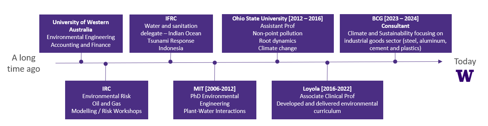
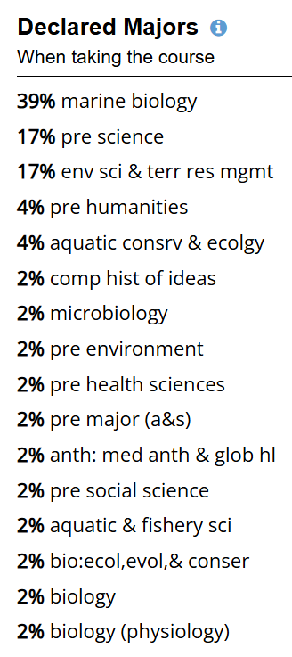
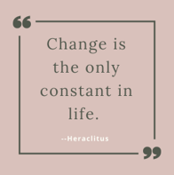
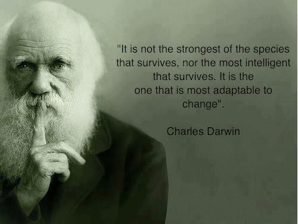
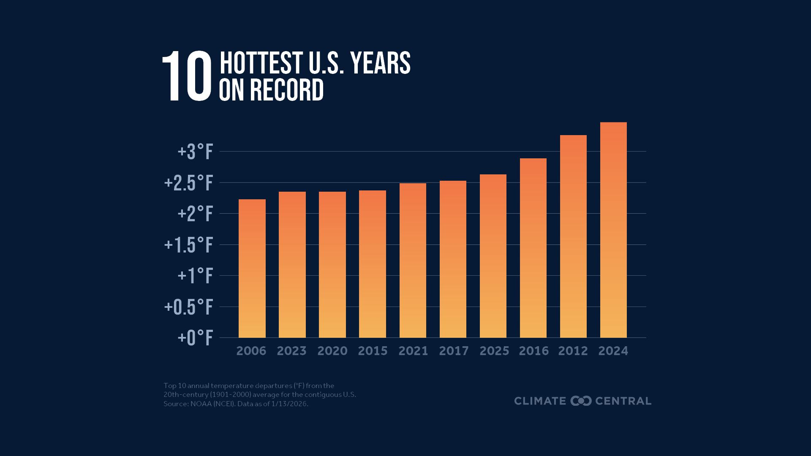
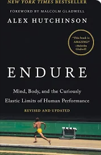
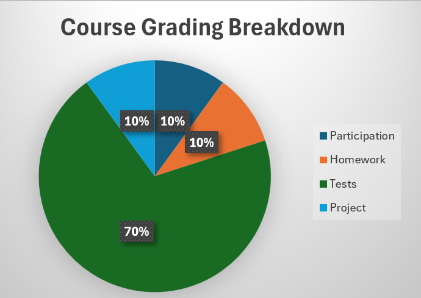
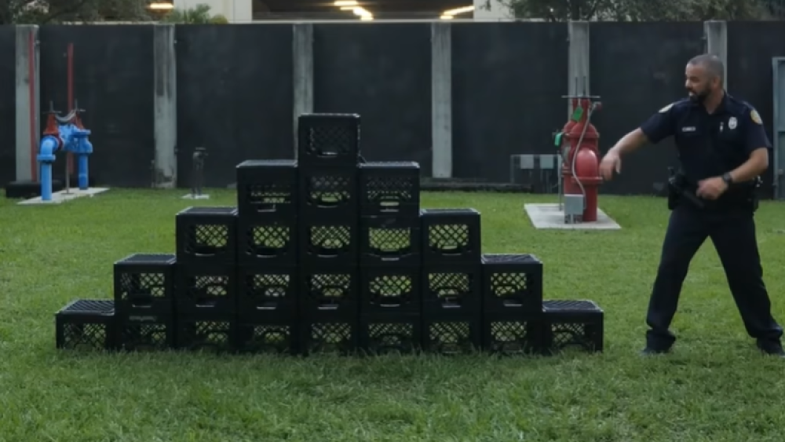
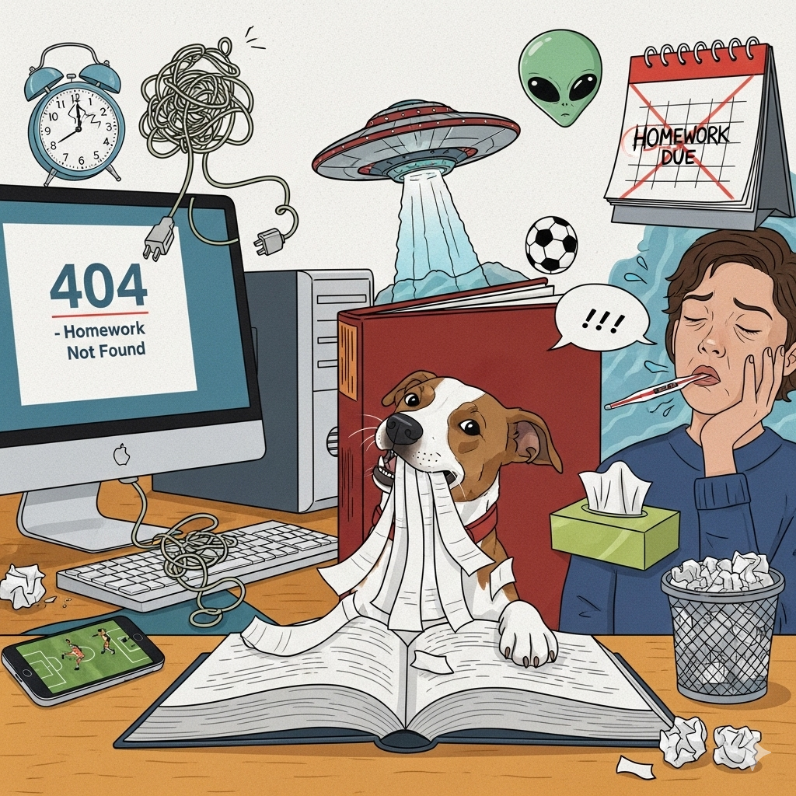
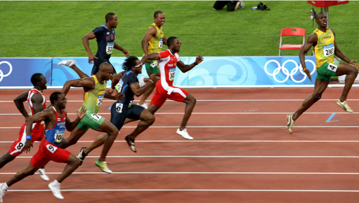

# (PART) Workbook Chapters {-}

# Why Calculus Workbook

## Teaching Team Introductions
### Gaj Sivandran

**Teaching Interests**

- Design (freshman and senior)
- Fundamental engineering (statics, fluids)
- Environmental labs
- Water resources

**Research Interests**

- Climate change
- Active learning pedagogy
- Simulation modeling
- Decision support (socio-economic modeling) 

**Random Facts**

- I have an 11yr old daughter that helps me write exam questions
- Dogs >Cats, Cricket > Baseball,  AFL > NFL, Vegemite > Peanut butter 
- I like to run very very long distances, stilling working on why

## Classroom Etiquette

{fig.alt="Illustration of multiple raised hands in different skin tones reaching upward. Colorful question marks appear above the hands, representing curiosity, participation, and questions from a diverse group of people." style="float:right; width:250px; margin:10px;"}

- Please feel free to bring your breakfast/lunch to class – just be sure to clean up before you leave
- Bring whatever tech you need to take notes and engage. We will be using Poll everywhere 
- Ask questions – but please be respectful of all voices and views - wrong answers have more value than right ones!

## Why are you here?

::: promptbox

**Discussion**
In small groups:

{fig.alt="Chart titled 'Declared Majors' showing the distribution of student majors. The largest group is marine biology at about 31 percent, followed by civil and environmental resource management at 26 percent, and pre-science at 16 percent. Smaller groups include pre-environment, environmental studies, pre-social science, and oceanography, each under 5 percent. Several additional majors such as wildlife conservation, biology, anthropology, and earth and space sciences each make up about 1 percent." style="float:right; width:200px; margin:10px;"}

- Introduce yourselves
- Why are you all here?
- What do you think this class could be useful for?
- What do you notice about the declared majors in this class?

Class Make Up

- Freshman 25%
- Sophomores 45%
- Juniors 20%
- Seniors 10%
- Transfer Students 15% 

              
:::

## What is Calculus?

{fig.alt="Graphic with a framed quote that reads, 'Change is the only constant in life.' attributed to Heraclitus. The design features stylized quotation marks and a simple, muted background." style="float:right; width:300px; margin:10px;"}
{fig.alt="Image of Charles Darwin alongside a quote that reads, 'It is not the strongest of the species that survives, nor the most intelligent that survives. It is the one that is most adaptable to change.' The quote is displayed next to a portrait of Darwin against a muted green background." style="width:400px; margin:10px;"}

::: promptbox

**Discussion**

What do you see in this graph?

{fig.alt="Bar chart titled '10 Hottest U.S. Years on Record' showing increasing temperature anomalies. The bars represent years from 1998 to 2024, with the most recent years generally being the warmest. The tallest bar corresponds to 2024, indicating it is the hottest year on record, with several other recent years such as 2012, 2016, 2020, 2021, and 2023 also among the hottest." style="float:center; width:800px; margin:10px;"}
    

:::

## My Expectations of You

{fig.alt="Book cover of 'Endure' by Alex Hutchinson, featuring a runner on a track beneath a dark background with the title prominently displayed." style="float:right; width:100px; margin:10px;"}

**Objective 1** : The ability to apply calculus to the natural system

- Calculus is a language that allows us to tell complex environmental stories

**Objective 2**: Effort

- The best definition of I have come across *the struggle to continue against a mounting desire to stop - Alex Hutchinson, Endure*

## Your Expectations of Me

::: promptbox
**Discussion**

In a small group make 2 lists

- What can you come to see me about?

        

- What should you find someone else for?
        

:::

## Syllabus Highlights

### Assessments

{fig.alt="Pie chart titled 'Course Grading Breakdown' showing that tests make up 70 percent of the grade, while participation, homework, and project each contribute 10 percent." style="float:right; width:400px; margin:10px;"}

**Preparation & Participation** [10%]

- Before class readings/questions
- After-class self checks
- In-class activities
- Polleverywhere

**Homeworks** [10%]

- Roughly every week
- Revise and resubmit
- Grade on accuracy and effort

**Tests** [70%]

- 4 Tests over the term 
- 2 can be re-taken during finals week
- 1 pg of notes (2sides)

**Project** [10%]

- Low stakes group project applying the big picture concepts of this class
- Focuses on reading and interpreting the math

::: promptbox
**Class discussion**

Why do you think there is so much weight on tests and participation?

    
:::

### Acedemic Integrity

This class has been designed to reward you for doing your **own** work
Tests will be relatively straightforward if you make the effort on the in-class and homework assessments

Using these resources will only make studying for tests harder. Many of these resources give you the *illusion* of understanding - but the reality is quite different.

{fig.alt="Image of a pyramid stack of black milk crates arranged on grass, with a person standing nearby preparing to climb it. The structure resembles a stepped pyramid used in a balance or climbing challenge." style="float:right; width:300px; margin:10px;"}

{fig.alt="Logos of Chegg, YouTube, and ChatGPT displayed side by side, representing different online platforms used for learning and information access." style="width:300px; margin:10px;"}

### Late Assessment / Missed Assessment Policy

This is a firm policy to make sure I am being fair to all of you.

**Grace period:** Homeworks for this class are due Friday at 11:59pm. Homeworks will be accepted 72 hrs after their due date with no penalty (Monday 11:59pm). Graded work not turned in by this time will receive a grade of zero.

**Missed Tests**: If you miss a test, you will need to use one of your 're-takes' during finals weeks to do it. However, if you have a legitimate reason, I will work with you to reschedule the test earlier so you can save your re-take.

**Missed Class Preparation/Participation:** From time to time we miss class for several reasons (studying for another test that day, field work, illness, etc). There will be **no opportunity** to submit preparation and participation activities if they are missed. The purpose of these activities are to reinforce concepts in the moment – and have little value out the context of the material being covered that day.

To accommodate for this, 5% of the total preparation and participation assessments will be dropped. There will also be additional extra-credit opportunities throughout the term. 

**Exceptional Circumstances**: You must contact me 48 hours before the **actual** due date (not after the 48hr grace period) of a graded assignment to give me advanced notice, or within 12 hours after the work is due in the case of an emergency. If you fail to do this, you will receive zero credit for the missed assignment.

::: promptbox

**Class Discussion** 

What do we consider **exceptional circumstances**?

{fig.alt="Cartoon of a student surrounded by exaggerated excuses for not doing homework, including a computer showing '404 homework not found,' an alarm clock, a tangled mess, a UFO, an alien, and a calendar with homework crossed out. A dog sits at the desk with tissues while the student looks overwhelmed, suggesting avoidance and distraction." style="float:left; width:300px; margin:10px;"}
:::

### Test Retakes Policy

There is no Final in this class – BUT – I will use the finals time slot for the retakes. So don't plan an early break if you think you might be doing a retake.

If you miss a test during the term for a valid reason (health, emergency etc) and inform me in a timely manner, I’ll schedule a time during office hours for you to take the test. This flexibility is only good for a couple of days as I want to get the graded tests back to the rest of the class.

If you miss a test for another reason (slept in, went to a wedding etc) you can always use one of your retakes – that’s what they are for.

Reasons to retake
Missed a test
Want to try for a better grade
Love calculus so much you want to do more problems

You can retake up to 2 tests. Your best score counts – so no risk

### Class notes

All notes that I take in class are available on the OneNote notebook link on Canvas
All lectures will be recorded - these will also be made available on Canvas

From time to time the technology will fail us. Remember these are being provided as a *bonus*. There is no substitute for attending class and taking your own notes.

### Office Hours

Please select ALL times that **could** work.

I will always try to hang around for 30mins or so after class to answer any questions.

Office hours will be posted on Canvas as soon as they are set.

   

## Questions?
::: promptbox

**Class discussion**

Ask me anything - whats on your mind - need clarification on any of the things we've talked about?
         

:::

## Paper Planes

::: promptbox

**Paper Plane Activity**
We are going to make paper planes and then see how well they fly.

We are going to break into 4 groups:

- Group 1: Instructions not included – I know how to make a paper plane already
- Group 2: Notes -  Watch the video multiple times, pausing and taking notes – I’m confident I can make a good plane
- Group 3: Team – Work together and make 1 TEAM plane. 
- Group 4: Solo first + then team up - Make your own plane, then make a team plane

  <iframe
    src="https://www.youtube.com/embed/eHSa-vF6ZlM"
    title="YouTube video"
    frameborder="0"
    allow="accelerometer; autoplay; clipboard-write; encrypted-media; gyroscope; picture-in-picture; web-share"
    allowfullscreen
    style="position:absolute; top:0; left:0; width:100%; height:100%;">
  </iframe>

**Discussion**

Why did we make paper planes in calculus?
                  

:::

## Rate of Change - A First Look

::: promptbox

**Class Discussion**

{fig.alt="Photo of a men's sprint race on a track with several runners competing at full speed. One runner is clearly ahead of the others as they approach the finish line." style="float:right; width:300px; margin:10px;"}

When we try to understand derivatives, the most common place to start is Position->Velocity->Acceleration and how they are linked.

Lets have a look at this while watching Usain Bolt run the 100m in 9.69s

While we watch this video I want you to keep in mind the idea of change - what variables are changing as we move through this race.

[Usain Bolt 100m Record](https://www.youtube.com/clip/UgkxYLQtjngzm0z_y34zOcFQH24uIOKdLFCd){target="_blank" rel="noopener"}

**Group Discussion**

1) How fast did he run? Can you calculate it?
              

2) What was the fastest he ran? OR what was his top speed (velocity)?
When do you think this happened?
              

3)The time it took him to get to 10m markers was measured, and the plot is below. What does this tell us about how fast he ran?

{fig.alt="Position versus time graph for a 100 meter race, showing distance increasing from 0 to 100 meters over about 10 seconds. The graph is divided into segments with changing slopes, indicating changes in speed. Early segments are steeper at first, with one labeled about 1.83 seconds, while a middle segment is labeled about 0.82 seconds, showing faster movement later in the race." style="width:500px; margin:10px;"}
       

4)If we fit a smooth curve to this path, instead of looking at the slope over every 10m, we can look at the **instantaneous rate of change** or the derivative at any point. 

Note: The reason the curve needs to be smooth will be covered later - this is all just a preview

{fig.alt="Position versus time graph for a 100 meter race, showing distance increasing from 0 to 100 meters over about 10 seconds. Unlike a piecewise linear graph, the data points are connected by a smooth curve, representing continuous changes in speed throughout the race." style="width:500px; margin:10px;"}
       

5) No if we calculate the instantaneous rate of change and plot it against time - we get the velocity vs time relationship.

Using this - try to describe how is velocity (speed) varied during the race.

{fig.alt="Velocity versus time graph for a 100 meter race. The curve shows velocity increasing rapidly at the start, leveling off near a maximum speed, and then decreasing slightly toward the end of the race. An inset image shows runners sprinting on a track." style="width:500px; margin:10px;"}
       

6) The world wondered how fast he could actually run the 100m. A year later at the world championships sensors were places along the tract to capture in high resolution his position with time.

- What do you notice this time?
- What is causing the oscillating in the red line?

{fig.alt="Velocity versus distance graph for a sprint. A smooth black curve shows average speed increasing quickly at the start and then leveling off near 12 meters per second. A red line oscillates around the black curve, representing instantaneous speed that fluctuates slightly above and below the average throughout the race." style="width:500px; margin:10px;"}
       

:::

