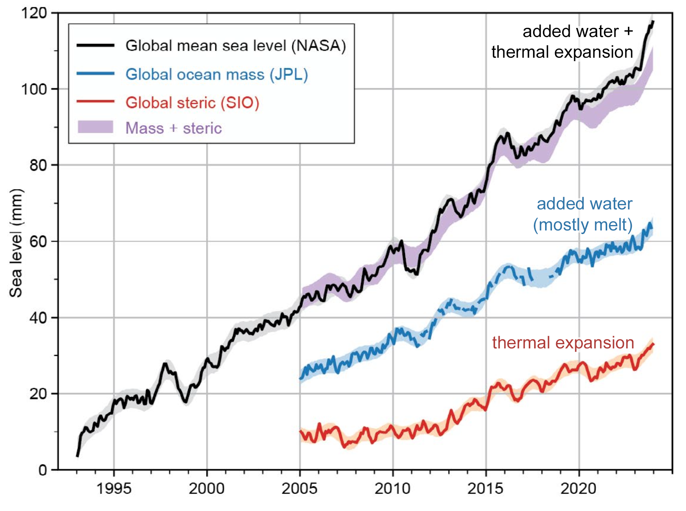

# Introduction to Derivatives — Workbook

---

## Learning Objectives (Quick Self-Check)

::: promptbox
**Check your readiness:**  
For each objective, write one sentence in your own words or a question you still have:

1. What is the difference between an **average rate of change** and an **instantaneous rate of change**?  
2. How can you interpret a derivative from a **graph, dataset, or equation**?  
3. What does derivative **notation** mean, and how does it connect to context?  
4. How could you apply derivatives to a **real-world environmental example**?  

**Notes:**  
<br><br><br><br><br><br>
<br><br><br><br><br><br>
:::

---

## Understanding the Speed of Change

*A derivative is about how fast something is changing, right now, and in what direction.*

### Class Brainstorm: What’s Changing?
::: promptbox
**Activity:**  
{style="float:right; width:250px; margin:10px;"}
[Shared Google Doc](https://docs.google.com/document/d/1FgOMQHnzNYIyq1sEqhB6YfLKFwI-kqfl90Zuy9IlBsY/edit?usp=sharing)

1. As a group, pick an **environmental system** you are interested in (e.g. Lake Washington).  
2. Discuss:

   - What quantity is **changing** in that system?  
   - What is it changing **with respect to** (time, distance, depth, etc.)?  
   - Why might the **speed of change** matter for scientists, managers, or communities?  
   - Rinse and repeat, can you think of another quantity or variable that is changing in your system?

3. Share your group’s example with the class.  

**Notes:**  


<br><br><br><br><br><br>
<br><br><br><br><br><br>

:::


---

### Average vs Right-Now: Build the Contrast
::: promptbox
**Practice:**  
Using your scenario:  

1. What **average rate of change** could you compute between two times?  
2. What would the **instantaneous rate** tell you “right now”?  
3. How would the decisions based on these two rates differ?  

**Notes:**  
<br><br><br><br><br><br>
<br><br><br><br><br><br>
:::

---

### Graph Interpretation: Slope as a Story
::: promptbox
**Activity (no equations needed):**  
Sketch a simple curve of your quantity vs. its input (e.g., population vs. time).  

- Mark one place slope is **positive** (increase).  
- Mark one place slope is **near zero** (flat).  
- Mark one place slope is **negative** (decrease).  
- For each mark, write a one-sentence *story* of what’s happening.  
- What does the steepness tell you about your quantity?
**Notes:**  
<br><br><br><br><br><br>
<br><br><br><br><br><br>


:::

---

### From Monitoring to Action
::: promptbox
**Practice:**  
Imagine you only have resources to collect limited data.  

1. When would an **average rate** be most useful?  
2. When would you need an **instantaneous rate**?  
3. What extra data (resolution, sensors) would help improve your estimates?  

**Notes:**  
<br><br><br><br><br><br>
<br><br><br><br><br><br>
:::

---

## Why We Need New Math Tools

### Compare: Snapshots vs. Speed
::: promptbox
**Activity (Whole Class Scenario + Small Groups):**  

**Scenario:**  
A coastal city is monitoring **sea level rise** to plan future flood defenses.  

- Snapshot: “Sea level is currently 1.2 meters above the baseline.”  
- Speed: “Sea level is rising at 4 mm per year.”  

---

**Step 1: Snapshot vs. Speed**  

- What can the snapshot alone tell the city planners?  
- What critical information is missing if they only have the snapshot?  
- How does the speed of change alter the urgency of decisions?  
<br><br><br><br><br><br>

---

**Step 2: Consequences of Missing Information**  

- If planners **only use the snapshot**, what mistakes could they make?  
- If they **only use the speed**, what context would be missing?  
- Why do they need *both*?  
<br><br><br><br><br><br>

---

**Step 3: Push Further**  

- How would decisions differ if the speed of rise is *constant* vs. *accelerating*?  
- What additional data (short-term vs. long-term) would make predictions more reliable?  
<br><br><br><br><br><br>

---

**Step 4: Generalize**  
Complete this sentence as a group:  

> *In environmental systems, a snapshot tells us ________, but the derivative tells us ________.*  

---

**Notes:**  
<br><br><br><br><br><br>
:::

## What Is A Derivative? 

You’ve probably seen derivatives before—even if you didn’t call them that. If you've ever looked at how fast something was growing, declining, or shifting in space or time, you've already been thinking about derivatives.


```{r derivative-terms-table, echo=FALSE}
knitr::kable(
  data.frame(
    `Math / Physics / Data / Context` = c(
      "Rate of change",
      "Slope of the tangent line",
      "Instantaneous rate",
      "Velocity",
      "Acceleration",
      "Gradient",
      "Marginal change",
      "Slope at a point",
      "Rise over run",
      "Delta Y / Delta X"
    ),
    `Environmental / Applied / Context` = c(
      "Growth rate",
      "Decay rate",
      "Reaction rate",
      "Flux",
      "Turnover rate",
      "Loss rate / Gain rate",
      "Change per unit time",
      "Response rate",
      "Uptake rate",
      "First difference"
    )
  ),
  caption = "Terms Across Disciplines That Represent Derivatives",
  booktabs = TRUE
)
```

Mathematically, the derivative describes the **instantaneous rate of change**—the slope of the tangent line to a curve at a given point.


### Derivative Notation: Speaking the Language of Change

In calculus, there are several common notations used to represent the **derivative**—the instantaneous rate of change of a function. Understanding these notations is key to reading and writing mathematics fluently, especially when interpreting real-world problems in environmental science.

---

#### Common Derivative Notations

Let’s say we have a function, we could right this as:

$$
f(x) = something\ with\ x's \ in\ it \\
y= something\ with\ x's \ in\ it
$$

We can then write the notation of the derivative  with respect to \( x \) in several ways, all of which mean exactly the same thing:

| Notation | Spoken As | Description |
|:----------:|:-----------:|:-------------:|
| \( f'(x) \) | "f prime of x" | Most compact form; often used in textbooks |
| \( \frac{dy}{dx} \) | "dee y over dee x" | Emphasizes that \( y \) is a function of \( x \); Leibniz notation |
| \( \frac{d}{dx} f(x) \) | "dee by dee x of f of x" | Shows that differentiation is an operation |
| \( D_x f(x) \) | "D sub x of f of x" | Operator form used in some texts |
| \( y' \) | "y prime" | Used when \( y = f(x) \), common in applied settings |


- **Prime notation**: e.g., \( f'(x) \), \( g'(t) \)
- **Leibniz notation**: e.g., \( \frac{dy}{dx} \), \( \frac{d}{dt} \)
- **Operator notation**: e.g., \( \frac{d}{dx}(f(x)) \), applying \( \frac{d}{dt} \) to an expression

---

#### The Derivative as an Operator

The notation \( \frac{d}{dx} \) is not just a symbol—it’s an **operator**. That means it **acts on** a function to produce another function: the derivative.

Think of it this way:

> The symbol \( \frac{d}{dx} \) is a command: 
> “Take the derivative of whatever comes after this with respect to \( x \).”

So if you write:

$$
\frac{d}{dx} \left(3x^2 + 2x\right)
$$

You are instructing the reader (or yourself!) to **differentiate** the expression \( 3x^2 + 2x \) with respect to \( x \). The result:

$$
\frac{d}{dx} \left(3x^2 + 2x\right) = 6x + 2
$$

---


### Snapshots vs speed of change

We’ve seen examples where snapshots (a single measurement) and speed (how fast something changes) both matter. The derivative is the mathematical tool that lets us capture that “speed of change” precisely.

---

### Reflection
::: promptbox
**Prompt:**  
Complete this thought:  

> *A derivative is not just a formula — it’s a way of describing ________.*  

**Notes:**  
<br><br><br><br><br><br>
:::

## Average Rate of Change

The average rate of change tells us how much something changes per unit of input (like time, distance, or depth) over a chosen interval.
Mathematically, it’s the slope of a secant line connecting two points on a function.

---

### Practice: Secant Slope on a Graph

::: promptbox
**Activity (Individual or Pairs):**
Look at the quadratic function below.

$$f(x) = -x^2 + 4x + 5$$
```{r avg-rate-quad, echo=FALSE, fig.width=6, fig.height=4}
f <- function(x) -x^2 + 4*x + 5
curve(f(x), from = 0, to = 6,
      xlab = "x", ylab = "f(x)",
      col = "steelblue", lwd = 2)
grid()
```

* Pick two points on the curve.
* Estimate their coordinates.
* Use the formula below to compute the average rate of change.

$$\frac{f(b) - f(a)}{b - a}$$


* What does the sign of your slope tell you about how the function is changing?
* Write a descriptive sentence about what your value represents

**Notes:** <br><br><br><br><br><br><br><br><br><br><br><br>
:::

---

### Practice: Environmental Table

::: promptbox
**Activity (Small Groups):**
The table below shows the amount of carbon stored in forest soil over time.

| Year | Carbon (kg/m²) |
| :--: | :------------: |
| 2000 |       4.1      |
| 2005 |       4.8      |
| 2010 |       5.0      |

* Compute the average rate of change from 2000 to 2005.
* Compute the average rate of change from 2005 to 2010.
* Compute the average rate of change from 2000 to 2010.
* Write one or two sentences explaining what these numbers mean in the context of carbon storage.

**Notes:** <br><br><br><br><br><br><br><br><br><br><br><br>
:::

---

### Practice: Application to Sea Level

::: promptbox
**Activity (Whole Class Discussion):**
Suppose sea level in a coastal region is modeled by

$$S(t) = 3.2t + 45$$

where $S(t)$ is in millimeters and $t$ is years since 2000.

* Calculate the average rate of change of $S(t)$ from 2010 to 2020.
* State the units of your result.
* Interpret the meaning: what does this tell us about sea level trends?
* Is there a shortcut to finding the average rate of change?
* Visualize this function with a sketch, add in the secant line, what do you notice?

**Notes:** <br><br><br><br><br><br><br><br><br><br><br><br><br><br><br><br><br>
:::

---

::: promptbox
**Environmentla Application - A Visual View**

{fig.alt='Line graph showing changes in global mean sea level from 1993 to 2023. The black line (NASA) shows total sea level rise, increasing from near 0 mm in 1993 to over 110 mm in 2023. Two contributing factors are plotted: blue line (JPL) shows added ocean mass from mostly land ice melt, rising steadily from about 20 mm in 2003 to over 60 mm in 2023; red line (SIO) shows thermal expansion, rising from near 0 mm in 2003 to about 40 mm in 2023. The purple shaded region (Mass + steric) closely matches the black line. Together, the figure shows that sea level rise is explained by added water plus thermal expansion.'}

**Discussion Questions**

1.  **Describe the Trend**

-   What does the plot tell you about how global sea level has changed since 1993?
-   Is the trend linear, exponential, or something else?

2.  **Estimate the Average Rate of Change**

-   Pick two points on the black line (e.g., between 1993 and 2025) to estimate:

    $$
       \text{Average Rate} = \frac{\text{Change in Sea Level (mm)}}{\text{Change in Time (years)}}
       $$

-   What units does your answer have?


3.  **Interpret in Context**

-   What does your calculated rate tell you about sea level rise?
-   Why is knowing the *average rate* important for cities, communities, and planners?

4.  **Explore Acceleration**

-   Estimate the average rate of change over each 5-year interval below by reading approximate values from the graph.

-   Use the formula:

    $$
       \text{Avg. Rate} = \frac{\Delta \text{Sea Level}}{\Delta \text{Time}} \quad \text{(in mm/year)}
       $$

    -   Fill in the table:

| Time Interval | Sea Level at Start (mm) | Sea Level at End (mm) | Avg. Rate (mm/year) |
|---------------|--------------------------|-----------------------|---------------------|
| 1995–2000     |                          |                       |                     |
| 2000–2005     |                          |                       |                     |
| 2005–2010     |                          |                       |                     |
| 2010–2015     |                          |                       |                     |
| 2015–2020     |                          |                       |                     |
| 2020–2025     |                          |                       |                     |


-   What do you notice about how the average rate changes over time?
-   What does that suggest about the *acceleration* of sea level rise?

5.  **Connect to Derivatives**

-   If this were a smooth function $S(t)$ representing sea level at year $t$, what would the *derivative* $S'(t)$ represent?
-   What would a plot of the average rate of change look like?
-   What would happen if we looked at the average rate of change over shorter and shorter periods? How would this chang the way a plot of the rate of change look like?

**Reflection Prompt**
Describe a situation in your area of interest (marine biology, forestry, climate science, etc.) where an average rate of change is used. What does it tell you, and what might it leave out?
:::


## Instantaneous Rate of Change

The instantaneous rate of change tells us how fast something is changing at a *specific moment*. Unlike the average rate, which looks at an interval, the instantaneous rate captures the slope of the tangent line at a single point. This is the essence of a derivative.

---

### Zooming In on Change

::: promptbox
**Activity (Whole Class Demonstration):**
Look at the function below.

```{r zoom-demo, echo=FALSE, fig.width=6, fig.height=4}
f <- function(x) 0.02*(x - 2000)^2 + 5
curve(f(x), from = 1995, to = 2025,
      xlab = "Year", ylab = "Sea Level (mm)",
      main = "Sea Level Curve with Focus Point",
      col = "blue", lwd = 2)
points(2010, f(2010), pch = 19, col = "red")
```

* As a class, discuss: What does the slope of the curve at 2010 represent?
* Imagine drawing a tangent line right at that point. How is this different from a secant line?
* How might the meaning of this slope change if this were a glacier, a population, or a pollutant concentration?

**Notes:** <br><br><br><br><br><br><br><br><br><br><br><br>
:::

---

### Tangent Hunt

::: promptbox
**Activity (Pairs):**
On the curve below:

```{r, echo=FALSE}
# An interesting curve with varied behavior
f <- function(x) {
  0.04*(x - 5)^3 - 0.9*(x - 5) + 0.8*sin(1.2*x) + 8
}

# Grid for plotting and finite-difference slope estimates
x  <- seq(0, 10, length.out = 3000)
y  <- f(x)
dy <- diff(y) / diff(x)
xm <- (head(x, -1) + tail(x, -1)) / 2  # midpoints for derivative

# Find one near-zero slope (tangent ~ 0), one strongly positive, one strongly negative
i_zero <- which.min(abs(dy))
i_pos  <- which.max(dy)
i_neg  <- which.min(dy)

# Extract the points
pts <- data.frame(
  x  = c(xm[i_pos], xm[i_zero], xm[i_neg]),
  y  = c(f(xm[i_pos]), f(xm[i_zero]), f(xm[i_neg])),
  m  = c(dy[i_pos],  dy[i_zero],  dy[i_neg]),
  lab= c("Positive slope", "Zero slope", "Negative slope")
)

# Base plot
plot(x, y, type = "l", lwd = 2, col = "steelblue",
     xlab = "Time (or other input)", ylab = "Environmental quantity",
     main = "Identify Positive, Zero, and Negative Tangent Slopes")
grid()

# Add tangent lines at the three marked points
draw_tangent <- function(x0, y0, m, col) {
  xline <- seq(max(min(x), x0 - 1.2), min(max(x), x0 + 1.2), length.out = 200)
  yline <- y0 + m*(xline - x0)
  lines(xline, yline, col = col, lwd = 2, lty = 2)
}


```

* Mark one point where the tangent slope is clearly **positive**.
* Mark one point where the tangent slope is clearly **negative**.
* Mark one point where the tangent slope is **zero**.
* When does the *sign* of the tangent slope change? 
* Where is change happening the fastest? (positive and negative)

*Discuss:* What does each slope mean in an environmental context (e.g., population peak, fastest growth, fastest decline)? Break up the function into regions and tell a story.

**Notes:** <br><br><br><br><br><br><br><br><br><br><br><br>


**Challenge**: Can you sketch the derivative - dont worry about getting the right magnitudes, just the right shape. [Hint: start with some points you know for sure, then ask yourself as you move left to right what is happening to the slope]

```{r, echo=FALSE}
# An interesting curve with varied behavior
f <- function(x) {
  0.04*(x - 5)^3 - 0.9*(x - 5) + 0.8*sin(1.2*x) + 8
}

# Grid for plotting and finite-difference slope estimates
x  <- seq(0, 10, length.out = 3000)
y  <- f(x)
dy <- diff(y) / diff(x)
xm <- (head(x, -1) + tail(x, -1)) / 2  # midpoints for derivative

# Find one near-zero slope (tangent ~ 0), one strongly positive, one strongly negative
i_zero <- which.min(abs(dy))
i_pos  <- which.max(dy)
i_neg  <- which.min(dy)

# Extract the points
pts <- data.frame(
  x  = c(xm[i_pos], xm[i_zero], xm[i_neg]),
  y  = c(f(xm[i_pos]), f(xm[i_zero]), f(xm[i_neg])),
  m  = c(dy[i_pos],  dy[i_zero],  dy[i_neg]),
  lab= c("Positive slope", "Zero slope", "Negative slope")
)

# Set up 2x1 layout
par(mfrow = c(2,1), mar = c(4,4,2,1))

# --- Top: Original function with tangent slopes ---
plot(x, y, type = "l", lwd = 2, col = "steelblue",
     xlab = "Time (or other input)", ylab = "Environmental quantity",
     main = "Identify Positive, Zero, and Negative Tangent Slopes")
grid()

# Tangent helper
draw_tangent <- function(x0, y0, m, col) {
  xline <- seq(max(min(x), x0 - 1.2), min(max(x), x0 + 1.2), length.out = 200)
  yline <- y0 + m*(xline - x0)
  lines(xline, yline, col = col, lwd = 2, lty = 2)
}


# --- Bottom: Blank axis for derivative sketch ---
plot(NA, xlim = c(0, 10), ylim = c(-5, 5),
     xlab = "x", ylab = "f'(x)", main = "Derivative Graph", yaxt = "n")
abline(h=0, v=0, col="gray70", lty=2)  # add axes through origin
grid()
```

:::

---

### Practice: Bear Growth Scenario

::: promptbox
**Activity (Small Groups):**
Imagine tracking the weight of a bear throughout its life. Sketch or imagine the weight vs. age curve.

* Where is the slope (rate of change) steepest?
* Where does the slope flatten out?
* Could it ever become negative?

*Group Discussion:* Why might wildlife managers care about whether the rate of weight gain is accelerating or decelerating?

**Notes:** <br><br><br><br><br><br>


Now try sketching the derivative, or the rate of change of the bear's weight.
 <br><br><br><br><br><br><br><br><br><br><br><br>

:::

---

### From a's and b's to a's and h's

::: promptbox
**Changing our frame of reference**

$$
\frac{f(b)-f(a)}{b-a} = \frac{f(a+h)-f(a)}{h}
$$

<br><br><br><br><br><br><br><br><br><br><br><br><br><br><br><br><br><br><br><br><br><br><br><br>  


:::

---

### Data to Derivative

::: promptbox
**Activity (Hands-On, with Data Table):**
You measure dissolved oxygen in a lake for three consecutive days:

| Day | DO (mg/L) |
| :-: | :-------: |
| 4.0 |    8.15   |
| 5.0 |    8.10   |
| 6.0 |    8.05   |

* Estimate the instantaneous rate of change at Day 4, 5 and 6 using the formula:

$$f'(a) \approx \frac{f(a+h) - f(a)}{h}$$

with $h = 1$.

* Interpret your result in context, including units.
* Was it possible to calculate the instantaneous rate of change at day 6?
* How would a higher-resolution dataset (more frequent measurements) improve your estimate?

**Notes:** <br><br><br><br><br><br><br><br><br><br><br><br>

>REMEMBER: We are just estimating here! If h is small enough its a good estimate, if h is big, well it becomes the 'average' rate of change. 

**Discuss**: Is this more of an average or instantaneous rate of change?
 <br><br><br><br><br>
:::

---

### Instantaneous vs. Average

::: promptbox
**Activity (Class Discussion):**
Compare these two statements:

1. A glacier retreats 20 meters per year between 2000 and 2010.
2. On January 1st 2005, the glacier front is moving backward at 3.5 meters per year.

* Which is an average rate? Which is instantaneous?
* What added information do you get (or can deduce) when you have both pieces of information?
* Why does the distinction matter for scientists, policymakers, or communities?
* Brainstorm 2–3 other examples where average vs. instantaneous rates tell very different stories.

**Notes:** <br><br><br><br><br><br>
:::

---

## The Limit Definition of a Derivative

We don't do many *proofs* in this class, but understanding the mathematical origins of the derivative really helps with interpretation. So we will work through this one together.

### Deriving the Limit Definition with a Real Example — Seattle Daylight

We’ll use a simple model of **daylight hours in Seattle** (approx. 47.6°N) to build the derivative from limits.
A realistic sinusoidal model for daylight hours $D(t)$ (in hours) on day $t$ of the year is:

$$
D(t) \;=\; 12.25 \;+\; 3.75 \,\cos\!\Big(\tfrac{2\pi}{365}\,(t - 172)\Big)
$$

* Midline $\approx 12.25$ hours
* Amplitude $\approx 3.75$ hours

Let’s first build an intuition for what daylight hours look like over a year in Seattle.

Sketch what you think the curve looks like (peak near late June, minimum near late December), then compare to the model above. 
Annotate interesting points along this function.

<br><br><br><br><br><br><br><br><br>


---

### Connect to the Question

::: promptbox
**Activity (Think-Pair-Share):**
Lets pick a specific day $a=250$ (**day 250** ≈ early Sep).

* What does $D(a)$ represent in words?  
* If you only know $D(a)$ and $D(a+h)$, how would you estimate “how fast daylight is changing around day $a$” using the **average rate of change**?

* Why might we want the **instantaneous** rate of change instead?

**Notes:** <br><br><br><br><br><br>
:::

---

### From Average to Instant: The Difference Quotient

::: promptbox
**Step 1 — Average Rate on $[a, a+h]$:**
Write the average rate of change of daylight hours between day $a$ and day $a+h$ where $h=10$:

| Day of Year | Daylight Hours (hrs) |
|:-----------:|:--------------------:|
| 250         | 13.26                |
| 260         | 12.61                |
| 270         | 11.96                |


$$
\frac{D(a+h) - D(a)}{h}
$$

* What does the **numerator** represent in context?
* What are the **units** of this average rate?

**Notes:** <br><br><br><br><br><br><br><br><br><br><br><br>
:::

::: promptbox
**Step 2 — Shrink the Interval:**
To get the rate “**right now**” on day $a$, we take the **limit** as $h \to 0$:

$$
D'(a) \;=\; \lim_{h \to 0} \frac{D(a+h) - D(a)}{h}
$$

So if we use the data below we can see we are shrinking our $h$ getting it close to $0$.

| Day of Year | Daylight Hours (hrs) |
|:-----------:|:---------------------:|
| 250         | 13.259               |
| 251         | 13.195               |
| 252         | 13.131               |

Calculate the average rate of change with an $h=1$

<br><br><br><br><br><br>

What if we shrink the interval even further and make $h=0.01$

| Day of Year | Daylight Hours (hrs) |
|:-----------:|:---------------------:|
| 250.00      | 13.259240             |
| 250.01      | 13.258602             |
| 250.02      | 13.257965             |


<br><br><br><br><br><br>

* Why can’t we just set $h=0$ directly?
* In words, what does this limit do with the two-day comparison?

**Notes:** <br><br><br><br><br><br>


**Challenge:** In your groups discuss this table, what do you notice on both ends of the table?

| h       | Average Rate of Change (hrs/day) |
|:--------:|:---------------------------------:|
| 365     | 0.000000                         |
| 300     | 0.009487                         |
| 200     | -0.002907                        |
| 100     | -0.046478                        |
| 50      | -0.062121                        |
| 10      | -0.064676                        |
| 1       | -0.063844                        |
| 0.1     | -0.063732                        |
| 0.01    | -0.063721                        |
| 0.001   | -0.063720                        |
| 0.00001 | -0.063720                        |

<br><br><br><br><br><br>

>Technically what have found here is an **estimate** for the instantanous rate of change at a point

:::

---

### Visualizing Secant $\to$ Tangent (Seattle Daylight)

Using the plot below, sketch:

- The secant at day 250 with $h=365$
- Now draw another secant with $h=300$
- Now draw it with $h=50$
- Finally sketch the **tangent** at $h=250$

>Remember the average rate of change equation is just *rise over run* or the slope of the secant lines, so the slopes of the lines are what tell us the rate of change


```{r daylight-secant-to-tangent, echo=FALSE, fig.align='center', fig.height=5, fig.width=8, out.width='90%'}
# Daylight model for Seattle (simple sinusoid with correct phase)
omega <- 2*pi/365
D <- function(t) 12.25 + 3.75*cos(omega*(t - 172))

# Choose the focal day 'a' (try a = 80 ~ Mar 21; change as needed)
a <- 250
h_vals <- c(30, 10, 3, 1, 0.2)  # shrinking intervals

# Plot settings
t_grid <- seq(1, 730, length.out = 2000)
plot(t_grid, D(t_grid), type = "l", lwd = 2, col = "steelblue",
     xlab = "Day of Year (t)", ylab = "Daylight Hours D(t)",
     main = paste("Secant Line Slopes Approaching the Tangent at Day a =", a))
grid()

# Mark the focal point
points(a, D(a), pch = 19, col = "black")
text(a+50, D(a), labels = paste0("a = ", a), cex = 0.9, pos = 3)


```

### Read What the Slope Means

::: promptbox
**Interpretation:**
Using your numerical/visual estimate of $D'(a)$:

* If $D'(a) > 0$, what does that say about the **season** and daylight change?
* If $D'(a) < 0$, what time of year might that correspond to?
* If $D'(a) \approx 0$, what’s happening seasonally?

**Notes:** <br><br><br><br><br><br>
:::

---

### Why Limits Matter (Wrap-Up)

::: promptbox
**Prompt:**
Explain—in your own words—why the **limit** is essential for defining the **instantaneous rate of change**, using the Seattle daylight model as your example.

**Notes:** <br><br><br><br><br><br>
:::

## Introducing Limit Notation

We now need a way to **formalize** what happens as we “zoom in” on a function — this is where the idea of a **limit** comes in.  

---

### Building Intuition
::: promptbox
**Activity (Think-Pair-Share):**  

Imagine a pollutant concentration in a river, \(C(x)\), as you move downstream toward a factory outfall.  

- At 0.9 km downstream, \(C = 4.9\) mg/L  
- At 0.99 km, \(C = 4.99\) mg/L  
- At 0.999 km, \(C = 4.999\) mg/L  

As you move closer to 1 km, what value does the concentration seem to be approaching?  

This “approaching behavior” is what we call the **limit**.

**Notes:**  
<br><br><br><br><br><br>
:::

---

### Symbol and Words
::: promptbox
**Practice:**  

The formal symbol is:  
\[
\lim_{x \to a} f(x)
\]

- What does the arrow (\(\to\)) mean?  
- What does the \(a\) represent?  
- What is \(f(x)\) approaching as \(x\) gets closer to \(a\)?  

**Notes:**  
<br><br><br><br><br><br>
:::

---

### Why Not Just Plug In?
::: promptbox
**Discussion Prompt:**  

Sometimes \(f(a)\) is undefined (like dividing by zero). In fact - when we look at the limit defintion of a derivative, this is the problem we encounter.

$$
f'(a) \;=\; \lim_{h \to 0} \frac{f(a+h) - f(a)}{h}
$$
**Notes:**  
<br><br><br><br><br><br>
:::

---

### One-Sided Limits
::: promptbox
**Activity (Small Groups):**  

We can approach a point from the **left** (\(a^-\)) or from the **right** (\(a^+\)).  

- Sketch a graph where the left-hand and right-hand limits are the **same**.  
- Sketch a graph where they are **different**. Can you link this to a real-world example?

**Notes:**  
<br><br><br><br><br><br>
<br><br><br><br><br><br>
:::

## From Average to Instantaneous: The Role of Limits

We want to connect the **average rate of change** to the **instantaneous rate of change**.  
Start with the average rate formula:  

\[
\text{Average Rate on } [a,b] = \frac{f(b) - f(a)}{b-a}
\]

---

### Scaffold the Derivation

::: promptbox
**Practice (Step by Step):**

1. Start with the formula for the average rate of change between two points \(a\) and \(b\):  
   \[
   \frac{f(b) - f(a)}{b-a}
   \]  
   - What does the numerator mean?  
   - What does the denominator mean?  
   <br><br><br><br><br><br>

2. Introduce a new variable \(h = b-a\).  
   - Rewrite the denominator in terms of \(h\).  
   - Replace \(b\) with \(a+h\).  
<br><br><br><br><br><br>

3. Show that the formula becomes:  
   \[
   \frac{f(a+h) - f(a)}{h}
   \]  
   - Why is this still the average rate of change, just written differently? Try to explain this with a sketch.  

<br><br><br><br><br><br>

4. Now imagine shrinking the interval smaller and smaller: let \(h \to 0\). This makes the slope of secant line approach the slope of the tangent line.  
   - What problem happens if you just set \(h=0\)?  
   - How does the **limit** fix this?  
   - Add in the limit notation
   <br><br><br><br><br><br>

5. Arrive at the definition of the derivative:  
   \[
   f'(a) = \lim_{h \to 0} \frac{f(a+h) - f(a)}{h}
   \]  

**Notes:**  
<br><br><br><br><br><br>
:::


::: promptbox
Let's annotate this equation so we know what everything is and what to do with it.
<br><br><br>
   \[
   f'(a) = \lim_{h \to 0} \frac{f(a+h) - f(a)}{h}
   \]  
<br><br><br>
:::

## Finding the Derivative Using the Limit Definition of a Derivative

We’ll now practice moving from the **definition** of the derivative to actually **computing** one.  
Remember, the derivative at a point \(a\) is defined as:

\[
f'(a) = \lim_{h \to 0} \frac{f(a+h) - f(a)}{h}
\]

We are going to take this one step at a time:

- We'll deal with the numerator
- We'll add in the fraction term
- We'll add the limit
---

### Step 1: Setup the equations 
::: promptbox
**Activity:**  
Suppose we have the function:

\[
f(x) = x^2
\]

We want to find the derivative at \(x = 2\).

1. Write down the limit definition of the derivative at \(a = 2\).  
2. Substitute \(a = 2\) into the formula (but don’t simplify yet).  
3. What expression do you now have?  

**Notes:**  
<br><br><br><br><br><br>
:::

---

### Step 2: Expand the Numerator
::: promptbox
**Activity:**  
The numerator is:

\[
f(2+h) - f(2)
\]

1. Compute \(f(2+h)\).  
2. Compute \(f(2)\).  
3. Subtract them to simplify the numerator.  
4. Write your result in expanded form.  

**Notes:**  
<br><br><br><br><br><br>
:::

---

### Step 3: Simplify the Difference Quotient
::: promptbox
**Activity:**  
Now substitute your numerator back into:

\[
\frac{f(2+h) - f(2)}{h}
\]

1. Factor/simplify if possible.  
2. What cancels out?  
3. Why is this helpful?  

**Notes:**  
<br><br><br><br><br><br>
<br><br><br><br><br><br>
:::

---

### Step 4: Take the Limit
::: promptbox
**Activity:**  
Finally, take the limit as \(h \to 0\).

1. Substitute \(h = 0\) *after* simplification.  
2. What value do you get for \(f'(2)\)?  
3. Interpret: What does this mean in terms of the slope of the tangent line?  

**Notes:**  
<br><br><br><br><br><br>

>You've found the **derivative at a point** $a=2$
:::

---

### Step 5: Generalize
::: promptbox
**Activity:**  
Repeat the same process, but this time use \(x\) instead of a fixed number like 2.

1. Start with:

\[
f'(x) = \lim_{h \to 0} \frac{f(x+h) - f(x)}{h}
\]

2. Expand \(f(x+h)\) and subtract \(f(x)\).  
3. Simplify and take the limit.  
4. What is the **general derivative function** of \(f(x) = x^2\)?  

**Notes:**  
<br><br><br><br><br><br>
<br><br><br><br><br><br>

>You've now found the **derivative function**
:::

## Workbook: More Practice with the Limit Definition

Now let’s apply the same step-by-step process to two new functions.  
Work carefully through each scaffold — the algebra will get trickier, but the structure is the same.

---

### Example 1: \( f(x) = x^3 \)

We’ll find the derivative of \(f(x) = x^3\) at a point, and then generalize.

#### Step 1: Write the Definition
::: promptbox
**Activity:**  
Start with the limit definition:

\[
f'(a) = \lim_{h \to 0} \frac{f(a+h) - f(a)}{h}
\]

- Substitute \(f(x) = x^3\).  
- Don’t expand yet, just write down the expression.

**Notes:**  
<br><br><br><br><br><br>
:::

#### Step 2: Expand
::: promptbox
**Activity:**  
- Expand \((a+h)^3\).  
- Subtract \(a^3\).  
- Simplify your numerator.

**Notes:**  
<br><br><br><br><br><br>
:::

#### Step 3: Simplify the Fraction
::: promptbox
**Activity:**  
- Divide the numerator by \(h\).  
- Cancel common factors where possible.  
- What remains?  

**Notes:**  
<br><br><br><br><br><br>
:::

#### Step 4: Take the Limit
::: promptbox
**Activity:**  
- Let \(h \to 0\).  
- What’s left?  
- Interpret: What does this slope mean for the cubic function at \(x=a\)?  

**Notes:**  
<br><br><br><br><br><br>
:::

### Step 5: Generalize
::: promptbox
**Activity:**  
Repeat the same process, but this time use \(x\) instead of a fixed number $a$.

What is the derivative function?
**Notes:**  
<br><br><br><br><br><br>
:::

---

### Example 2: \( f(x) = 3x^2 + 7x \)

This time, the function is a polynomial. Let’s find its derivative using the limit definition.

#### Step 1: Write the Definition
::: promptbox
**Activity:**  
- Start with:

\[
f'(a) = \lim_{h \to 0} \frac{f(a+h) - f(a)}{h}
\]

- Substitute \(f(x) = 3x^2 + 7x\).  

**Notes:**  
<br><br><br><br><br><br>
:::

#### Step 2: Expand
::: promptbox
**Activity:**  
- Expand \(3(a+h)^2 + 7(a+h)\).  
- Subtract \((3a^2 + 7a)\).  
- Simplify your numerator.  

**Notes:**  
<br><br><br><br><br><br>
:::

#### Step 3: Simplify the Fraction
::: promptbox
**Activity:**  
- Factor out \(h\) from the numerator.  
- Cancel the denominator.  
- What remains?  

**Notes:**  
<br><br><br><br><br><br>
:::

#### Step 4: Take the Limit
::: promptbox
**Activity:**  
- Let \(h \to 0\).  
- State the result clearly as \(f'(x)\).  
- Interpret: How do the terms \(3x^2\) and \(7x\) each behave under differentiation?  

**Notes:**  
<br><br><br><br><br><br>
:::

### Step 5: Generalize
::: promptbox
**Activity:**  
Repeat the same process, but this time use \(x\) instead of a fixed number $a$.

What is the derivative function?

**Notes:**  
<br><br><br><br><br><br>
:::

### Example 3: Environmental Application — Glacier Retreat

Suppose the area of a glacier (in km\(^2\)) is modeled by:  

\[
G(t) = 100 - 2t - 0.1t^2
\]

where \(t\) is years since 2000.  

We want to compute the **instantaneous rate of change** of glacier area at \(t = 10\).  

::: promptbox
**Practice (Small Groups):**  
1. Write the limit definition for \(G'(10)\).  
2. Compute \(G(10+h)\).  
3. Subtract \(G(10)\).  
4. Divide by \(h\).  
5. Simplify.  
6. Take the limit as \(h \to 0\).  

**Discussion:**  
- What does the sign of \(G'(10)\) tell you about the glacier at that time?  
- How would you explain your result to a policymaker?  

**Notes:**  
<br><br><br><br><br><br><br><br><br><br><br><br><br><br><br><br><br><br>
:::


::: promptbox
**Practice**

Given \(f(x)=7x\)

Find an expression for the derivative function \(f'(x)\), using the limit definition of the derivative.
<br><br><br><br><br><br><br><br><br><br><br><br><br><br><br><br><br><br><br><br><br><br>
:::


::: promptbox
**Practice**

Given \(f(x)=3x^2+6x+2\)

Find an expression for the derivative function \(f'(x)\), using the limit definition of the derivative.
<br><br><br><br><br><br><br><br><br><br><br><br><br><br><br><br><br><br><br><br><br><br>
:::

::: promptbox
**Practice**

Given \(f(x)=27\)

Find an expression for the derivative function \(f'(x)\), using the limit definition of the derivative.
<br><br><br><br><br><br><br><br><br><br><br><br><br><br><br><br><br><br><br><br><br><br>
:::

::: promptbox
**Hard problem (because of the algebra)**

Given \(f(x)=\frac{1}{x}\)

Find an expression for the derivative function \(f'(x)\), using the limit definition of the derivative.
<br><br><br><br><br><br><br><br><br><br><br><br><br><br><br><br><br><br><br><br><br><br>
:::

::: promptbox
**Estimate vs Calculate**

Given \(f(x)=e^x\)

Estimate, using the limit definition of the derivative, \(f'(1)\).
<br><br><br><br><br><br><br><br><br><br><br><br><br><br><br><br><br><br>
:::


## Workbook: When Does a Derivative Exist?  
### Exploring Differentiability, Continuity, and Smoothness

Before we use derivatives, we need to know **when they exist**.  
In other words, under what conditions is a function *differentiable* at a point?

---

### Requirements for Differentiability

At a point \(x = a\), a function \(f\) is **differentiable** if its **instantaneous rate of change** (the derivative) exists and is **finite**.

Formally:
\[
f'(a) = \lim_{h \to 0} \frac{f(a + h) - f(a)}{h}
\]
exists and is a real number.

For that limit to exist, three conditions must hold:

| Requirement | Meaning | What Can Go Wrong |
|--------------|----------|------------------|
| **1. Function is defined** | \(f(a)\) exists | Hole, asymptote |
| **2. Function is continuous** | \(\lim_{x \to a} f(x) = f(a)\) | Jump or removable discontinuity |
| **3. Slope changes smoothly** | The left- and right-hand difference quotients approach the same finite value | Corner, cusp, vertical tangent, oscillation |

> A function is **differentiable** if it is **defined**, **continuous**, and **smooth** (no sharp turns or infinite slopes).

---

::: promptbox
**Prompt 1: Definition and Meaning**
In your own words, what does it mean for a function to be **differentiable**?  
How is this related to the idea of a function being **continuous** and **smooth**?

**Notes:**  
<br><br><br><br>
:::

---

### Continuity: The Foundation for Differentiability

A function \( f(x) \) is **continuous at a point** \( x = a \) if all three of the following conditions are satisfied:

---

**1. The function is defined at \(a\)**
\[
f(a) \text{ exists.}
\]

→ *In practice:* Check that there’s a real number assigned to \( f(a) \); the point is not a hole, asymptote, or gap.

::: promptbox
**Prompt 2:**  
Sketch or describe an example of a function that is *not defined* at a point.  
What happens to continuity there?

**Notes:**  
<br><br><br><br>
:::

---

**2. The limit exists as \(x \to a\)**
\[
\lim_{x \to a} f(x) \text{ exists.}
\]

→ *In practice:* Approach \(a\) from both the left and right.  
If the left-hand and right-hand limits agree and are finite, the limit exists.

::: promptbox
**Prompt 3:**  
Give an example where the left-hand and right-hand limits are *different*.  
How does this affect continuity?

**Notes:**  
<br><br><br><br>
:::

---

**3. The limit equals the function value**
\[
\lim_{x \to a} f(x) = f(a)
\]

→ *In practice:* Compare the numerical (or graphical) limit you found with the actual value of \( f(a) \).  
If they match, the function is continuous at that point.

::: promptbox
**Task A — Classify each panel (1–9):**  
For each graph, decide whether the function is **continuous** within the region shown on the graph.  
If it is **not** continuous, label the failure type:

- **Removable (hole / mismatched value)**
- **Jump**
- **Infinite** (vertical asymptote)
- **Oscillation** (no limiting value)

**Task B — Multiple issues:**  
Some panels show more than one issue in the same figure.  
List **all** points of discontinuity and classify each one.

**Task C — Continuous examples:**  
Which panels are **continuous as shown** on their intervals?  
Explain briefly why.

**Suggested table (copy and fill):**

| Panel | Continuous? | Discontinuity points | Type(s) | One-sentence reason |
|------:|:------------|:---------------------|:--------|:--------------------|
| 1     |             |                      |         |                     |
| 2     |             |                      |         |                     |
| 3     |             |                      |         |                     |
| 4     |             |                      |         |                     |
| 5     |             |                      |         |                     |
| 6     |             |                      |         |                     |
| 7     |             |                      |         |                     |
| 8     |             |                      |         |                     |
| 9     |             |                      |         |                     |

**Extension:** For any discontinuity you labeled **removable**, propose a value for \( f(a) \) that would make the function continuous at that point, and justify it.

```{r continuity-3x3, echo=FALSE, fig.width=10, fig.height=10}
op <- par(mfrow = c(3,3), mar = c(3.2,3.2,2.4,0.8))

# 1) Continuous (polynomial)
x <- seq(-3,3,length.out=600)
y <- x^2
plot(x,y,type="l",lwd=2,col="steelblue",
     xlab="x",ylab="y",main="Panel 1")
grid()

# 2) Continuous with corner
x <- seq(-3,3,length.out=600)
y <- abs(x)
plot(x,y,type="l",lwd=2,col="steelblue",
     xlab="x",ylab="y",main="Panel 2")
grid()

# 3) Removable discontinuity: hole + mismatched f(1)=3
x <- seq(-1,3,length.out=800)
x_no1 <- x[x!=1]
y <- (x_no1^2 - 1)/(x_no1 - 1)
plot(x_no1,y,type="l",lwd=2,col="steelblue",
     xlab="x",ylab="y",main="Panel 3")
grid()
points(1,2,pch=1,cex=2.8,col="red",lwd=3)   # hole
points(1,3,pch=19,cex=2.8,col="firebrick")  # mismatched defined value

# 4) Jump discontinuity
x <- seq(-3,3,length.out=800)
y <- ifelse(x<0, 1, -1)
plot(x,y,type="s",lwd=2,col="steelblue",
     xlab="x",ylab="y",main="Panel 4")
grid()
points(0,1,pch=1,cex=2.8,col="red",lwd=3)
points(0,-1,pch=19,cex=2.8,col="firebrick")

# 5) Infinite discontinuity (1/x)
xL <- seq(-3,-0.05,length.out=600)
xR <- seq(0.05,3,length.out=600)
plot(NA,xlim=c(-3,3),ylim=c(-10,10),
     xlab="x",ylab="y",main="Panel 5")
grid()
lines(xL,1/xL,lwd=2,col="steelblue")
lines(xR,1/xR,lwd=2,col="steelblue")
abline(v=0,lty=2,col="gray50")

# 6) Oscillation near 0: sin(1/x)
x <- c(seq(-0.2,-0.002,length.out=1200), seq(0.002,0.2,length.out=1200))
y <- sin(1/x)
plot(x,y,type="l",lwd=1.5,col="steelblue",
     xlab="x",ylab="y",main="Panel 6")
grid()
abline(v=0,lty=2,col="gray50")

# 7) Hole repaired (continuous)
x <- seq(0,2,length.out=800)
x_no1 <- x[x!=1]
y <- (x_no1^2 - 1)/(x_no1 - 1)
plot(x,y,type="l",lwd=2,col="steelblue",
     xlab="x",ylab="y",main="Panel 7")
grid()
points(1,2,pch=19,cex=2.8,col="darkgreen")

# 8) Jump + mismatched f(1)=0
x <- seq(-1,3,length.out=800)
y <- ifelse(x<1,2*x,x+3)
plot(x,y,type="l",lwd=2,col="steelblue",
     xlab="x",ylab="y",main="Panel 8")
grid()
points(1,2,pch=1,cex=2.8,col="red",lwd=3)
points(1,4,pch=1,cex=2.8,col="red",lwd=3)
points(1,0,pch=19,cex=2.8,col="firebrick")

# 9) Hole + asymptote
xL <- seq(-1,1.9,length.out=1000); xL <- xL[xL!=1]
xR <- seq(2.1,5,length.out=1000)
plot(NA,xlim=c(-1,5),ylim=c(-5,5),
     xlab="x",ylab="y",main="Panel 9")
grid()
lines(xL,1/(xL-2),lwd=2,col="steelblue")
lines(xR,1/(xR-2),lwd=2,col="steelblue")
points(1,-1,pch=1,cex=2.8,col="red",lwd=3)
points(1,0,pch=19,cex=2.8,col="firebrick")
abline(v=2,lty=2,col="gray50")

par(op)

```


**Notes:**  
<br><br><br><br>
:::

---

**Summary:**  
A function is continuous at \(x=a\) if:
1. \(f(a)\) exists,  
2. \(\lim_{x\to a} f(x)\) exists, and  
3. \(\lim_{x\to a} f(x) = f(a)\).

---

## Smoothness: When Is a Function “Nice Enough” to Differentiate?

Continuity alone is **not enough** for differentiability.  
A function can be continuous but still have sharp corners, cusps, or vertical tangents where the slope suddenly changes or becomes infinite.  
To take a derivative, the function must also be **smooth** — meaning its slope changes gradually.

---

### **What “Smoothness” Means**

A function \( f(x) \) is **smooth at a point** \( x = a \) if:

1. It is **continuous** at \( a \).  
2. Its **derivative exists** and is **finite** at \( a \).  
3. The **slope** changes continuously (no sudden jumps or sharp turns).

---

::: promptbox
**Prompt 5:**  
What visual features in a graph help you decide whether a function is “smooth”?  
List or sketch examples of what *fails* to be smooth.

**Notes:**  
<br><br><br><br>
:::

---

### **How to Test for Smoothness**

To check whether a function is smooth at \(x = a\):

1. **Confirm continuity:**  
   \[
   \lim_{x \to a} f(x) = f(a)
   \]
   → The graph is unbroken at \(a\).

2. **Check the slopes from both sides:**  
   \[
   \lim_{h \to 0^-}\frac{f(a+h)-f(a)}{h}
   \quad \text{and} \quad
   \lim_{h \to 0^+}\frac{f(a+h)-f(a)}{h}
   \]
   → If both limits exist, are finite, and equal each other, the function is smooth at that point.

3. **Look for visual cues:**  
   - A **corner** or **cusp** means slopes differ → not smooth.  
   - A **vertical tangent** means infinite slope → not smooth.  
   - A **continuous curve** with gentle slope change → smooth.

---

::: promptbox
**Prompt 6:**  
Identify which of the following functions are smooth at \(x=0\):  
Explain your reasoning.

```{r smoothness-4panels, echo=FALSE, fig.width=10, fig.height=7}
op <- par(mfrow = c(2,2), mar = c(4,4,2,1))

# Helper: real cube root for negative x
cbrt <- function(x) sign(x) * abs(x)^(1/3)

## Panel A: f(x) = x^2
x <- seq(-2, 2, length.out = 800)
plot(x, x^2, type="l", lwd=2, col="steelblue",
     xlab="x", ylab="f(x)", main="A: f(x) = x^2")
abline(v=0, lty=2, col="gray50")
points(0, 0, pch=19, cex=1.6, col="darkgreen")
grid()

## Panel B: f(x) = |x|
plot(x, abs(x), type="l", lwd=2, col="steelblue",
     xlab="x", ylab="f(x)", main="B: f(x) = |x|")
abline(v=0, lty=2, col="gray50")
points(0, 0, pch=19, cex=1.6, col="firebrick")
grid()

## Panel C: f(x) = x^{1/3}
plot(x, cbrt(x), type="l", lwd=2, col="steelblue",
     xlab="x", ylab="f(x)", main="C: f(x) = x^{1/3}")
abline(v=0, lty=2, col="gray50")
points(0, 0, pch=19, cex=1.6, col="firebrick")
grid()

## Panel D: f(x) = x sin(1/x) with f(0)=0
x1 <- seq(-0.2, -0.001, length.out = 2000)
x2 <- seq( 0.001,  0.2,  length.out = 2000)
plot(NA, xlim=c(-0.2,0.2), ylim=c(-0.2,0.2),
     xlab="x", ylab="f(x)", main="D: f(x) = x·sin(1/x),  f(0)=0")
lines(x1, x1*sin(1/x1), lwd=1.2, col="steelblue")
lines(x2, x2*sin(1/x2), lwd=1.2, col="steelblue")
abline(v=0, lty=2, col="gray50")
points(0, 0, pch=19, cex=1.6, col="firebrick")
grid()

par(op)
```
**Notes:**  
<br><br><br><br>
:::

---

### **Why Smoothness Matters**

Smoothness tells us that the system changes **gradually**, without abrupt shifts.  
In environmental modeling, this matters because:

- Temperature, population, or nutrient levels that change *smoothly* can be modeled with differential equations.  
- Processes with *jumps* or *discontinuities* (like dam releases or landslides) require piecewise or non-differentiable models.

---

### **Examples**

| Function | Smooth? | Why |
|:-----------:|:----------:|:-----:|
| \(f(x) = x^2\) | ✅ Yes | Continuous and derivative exists everywhere |
| \(f(x) = |x|\) | ❌ No | Corner at \(x=0\) — left and right slopes differ |
| \(f(x) = \sqrt[3]{x}\) | ❌ No | Vertical tangent at \(x=0\) (infinite slope) |
| \(f(x) = x\sin(1/x)\) (define \(f(0)=0\)) | ❌ No | Oscillating slope near \(x=0\) |
| \(f(x) = e^{-x^2}\) | ✅ Yes | Infinitely smooth everywhere |

---

## Testing for Differentiability

To test whether \(f\) is differentiable at \(x=a\):

1. **Check definition:** Make sure \(f(a)\) exists.  
   → If not, derivative automatically fails.

2. **Check continuity:**  
   \[
   \lim_{x \to a} f(x) = f(a)
   \]
   → If there’s a jump or hole, \(f'(a)\) cannot exist.

3. **Compare slopes from both sides:**  
   \[
   \lim_{h \to 0^-}\frac{f(a+h)-f(a)}{h}
   \quad \text{and} \quad
   \lim_{h \to 0^+}\frac{f(a+h)-f(a)}{h}
   \]
   → If they’re equal and finite, \(f'(a)\) exists.  
   → If they differ or blow up, \(f'(a)\) does **not** exist.

> **Key relationship:**  
> If \(f\) is differentiable at \(a\), then \(f\) is **continuous** at \(a\).  
> However, the converse is not always true —  
> \( \text{continuous} \not\Rightarrow \text{differentiable}. \)

---

::: promptbox
**Prompt 7:**  
Sketch or describe a function that is continuous but not differentiable.  
What feature prevents the derivative from existing?

**Notes:**  
<br><br><br><br>
:::

---

## Common Ways Differentiability Fails

| Type of Failure | Description | Example |
|-----------------|--------------|----------|
| **Discontinuity** | Jump or hole at the point | Step in dam outlet temperature |
| **Corner or cusp** | Left and right slopes differ | \( f(x) = |x| \) at \(x=0\) |
| **Vertical tangent** | Slope tends to \( \pm\infty \) | \( f(x) = (x)^{1/3} \) at \(x=0\) |
| **Oscillating slope** | No single limiting slope | \( f(x) = x \sin(1/x) \) at \(x=0\) |

---

::: promptbox
**Checking Differentiability at \(x=0\)**

In each panel below, decide whether the function is **differentiable at \(x=0\)**.

Use the following **criteria** to test:
1. Is the function **defined** at \(x=0\)?  
2. Is the function **continuous** at \(x=0\)?  
3. Do the **left-hand and right-hand slopes** (derivatives) agree and are they **finite**?  

| Panel | Function | Defined at \(x=0\)? | Continuous at \(x=0\)? | Left & Right Slopes Equal & Finite? | Differentiable? |
|:------|:----------|:--------------------:|:------------------------:|:-------------------------------------:|:----------------:|
| 1 | \(f(x)=e^{-x^2}\) |  |  |  |  |
| 2 | \(f(x)=\sqrt{|x|}\) |  |  |  |  |
| 3 | \(f(x)=x+|x|\) |  |  |  |  |
| 4 | \(f(x)=\sin(x^2)\) |  |  |  |  |

```{r differentiability-new-4panels, echo=FALSE, fig.width=10, fig.height=7}
op <- par(mfrow = c(2,2), mar = c(4,4,2,1))

# 1. f(x) = e^{-x^2}
x <- seq(-3,3,length.out=800)
plot(x, exp(-x^2), type="l", lwd=2, col="steelblue",
     xlab="x", ylab="f(x)", main="Panel 1: f(x) = e^{-x^2}")
abline(v=0,lty=2,col="gray50")
points(0,1,pch=19,cex=1.6,col="darkgreen")
grid()

# 2. f(x) = sqrt(|x|)
plot(x, sqrt(abs(x)), type="l", lwd=2, col="steelblue",
     xlab="x", ylab="f(x)", main="Panel 2: f(x) = √|x|")
abline(v=0,lty=2,col="gray50")
points(0,0,pch=19,cex=1.6,col="firebrick")
grid()

# 3. f(x) = x + |x|
plot(x, x + abs(x), type="l", lwd=2, col="steelblue",
     xlab="x", ylab="f(x)", main="Panel 3: f(x) = x + |x|")
abline(v=0,lty=2,col="gray50")
points(0,0,pch=19,cex=1.6,col="firebrick")
grid()

# 4. f(x) = sin(x^2)
plot(x, sin(x^2), type="l", lwd=2, col="steelblue",
     xlab="x", ylab="f(x)", main="Panel 4: f(x) = sin(x^2)")
abline(v=0,lty=2,col="gray50")
points(0,0,pch=19,cex=1.6,col="darkgreen")
grid()

par(op)
```
:::

---

## Environmental Examples

| Scenario | What’s Happening | Differentiability Outcome |
|-----------|------------------|---------------------------|
| **Dam outlet temperature step** | Sudden jump between upstream and downstream water | Derivative does **not** exist (discontinuous) |
| **Piecewise linear rating curve** | Continuous but with a sharp corner | Derivative does **not** exist at the corner |
| **Sharp flood peak** | Slope becomes extremely steep | Derivative may tend to \(\infty\), so does **not** exist |
| **Smooth glacier retreat curve** | Continuous and smooth change in slope | Differentiable |

---

## Activity: From Function to Derivative Graphs

In each question below, you are shown a graph of a function \(f(x)\).  
On the blank axes provided, **sketch the derivative \(f'(x)\)**.  
Focus on identifying:

- where the slope is positive, negative, or zero,
- relative steepness (large vs. small magnitude),
- points of non-differentiability or smooth transitions.

---


```{r, echo=FALSE}
x1 <- seq(-5, -2, length.out = 50)
x2 <- seq(-2, 1, length.out = 50)
x3 <- seq(1, 5, length.out = 50)
y1 <- -x1 - 1
y2 <- 0.5 * x2 + 0.5
y3 <- -x3 + 2

plot(x1, y1, type="l", lwd=2, col="steelblue", 
     xlim=c(-5,5), ylim=c(-5,5),
     xlab="x", ylab="f(x)",
     main="f(x): Piecewise Linear Function")
lines(x2, y2, lwd=2, col="steelblue")
lines(x3, y3, lwd=2, col="steelblue")
abline(h=0,v=0,col="gray80")

# Open and closed circles for discontinuities
points(-2, -(-2)-1, pch=16, col="steelblue")      # closed
points(-2, 0.5*(-2)+0.5, pch=1, col="steelblue")  # open
points(1, 0.5*1+0.5, pch=16, col="steelblue")     # closed
points(1, -1+2, pch=1, col="steelblue")           # open

```
```{r, echo=FALSE}

x <- seq(-5,5,length.out=300)
y <- 0.3*x^3 - x^2 + 2*sin(x)
plot(x, y, type="l", lwd=2, col="darkorange",
     main="f(x): Wavy Function (Continuous)",
     xlab="x", ylab="f(x)")
abline(h=0, v=0, col="gray80")


```


```{r, echo=FALSE}
x <- seq(0, 4*pi, length.out=300)
y <- sin(x)
plot(x, y, type="l", lwd=2, col="seagreen",
     main="f(x) = sin(x)",
     xlab="x", ylab="f(x)")
abline(h=0, v=0, col="gray80")

```

```{r, echo=FALSE}

# Regions
x0 <- seq(-4, -2, length.out=100)
x1 <- seq(-2, 0, length.out=100)
x2 <- seq(0, 2, length.out=100)
x3 <- seq(2, 4, length.out=100)

# Function definitions
y0 <- 2*x0 + 6                 # linear (decreasing)
y1 <- rep(2, length(x1))       # constant section
y2 <- x2^2                     # quadratic from 0 to 2
y2_end <- tail(y2, 1)
y3 <- 4*(x3 - 2) + y2_end      # linear continuation, slope = 4

# Plot function
plot(x0, y0, type="l", lwd=2, col="purple",
     xlim=c(-4,4), ylim=c(-2,6),
     xlab="x", ylab="f(x)",
     main="f(x): Mixed Function with Smooth Transition")
lines(x1, y1, lwd=2, col="purple")
lines(x2, y2, lwd=2, col="purple")
lines(x3, y3, lwd=2, col="purple")
abline(h=0,v=0,col="gray80")

# --- Junction markers (open/closed circles) ---

# Between x0 (-4,-2) and x1 (-2,0)
points(-2, 2*(-2)+6, pch=16, col="purple")   # closed (end of first segment)
points(-2, 2, pch=1, col="purple")           # open (start of constant)

# Between x1 (constant) and x2 (quadratic)
points(0, 2, pch=16, col="purple")           # closed (end of constant)
points(0, 0^2, pch=1, col="purple")          # open (start of quadratic)

# Between x2 (quadratic) and x3 (linear)
points(2, y2_end, pch=16, col="purple")      # closed both sides (smooth join)

```


```{r, echo=FALSE}

x1 <- seq(-4,-1,length.out=100)
x2 <- seq(-1,1.5,length.out=100)
x3 <- seq(1.5,4,length.out=100)
y1 <- -0.5*(x1+4)^2 + 3                       # quadratic
y2 <- sin(1.5*x2) + 0.5*x2                    # sinusoidal-linear mix
y3 <- 0.1*(x3-1.5)^3 - 0.4*(x3-1.5)^2 + 2     # cubic section

plot(x1,y1,type="l",lwd=2,col="darkred",
     xlim=c(-4,4),ylim=c(-2,3),
     xlab="x",ylab="f(x)",
     main="f(x): Complex Smooth Piecewise Function")
lines(x2,y2,lwd=2,col="darkred")
lines(x3,y3,lwd=2,col="darkred")
abline(h=0,v=0,col="gray80")

# Open/closed markers for transitions
points(-1, -0.5*(-1+4)^2 + 1, pch=16, col="darkred")   # closed
points(-1, sin(1.5*(-1)) + 0.5*(-1), pch=1, col="darkred")  # open
points(1.5, sin(1.5*1.5) + 0.5*1.5, pch=16, col="darkred")  # closed
points(1.5, 0.1*(1.5-1.5)^3 - 0.4*(1.5-1.5)^2 + 2, pch=1, col="darkred") # open

```

::: promptbox
**Recipe of Plotting Derivatives**

- What are we actually plotting?
- What are the key steps?
- What are the checks?

<br><br><br><br><br><br><br><br><br><br><br><br><br><br><br>
:::

::: promptbox
**More Limit Definition Practice**

Given the quadratic equation:

\( f(x) = 3x^2 + x \).

1. Find the derivative function using the limit definition of the derivative
2. What is the derivative at x=0, \(f'x(0)\)?
3. What does the mean graphically?
4. Can you find the equation for the tangent line at x=0?
These equations might help with thinking about the equation of the tangent.
\[
y - f(a) = f'(a)\,(x - a)
\]
\[
y = mx+b
\]
<br><br><br><br><br><br><br><br><br><br><br><br><br><br><br>
:::

::: promptbox
**Testing a Limit**

Consider the function:

\[
f(x) = \frac{x^2 + 1}{x - 1}
\]

1. Find the limit of \(f(x)\) as \(x \to 2\).  
   \[
   \lim_{x \to 2} \frac{x^2 + 1}{x - 1}
   \]

2. Find the limit of \(f(x)\) as \(x \to 1\).  
   \[
   \lim_{x \to 1} \frac{x^2 + 1}{x - 1}
   \]

3. Is this function differentiable everywhere?
<br><br><br><br><br><br><br><br><br><br><br><br><br><br><br>
:::


