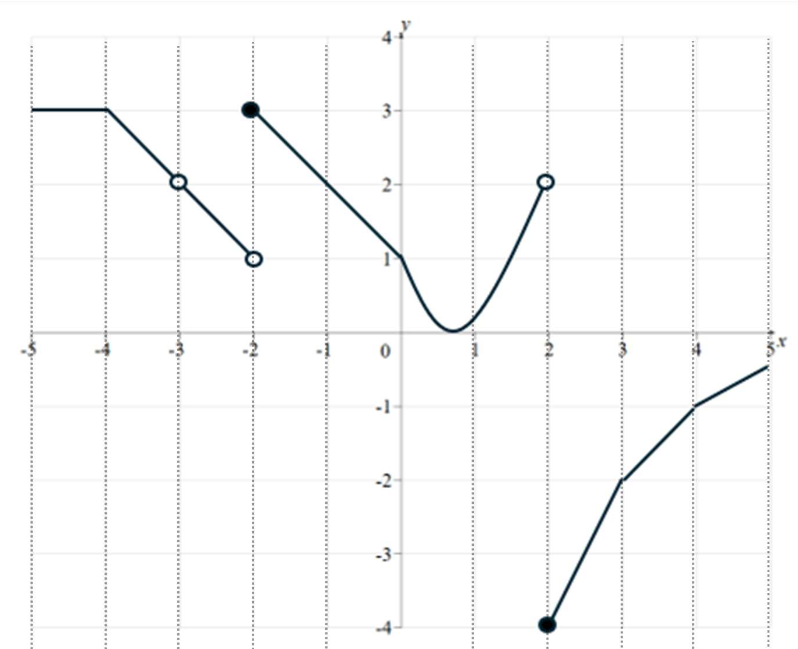
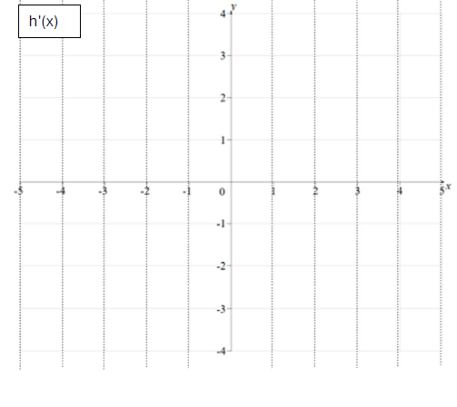
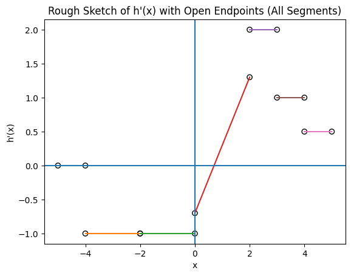
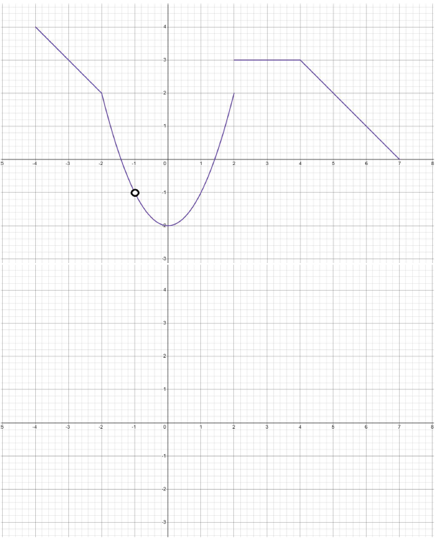
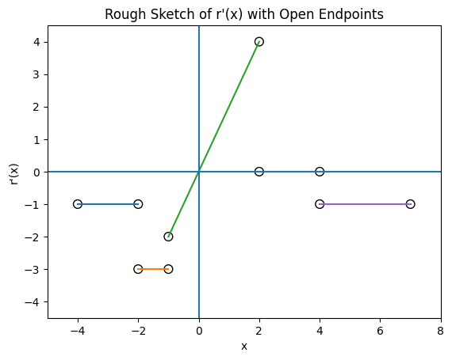
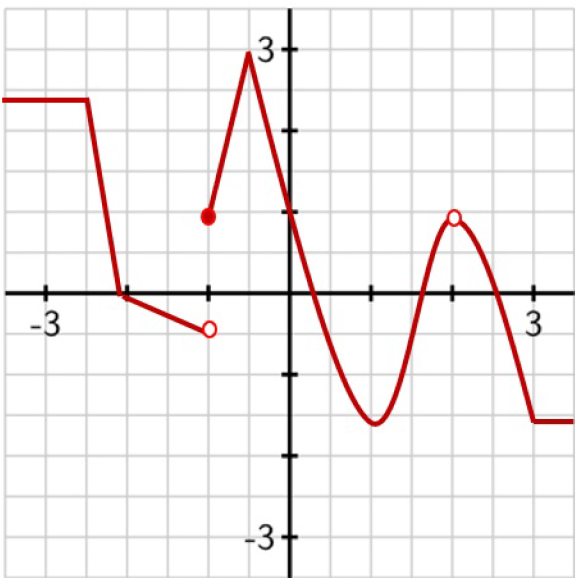
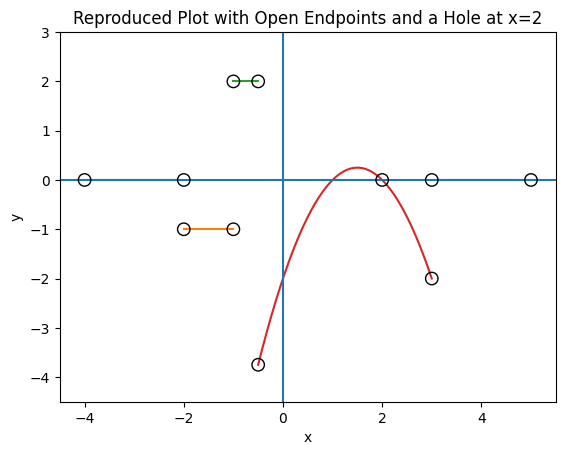

# Test Review Materials

## Test Instructions {-}
Below are the general instructions for all tests

- You will get a chance to **retake** this. Your **highest** score counts toward your final grade.  
- Follow the guidance for each part and **show all work** for full credit.  
- **Non-graphical calculators** are allowed.  
- **One page (two sides)** of handwritten (or font size 8) notes are allowed.
- The equation sheet from the textbook is included as part of the test pack (it doesn't count as note pages)

# Test1 Review Material {-}

Below are resources to help you practice and prepare for the tests in this course
Test 1 will cover the material covered in Chapter 3 of this textbook.

## Multiple Choice {-}

### **A. Limits and Continuity** {-}

#### 1. Which statement is sufficient to conclude that \(\lim_{x\to a} f(x)\) exists? {-}

A. \(f(a)\) is defined  
B. \(\lim_{x\to a^-} f(x)\) and \(\lim_{x\to a^+} f(x)\) both exist and are equal  
C. \(f(a)=0\)  
D. \(f\) is differentiable at \(x=a\)

<strong>Hint</strong>

A two-sided limit depends on what happens from both sides of \(a\), not just on the function value at \(a\).

<strong>Answer with justification</strong>

**Answer: B**

A two-sided limit exists when the **left-hand** and **right-hand** limits both exist and are equal.  
- A is not enough because a function can be defined at \(a\) even when the limit does not exist.  
- C is irrelevant.  
- D is stronger than needed; differentiability implies continuity, but a limit can exist even if the function is not differentiable.

---

#### 2. Evaluate \(\lim_{x\to 3}\dfrac{x^2-9}{x-3}\). {-}

A. \(0\)  
B. \(3\)  
C. \(6\)  
D. Does not exist

<strong>Hint</strong>

Factor the numerator before substituting.

<strong>Answer with justification</strong>

**Answer: C**

\[
\frac{x^2-9}{x-3}=\frac{(x-3)(x+3)}{x-3}=x+3 \quad (x\ne 3)
\]

So,

\[
\lim_{x\to 3}\frac{x^2-9}{x-3}=\lim_{x\to 3}(x+3)=6
\]

A common mistake is plugging in \(x=3\) too early and getting \(0/0\), which is indeterminate, not the final answer.

---

#### 3. A function \(f\) satisfies \(\lim_{x\to 2} f(x)=4\), but \(f(2)=10\). Which statement is true? {-}

A. \(f\) is continuous at \(x=2\)  
B. \(f\) is differentiable at \(x=2\)  
C. \(f\) is not continuous at \(x=2\)  
D. The limit does not exist

<strong>Hint</strong>

Compare the function value to the limit.

<strong>Answer with justification</strong>

**Answer: C**

A function is continuous at \(x=2\) only if:

\[
\lim_{x\to 2}f(x)=f(2)
\]

Here,

\[
\lim_{x\to 2}f(x)=4 \ne 10=f(2)
\]

So the function is **not continuous** at \(x=2\). If a function is not continuous, it also cannot be differentiable there.

---

#### 4. For the piecewise function {-}
\[
f(x)=
\begin{cases}
2x+3,& x<1\\
5,& x=1\\
x^2+1,& x>1
\end{cases}
\]
which statement is correct?

A. \(f\) is continuous and differentiable at \(x=1\)  
B. \(f\) is continuous but not differentiable at \(x=1\)  
C. \(f\) is not continuous at \(x=1\)  
D. The left-hand and right-hand limits at \(x=1\) are both 5

<strong>Hint</strong>

Compute the left-hand limit and the right-hand limit separately at \(x=1\).

<strong>Answer with justification</strong>

**Answer: C**

Left-hand limit:

\[
\lim_{x\to 1^-}(2x+3)=5
\]

Right-hand limit:

\[
\lim_{x\to 1^+}(x^2+1)=2
\]

Since the one-sided limits are not equal, the two-sided limit does not exist. Therefore, \(f\) is **not continuous** at \(x=1\), and therefore cannot be differentiable there either.

---

### **B. The Limit Definition of the Derivative** {-}

#### 5. The derivative {-}
\[
f'(x)=\lim_{h\to 0}\frac{f(x+h)-f(x)}{h}
\]
represents which idea?

A. Average rate of change over an interval  
B. Instantaneous rate of change at a point  
C. The value of the function at \(x\)  
D. The second derivative

<strong>Hint</strong>

The limit shrinks the interval width \(h\) toward zero.

<strong>Answer with justification</strong>

**Answer: B**

The derivative is the **instantaneous rate of change** at a point.  
- A describes the difference quotient before taking the limit.  
- C is just \(f(x)\).  
- D refers to the derivative of the derivative.

---

#### 6. Using the limit definition, what is \(f'(x)\) for \(f(x)=x^2+2x\)? {-}

A. \(x+2\)  
B. \(2x+2\)  
C. \(2x\)  
D. \(x^2\)

<strong>Hint</strong>

Expand \(f(x+h)\), subtract \(f(x)\), divide by \(h\), then take the limit.

<strong>Answer with justification</strong>

**Answer: B**

Using the limit definition,

\[
f(x+h)=(x+h)^2+2(x+h)=x^2+2xh+h^2+2x+2h
\]

Then:

\[
f(x+h)-f(x)=2xh+h^2+2h
\]

Divide by \(h\):

\[
\frac{f(x+h)-f(x)}{h}=2x+h+2
\]

Take the limit as \(h\to 0\):

\[
f'(x)=2x+2
\]

A common mistake is forgetting the derivative of the \(2x\) term.

---

#### 7. Using the limit definition, what is \(f'(x)\) for \(f(x)=\frac{1}{x}\)? {-}

A. \(\frac{1}{x^2}\)  
B. \(-\frac{1}{x}\)  
C. \(-\frac{1}{x^2}\)  
D. \(\frac{1}{x}\)

<strong>Hint</strong>

Combine the fractions in \(f(x+h)-f(x)\) before dividing by \(h\).

<strong>Answer with justification</strong>

**Answer: C**

Using the definition:

\[
\frac{\frac{1}{x+h}-\frac{1}{x}}{h}
=
\frac{\frac{x-(x+h)}{x(x+h)}}{h}
=
\frac{-h}{h\,x(x+h)}
=
-\frac{1}{x(x+h)}
\]

Taking the limit \(h\to 0\):

\[
f'(x)=-\frac{1}{x^2}
\]

The negative sign is a common place for mistakes.

---

#### 8. What is \(f'(a)\) for \(f(x)=x^2+2x\)? {-}

A. \(a^2+2\)  
B. \(2a+2\)  
C. \(2a\)  
D. \(a+2\)

<strong>Hint</strong>

First find the derivative formula, then evaluate it at \(x=a\).

<strong>Answer with justification</strong>

**Answer: B**

Since

\[
f'(x)=2x+2
\]

then

\[
f'(a)=2a+2
\]

A common misconception is to substitute \(a\) into the original function instead of the derivative.

---

### **C. Average and Instantaneous Rate of Change** {-}

#### 9. Let \(s(t)=2t^2+5t\). What is the average velocity on \([0,4]\)? {-}

A. \(7\)  
B. \(13\)  
C. \(17\)  
D. \(52\)

<strong>Hint</strong>

Use \(\dfrac{s(4)-s(0)}{4-0}\), not just \(s(4)\).

<strong>Answer with justification</strong>

**Answer: B**

\[
s(4)=2(4)^2+5(4)=32+20=52
\]

\[
s(0)=0
\]

Average velocity:

\[
\frac{52-0}{4}=13
\]

Choice D is the position at \(t=4\), not the average velocity.

---

#### 10. Let \(s(t)=2t^2+5t\). What is the instantaneous velocity at \(t=3\)? {-}

A. \(13\)  
B. \(17\)  
C. \(23\)  
D. \(33\)

<strong>Hint</strong>

Instantaneous velocity is the derivative of position.

<strong>Answer with justification</strong>

**Answer: B**

\[
s'(t)=4t+5
\]

So,

\[
s'(3)=4(3)+5=17
\]

A common confusion is mixing this with the average velocity from another interval.

---

#### 11. A river monitoring station records the height of the water surface, \(h(t)\), over time during a storm. Which statement best compares the **average rate of change** and the **instantaneous rate of change** of water level? {-}

A. They are always equal  
B. Average rate of change uses two times over an interval; instantaneous rate of change uses a limit at one time  
C. Instantaneous rate of change is always larger  
D. Average rate of change only applies when the water level changes at a constant rate

<strong>Hint</strong>

Think about the difference between measuring how much the water level changes over several hours versus how fast it is changing at one exact moment.

<strong>Answer with justification</strong>

**Answer: B**

The **average rate of change** of water level over a time interval is:

\[
\frac{h(t+h)-h(t)}{h}
\]

This tells you how much the water level changed on average over that period.

The **instantaneous rate of change** is:

\[
\lim_{h\to0}\frac{h(t+h)-h(t)}{h}
\]

This tells you how fast the water level is rising or falling at one exact moment.

They are not always equal, and average rate of change does not require the water level to change at a constant rate.

---

#### 12. For \(f(x)=x^3-2x+1\), what is \(f'(x)\)? {-}

A. \(3x^2-2\)  
B. \(x^2-2\)  
C. \(3x^2+1\)  
D. \(3x-2\)

<strong>Hint</strong>

Differentiate each term separately.

<strong>Answer with justification</strong>

**Answer: A**

\[
\frac{d}{dx}(x^3)=3x^2,\qquad \frac{d}{dx}(-2x)=-2,\qquad \frac{d}{dx}(1)=0
\]

So,

\[
f'(x)=3x^2-2
\]

Choice D is a common power-rule mistake.

---

#### 13. For \(f(x)=x^3-2x+1\), where does \(f'(x)=0\)? {-}

A. \(x=\pm \sqrt{2}\)  
B. \(x=\pm \sqrt{\frac{2}{3}}\)  
C. \(x=\pm \frac{2}{3}\)  
D. \(x=\frac{2}{3}\)

<strong>Hint</strong>

Set \(3x^2-2=0\) and solve carefully.

<strong>Answer with justification</strong>

**Answer: B**

\[
3x^2-2=0
\]

\[
3x^2=2
\]

\[
x^2=\frac{2}{3}
\]

\[
x=\pm \sqrt{\frac{2}{3}}
\]

Choice A forgets the coefficient 3.

---

### **D. Graphical Reasoning** {-}

#### 14. If a graph has a sharp corner at \(x=2\), then: {-}

A. \(f(2)\) does not exist  
B. \(f'(2)=0\)  
C. \(f'(2)\) does not exist  
D. The limit at \(x=2\) does not exist

<strong>Hint</strong>

A corner can occur on a continuous graph.

<strong>Answer with justification</strong>

**Answer: C**

At a sharp corner, the left-hand and right-hand slopes are different, so there is no single derivative value. The function can still be continuous there, so A and D are not necessarily true.

---

#### 15. If \(f'(x)>0\) on an interval, what does this mean about \(f(x)\) on that interval? {-}

A. \(f(x)\) is decreasing  
B. \(f(x)\) is increasing  
C. \(f(x)\) is concave up  
D. \(f(x)\) has a local minimum everywhere

<strong>Hint</strong>

The sign of the first derivative tells you about increasing versus decreasing.

<strong>Answer with justification</strong>

**Answer: B**

If \(f'(x)>0\), then the slope is positive, so \(f(x)\) is increasing on that interval. Concavity is determined by \(f''(x)\), not \(f'(x)\).

---

#### 16. If \(f'(x)\) changes from positive to negative at \(x=a\), then \(f(x)\) has a: {-}

A. Local minimum at \(x=a\)  
B. Local maximum at \(x=a\)  
C. Point of inflection at \(x=a\)  
D. Vertical tangent at \(x=a\)

<strong>Hint</strong>

Think about the graph rising before \(a\) and falling after \(a\).

<strong>Answer with justification</strong>

**Answer: B**

If \(f'(x)\) changes from positive to negative, then the function changes from increasing to decreasing, which means \(f(x)\) has a **local maximum** at \(x=a\).

---

### **E. Second Derivatives and Motion** {-}

#### 17. For \(f(x)=x^3-3x^2+2\), what is \(f''(x)\)? {-}

A. \(3x^2-6x\)  
B. \(6x-6\)  
C. \(6x\)  
D. \(3x-6\)

<strong>Hint</strong>

Differentiate twice: once for \(f'(x)\), then again.

<strong>Answer with justification</strong>

**Answer: B**

First derivative:

\[
f'(x)=3x^2-6x
\]

Second derivative:

\[
f''(x)=6x-6
\]

Choice A is the first derivative, not the second.

---

## Short Answer {-}

### **Limits and Continuity** {-}

#### 1. Explain how to test if a **limit** exists at a point on a function. {-}

<strong>Solution</strong>

To test whether \(\lim_{x \to a} f(x)\) exists:

- Evaluate the **left-hand limit**: \(\lim_{x \to a^-} f(x)\)
- Evaluate the **right-hand limit**: \(\lim_{x \to a^+} f(x)\)

The limit exists if:

- Both one-sided limits exist, and  
- They are equal

If they are not equal, the limit does not exist.

Graphically:
- The function must approach the same value from both sides of \(x=a\).

---

#### 2. Explain the conditions under which a limit can **fail to exist**. {-}

<strong>Solution</strong>

A limit can fail to exist if:

1. The left-hand and right-hand limits are **not equal** (jump discontinuity)  
2. The function increases or decreases without bound (infinite limit)  
3. The function oscillates and does not approach a single value  

Each of these prevents the function from approaching one consistent value.

---

#### 3. Give an example of a function where the **limit exists** but the function is **not continuous** at that point. {-}

<strong>Solution</strong>

Example:
\[
f(x)=
\begin{cases}
x^2, & x \ne 2 \\
10, & x = 2
\end{cases}
\]

\[
\lim_{x \to 2} f(x)=4
\]

But \(f(2)=10\), so the function is not continuous.

Continuity fails because:

- The limit exists  
- The function is defined  
- But the values are not equal

---

#### 4. State the three **conditions for continuity** at a point. {-}

<strong>Solution</strong>

A function is continuous at \(x=a\) if:

1. \(f(a)\) is defined  
2. \(\lim_{x \to a} f(x)\) exists  
3. \(\lim_{x \to a} f(x) = f(a)\)

To test:

- Check the function value  
- Compute the limit  
- Compare them

---

#### 5. Provide an example of a **limit that does not exist** and explain why. {-}

<strong>Solution</strong>

Example:
\[
f(x)=
\begin{cases}
1, & x < 0 \\
-1, & x > 0
\end{cases}
\]

At \(x=0\):

- Left-hand limit = 1  
- Right-hand limit = -1  

Since they are not equal, the limit does not exist.

---

### **Rates of Change and Tangent Lines** {-}

#### 6. Explain the relationship between a **secant line** and an **average rate of change**. {-}

<strong>Solution</strong>

A secant line connects two points on a curve.

Its slope is:
\[
\frac{f(b)-f(a)}{b-a}
\]

This represents the **average rate of change** over an interval.

It tells how much the function changes between two points.

---

#### 7. How is a **tangent line** related to **instantaneous rate of change**? {-}

<strong>Solution</strong>

A tangent line touches the graph at a single point.

Its slope is the **instantaneous rate of change**, given by:
\[
f'(x)
\]

It describes how fast the function is changing at exactly one point.

---

#### 8. Compare **secant** and **tangent** lines. {-}

<strong>Solution</strong>

- Secant line → average rate of change over an interval  
- Tangent line → instantaneous rate of change at a point  

As the two points of a secant line move closer together, the secant line approaches the tangent line.

---

#### 9. What is the difference between **average velocity** and **instantaneous velocity**? {-}

<strong>Solution</strong>

- Average velocity:
\[
\frac{s(t+h)-s(t)}{h}
\]

- Instantaneous velocity:
\[
\lim_{h \to 0}\frac{s(t+h)-s(t)}{h}
\]

Instantaneous velocity is the derivative of position.

---

#### 10. How can the slope of a tangent line be **negative** even if the function values are positive? {-}

<strong>Solution</strong>

The slope describes how the function is changing, not its value.

A function can be:

- Above the x-axis (positive values)  
- But decreasing  

So the slope can be negative while outputs remain positive.

---

### **Differentiability and Smoothness** {-}

#### 11. State the conditions required for a function to be **differentiable** at a point. {-}

<strong>Solution</strong>

A function is differentiable at \(x=a\) if:

1. It is **continuous** at that point  
2. It is **smooth**, meaning:

   - No corners  
   - No cusps  
   - No vertical tangents  

Additionally:

- Left-hand and right-hand derivatives must exist and be equal

---

#### 12. Give an example of a function with a **corner or cusp**, and explain why the derivative does not exist. {-}

<strong>Solution</strong>

Example:
\[
f(x)=|x|
\]

At \(x=0\):

- Left-hand slope = -1  
- Right-hand slope = +1  

Since they are not equal, the derivative does not exist.

There is no single tangent line at that point.

---

#### 13. Identify two scenarios where a function is **not differentiable**. {-}

<strong>Solution</strong>

1. **Corner or cusp**  
   Example: \(f(x)=|x|\)

2. **Discontinuity**  
   Example: jump function  

A function must be continuous and smooth to be differentiable.

---

#### 14. How can a function be **continuous but not differentiable**? {-}

<strong>Solution</strong>

A function can be continuous but have a **corner or cusp**.

Example:
\[
f(x)=|x|
\]

- Continuous at \(x=0\)  
- But slopes from left and right differ  

So the derivative does not exist.

---

#### 15. How do you test if a function is **smooth**? {-}

<strong>Solution</strong>

Compute:
- Left-hand derivative  
- Right-hand derivative  

If both:
- Exist  
- Are equal  

Then the function is smooth (differentiable).

---

#### 16. What is required for a function’s **derivative to exist at all points**? {-}

<strong>Solution</strong>

The function must be:

- Continuous everywhere  
- Smooth everywhere  

This means:

- No jumps  
- No corners  
- No cusps  
- No vertical tangents

---

### **Derivatives and Interpretation** {-}

#### 17. Write the **limit definition** of the derivative. {-}

<strong>Solution</strong>

\[
f'(x)=\lim_{h \to 0}\frac{f(x+h)-f(x)}{h}
\]

It represents the instantaneous rate of change.

---

#### 18. What does it mean when \( f'(x)=0 \)? {-}

<strong>Solution</strong>

It means:

- The slope of the tangent line is zero  
- The tangent line is horizontal  

These are **critical points**, which may be:

- Local maxima  
- Local minima  
- Or neither

---

#### 19. What do points where \(f'(x)=0\) represent on a graph? {-}

<strong>Solution</strong>

They are **critical points** where the graph is flat.

They often correspond to peaks or valleys.

---

#### 20. How do you find the **equation of a tangent line** at a point? {-}

<strong>Solution</strong>

Steps:

1. Find \(f'(x)\)  
2. Evaluate slope: \(f'(a)\)  
3. Find point: \((a,f(a))\)  
4. Use:
\[
y - f(a) = f'(a)(x - a)
\]

---

### **Second Derivatives and Behavior** {-}

#### 21. How is the **second derivative** related to the function? {-}

<strong>Solution</strong>

- \(f'(x)\): rate of change  
- \(f''(x)\): change in the rate of change  

It measures how the slope is changing.

---

#### 22. What does the **second derivative** tell you about a function? {-}

<strong>Solution</strong>

- \(f''(x) > 0\): concave up  
- \(f''(x) < 0\): concave down  

It describes how the graph bends.

## Problems  {-}

#### Problem 1 {-}

Let \( f(x)=10x^{2}+e^{x} \).

1. Find the **average velocity** on the interval \([2,6]\).  
2. **Estimate**, using the **limit definition** of the derivative, the **instantaneous velocity** at \(x=4\).

<strong>Solution</strong>

For \(f(x)=10x^2+e^x\):

1. **Average velocity on \([2,6]\):**

\[
\text{Average velocity}=\frac{f(6)-f(2)}{6-2}
\]

First compute the function values:

\[
f(6)=10(6)^2+e^6=360+e^6
\]

\[
f(2)=10(2)^2+e^2=40+e^2
\]

So,

\[
\frac{f(6)-f(2)}{4}
=\frac{(360+e^6)-(40+e^2)}{4}
=\frac{320+e^6-e^2}{4}
\]

\[
\boxed{\text{Average velocity}=80+\frac{e^6-e^2}{4}}
\]

2. **Instantaneous velocity at \(x=4\) using the limit definition:**

Use

\[
f'(4)=\lim_{h\to 0}\frac{f(4+h)-f(4)}{h}
\]

Compute each part:

\[
f(4+h)=10(4+h)^2+e^{4+h}
\]

Expand:

\[
10(4+h)^2=10(16+8h+h^2)=160+80h+10h^2
\]

So,

\[
f(4+h)=160+80h+10h^2+e^{4+h}
\]

Also,

\[
f(4)=10(4)^2+e^4=160+e^4
\]

Now form the difference quotient:

\[
\frac{f(4+h)-f(4)}{h}
=
\frac{160+80h+10h^2+e^{4+h}-(160+e^4)}{h}
\]

\[
=
\frac{80h+10h^2+e^{4+h}-e^4}{h}
\]

\[
=
80+10h+\frac{e^{4+h}-e^4}{h}
\]

Taking the limit as \(h\to 0\):

\[
f'(4)=80+e^4
\]

So the instantaneous velocity at \(x=4\) is

\[
\boxed{80+e^4}
\]

---

#### Problem 2 {-}

Using the **limit definition** of the derivative, let \( f(x)=x^{2}-4x \).

1. Find an expression for \(f'(x)\).  
2. Find the derivative at \(x=3\).  
3. Find the **equation of the tangent line** at \(x=3\).  
4. Using \(f'(x)\), determine where the **rate of change** of \(f(x)\) is **zero**.  
5. Explain how you would **adapt the limit definition** of a **first derivative** to find the **second derivative**.  
   *(Do not actually compute \(f''(x)\).)*  
6. In words, what does the **second derivative** mean?

<strong>Solution</strong>

For \(f(x)=x^2-4x\):

1. **Find \(f'(x)\) using the limit definition:**

\[
f'(x)=\lim_{h\to 0}\frac{f(x+h)-f(x)}{h}
\]

First compute:

\[
f(x+h)=(x+h)^2-4(x+h)
\]

\[
= x^2+2xh+h^2-4x-4h
\]

Now subtract \(f(x)=x^2-4x\):

\[
f(x+h)-f(x)=x^2+2xh+h^2-4x-4h-(x^2-4x)
\]

\[
=2xh+h^2-4h
\]

So,

\[
\frac{f(x+h)-f(x)}{h}=\frac{2xh+h^2-4h}{h}=2x+h-4
\]

Take the limit:

\[
f'(x)=\lim_{h\to 0}(2x+h-4)=2x-4
\]

\[
\boxed{f'(x)=2x-4}
\]

2. **Find the derivative at \(x=3\):**

\[
f'(3)=2(3)-4=2
\]

\[
\boxed{f'(3)=2}
\]

3. **Find the equation of the tangent line at \(x=3\):**

First find the point on the curve:

\[
f(3)=3^2-4(3)=9-12=-3
\]

So the point is \((3,-3)\), and the slope is \(2\).

Use point-slope form:

\[
y-(-3)=2(x-3)
\]

\[
y+3=2x-6
\]

\[
y=2x-9
\]

\[
\boxed{y=2x-9}
\]

4. **Where is the rate of change zero?**

Set \(f'(x)=0\):

\[
2x-4=0
\]

\[
2x=4
\]

\[
x=2
\]

So the rate of change is zero at

\[
\boxed{x=2}
\]

5. **How to adapt the limit definition to find the second derivative:**

The second derivative is the derivative of the first derivative.

So once you have \(f'(x)\), you apply the same limit-definition idea again:

\[
f''(x)=\lim_{h\to 0}\frac{f'(x+h)-f'(x)}{h}
\]

This is the same structure as the first derivative, but now it is applied to \(f'(x)\) instead of \(f(x)\).

6. **Meaning of the second derivative:**

The second derivative tells how the **rate of change** is changing.

In words:

- It measures how the slope of the function changes
- It helps describe **concavity**
- It shows whether the graph is bending upward or downward

---

#### Problem 3 {-}

Let \( g(x) = 7x^2 \).

1. Compute the **average rate of change** on the interval \([1,4]\).  
2. Estimate the **instantaneous rate of change** at \(x = 2\) using the **limit definition**.

<strong>Solution</strong>

For \(g(x)=7x^2\):

1. **Average rate of change on \([1,4]\):**

\[
\frac{g(4)-g(1)}{4-1}
\]

Compute the function values:

\[
g(4)=7(4)^2=7(16)=112
\]

\[
g(1)=7(1)^2=7
\]

So,

\[
\frac{112-7}{3}=\frac{105}{3}=35
\]

\[
\boxed{35}
\]

2. **Instantaneous rate of change at \(x=2\) using the limit definition:**

\[
g'(2)=\lim_{h\to 0}\frac{g(2+h)-g(2)}{h}
\]

Compute:

\[
g(2+h)=7(2+h)^2
\]

\[
=7(4+4h+h^2)=28+28h+7h^2
\]

Also,

\[
g(2)=7(2)^2=28
\]

Now form the difference quotient:

\[
\frac{g(2+h)-g(2)}{h}
=
\frac{(28+28h+7h^2)-28}{h}
\]

\[
=\frac{28h+7h^2}{h}=28+7h
\]

Take the limit:

\[
g'(2)=\lim_{h\to 0}(28+7h)=28
\]

\[
\boxed{28}
\]

---

#### Problem 4 {-}

Let \( f(x) = x^2 + 2x \). Using the **limit definition**:

1. Derive the formula for \( f'(x) \).  
2. Calculate the **derivative** at \(x = -1\).  
3. Write the **equation of the tangent line** to \(f(x)\) at \(x = -1\).  
4. Briefly describe how the **limit definition** could be used to find the **second derivative**.  
   Find an expression for \( f''(x) \).  
5. Explain what the **second derivative** tells you about the **behavior of the function**.

<strong>Solution</strong>

For \(f(x)=x^2+2x\):

1. **Derive \(f'(x)\) using the limit definition:**

\[
f'(x)=\lim_{h\to 0}\frac{f(x+h)-f(x)}{h}
\]

First compute:

\[
f(x+h)=(x+h)^2+2(x+h)
\]

\[
= x^2+2xh+h^2+2x+2h
\]

Now subtract \(f(x)=x^2+2x\):

\[
f(x+h)-f(x)=x^2+2xh+h^2+2x+2h-(x^2+2x)
\]

\[
=2xh+h^2+2h
\]

So,

\[
\frac{f(x+h)-f(x)}{h}=\frac{2xh+h^2+2h}{h}=2x+h+2
\]

Take the limit:

\[
f'(x)=\lim_{h\to 0}(2x+h+2)=2x+2
\]

\[
\boxed{f'(x)=2x+2}
\]

2. **Derivative at \(x=-1\):**

\[
f'(-1)=2(-1)+2=0
\]

\[
\boxed{f'(-1)=0}
\]

3. **Equation of the tangent line at \(x=-1\):**

First find the point:

\[
f(-1)=(-1)^2+2(-1)=1-2=-1
\]

So the point is \((-1,-1)\), and the slope is \(0\).

Use point-slope form:

\[
y-(-1)=0(x-(-1))
\]

\[
y+1=0
\]

\[
y=-1
\]

\[
\boxed{y=-1}
\]

4. **How to use the limit definition to find the second derivative, and find \(f''(x)\):**

The second derivative is the derivative of \(f'(x)\), so use

\[
f''(x)=\lim_{h\to 0}\frac{f'(x+h)-f'(x)}{h}
\]

Since \(f'(x)=2x+2\),

\[
f'(x+h)=2(x+h)+2=2x+2h+2
\]

Then

\[
\frac{f'(x+h)-f'(x)}{h}
=
\frac{(2x+2h+2)-(2x+2)}{h}
\]

\[
=\frac{2h}{h}=2
\]

So,

\[
f''(x)=\lim_{h\to 0}2=2
\]

\[
\boxed{f''(x)=2}
\]

5. **What the second derivative tells you:**

The second derivative describes how the slope is changing.

Since

\[
f''(x)=2>0
\]

the graph is **concave up** everywhere.

This means:

- Slopes are increasing
- The graph bends upward
- Any critical point would be a local minimum

#### Problem 5 {-}

Let \( s(t) = 16t^2 + e^t \).

1. Find the **average velocity** on the interval \([1, 10]\).  
2. Estimate the **instantaneous velocity** at \( t = 5 \).

<strong>Solution</strong>

For \(s(t)=16t^2+e^t\):

1. **Average velocity on \([1,10]\):**

\[
\text{Average velocity}=\frac{s(10)-s(1)}{10-1}
\]

Compute the function values:

\[
s(10)=16(10)^2+e^{10}=1600+e^{10}
\]

\[
s(1)=16(1)^2+e=e^1+16=16+e
\]

So,

\[
\frac{s(10)-s(1)}{9}
=
\frac{(1600+e^{10})-(16+e)}{9}
\]

\[
=
\frac{1584+e^{10}-e}{9}
\]

Thus, the average velocity is

\[
\boxed{\frac{1584+e^{10}-e}{9}}
\]

2. **Instantaneous velocity at \(t=5\):**

Using the limit definition,

\[
s'(5)=\lim_{h\to 0}\frac{s(5+h)-s(5)}{h}
\]

First compute:

\[
s(5+h)=16(5+h)^2+e^{5+h}
\]

Expand the quadratic term:

\[
16(5+h)^2=16(25+10h+h^2)=400+160h+16h^2
\]

So,

\[
s(5+h)=400+160h+16h^2+e^{5+h}
\]

Also,

\[
s(5)=16(5)^2+e^5=400+e^5
\]

Now form the difference quotient:

\[
\frac{s(5+h)-s(5)}{h}
=
\frac{400+160h+16h^2+e^{5+h}-(400+e^5)}{h}
\]

\[
=
\frac{160h+16h^2+e^{5+h}-e^5}{h}
\]

\[
=
160+16h+\frac{e^{5+h}-e^5}{h}
\]

Taking the limit as \(h\to 0\):

\[
s'(5)=160+e^5
\]

So the instantaneous velocity at \(t=5\) is

\[
\boxed{160+e^5}
\]

---

#### Problem 6 {-}

Using the **limit definition of the derivative**, let \( f(x) = x^2 + 3x \).

1. Find an expression for \( f'(x) \).  
2. Find the **derivative** at \( f'(2) \).  
3. Find the **equation of the tangent line** at \( x = 2 \).  
4. Using \( f'(x) \), determine where the **rate of change** of \( f(x) \) is **zero**.

<strong>Solution</strong>

For \(f(x)=x^2+3x\):

1. **Find \(f'(x)\) using the limit definition:**

\[
f'(x)=\lim_{h\to 0}\frac{f(x+h)-f(x)}{h}
\]

First compute:

\[
f(x+h)=(x+h)^2+3(x+h)
\]

\[
= x^2+2xh+h^2+3x+3h
\]

Now subtract \(f(x)=x^2+3x\):

\[
f(x+h)-f(x)=x^2+2xh+h^2+3x+3h-(x^2+3x)
\]

\[
=2xh+h^2+3h
\]

So,

\[
\frac{f(x+h)-f(x)}{h}
=
\frac{2xh+h^2+3h}{h}
=2x+h+3
\]

Take the limit:

\[
f'(x)=\lim_{h\to 0}(2x+h+3)=2x+3
\]

\[
\boxed{f'(x)=2x+3}
\]

2. **Find \(f'(2)\):**

\[
f'(2)=2(2)+3=7
\]

\[
\boxed{f'(2)=7}
\]

3. **Find the equation of the tangent line at \(x=2\):**

First find the point on the graph:

\[
f(2)=2^2+3(2)=4+6=10
\]

So the point is \((2,10)\), and the slope is \(7\).

Use point-slope form:

\[
y-10=7(x-2)
\]

\[
y-10=7x-14
\]

\[
y=7x-4
\]

\[
\boxed{y=7x-4}
\]

4. **Where is the rate of change zero?**

Set \(f'(x)=0\):

\[
2x+3=0
\]

\[
2x=-3
\]

\[
x=-\frac{3}{2}
\]

So the rate of change is zero at

\[
\boxed{x=-\frac{3}{2}}
\]

## Sketching Practice {-}

### Sketch 1 {-}

The **graph of a function** \(h(x)\) is shown below. Use it to answer the questions.

{fig.alt="Graph of a piecewise function showing multiple segments with both continuous curves and line segments. On the left, a horizontal segment transitions to a downward sloping line with open and closed circles indicating included and excluded endpoints. In the middle, a smooth curve forms a U-shaped section with a minimum near x equals 1 and an open circle at the right end of the segment. On the right, a separate increasing line segment begins at a filled point below the x-axis and rises to the right. The graph includes several discontinuities and changes in behavior across different intervals."}

1. **(2 pts)** Identify all points where \(h(x)\) has **no limit**. Explain why.  
2. **(2 pts)** Identify all points where \(h(x)\) is **not continuous**. Explain why.  
3. **(2 pts)** Identify all points where \(h(x)\) is **not differentiable**. Explain why.  
4. **(4 pts)** **Roughly sketch** the derivative \(h'(x)\).

{fig.alt="Empty coordinate plane labeled h prime of x, intended for sketching the derivative of a function. The grid includes both horizontal and vertical axes with evenly spaced tick marks and values ranging approximately from negative 5 to 5 on the x-axis and negative 4 to 4 on the y-axis. No function is drawn."}

<strong>Solution</strong>

1. No limit at x= -2 and 2
2. Not continuous at x= -3,-2 and 2
3. Not smooth at -4, -3,-2,2,3,4
4. Below is a sketch of the solution - remember things don't have to be perfect, relative differences in slope, key features like zeros, and point where the function have no derivative are the most important parts to capture

{fig.alt="A graph titled “Rough Sketch of \(h'(x)\) with Open Endpoints (All Segments)” showing the derivative of a piecewise function. The horizontal axis is labeled \(x\) and the vertical axis is labeled \(h'(x)\). The graph is composed of several disconnected line segments, each with open circles at its endpoints to indicate the derivative is not defined at those boundary points. From \(x=-5\) to \(x=-4\), there is a horizontal segment at \(h'(x)=0\). From \(x=-4\) to \(x=0\), there is a horizontal segment at \(h'(x)=-1\), with open circles at \(x=-4\), \(x=-2\), and \(x=0\). From \(x=0\) to \(x=2\), there is an increasing straight line segment, starting below zero near \(h'(0)\approx -0.7\) and rising to about \(h'(2)\approx 1.3\), representing a changing slope. From \(x=2\) to \(x=3\), there is a horizontal segment at \(h'(x)=2\), followed by a horizontal segment at \(h'(x)=1\) from \(x=3\) to \(x=4\), and another horizontal segment at \(h'(x)=0.5\) from \(x=4\) to \(x=5\), all with open endpoints. The graph shows gaps at \(x=-4\), \(-2\), \(0\), \(2\), \(3\), and \(4\), where the derivative is undefined."}

---

#### Sketch 2 {-}

The **graph of the function** \( r(x) \) is shown below.

1. **(2 pts)** List all \(x\)-values where \(r(x)\) has **no limit**. Explain.  
2. **(2 pts)** List all points where \(r(x)\) is **not continuous**. Explain why.  
3. **(2 pts)** Identify all points where \(r(x)\) is **not differentiable**. Provide reasons.  
4. **(4 pts)** Sketch a graph of the **derivative \(r'(x)\)**, based on the shape of \(r(x)\).

{fig.alt="Graph of a function with multiple pieces. On the left, a decreasing line segment transitions into a steeper downward segment, then connects to a smooth upward-opening parabola with a minimum near x equals 0. An open circle appears on the left side of the parabola indicating a hole in the graph. To the right, a separate horizontal line segment at about y equals 3 extends for a short interval, followed by a downward sloping line that decreases toward the right. The graph shows changes in slope, curvature, and continuity across different intervals."}

<strong>Solution</strong>

1. No limit at x= 2
2. Not continuous at x= -1 and 2
3. Not differentialble at x= -2, -1, 2 and 4
4. Below is a sketch of the solution - remember things don't have to be perfect, relative differences in slope, key features like zeros, and point where the function have no derivative are the most important parts to capture

{fig.alt="A graph titled “Rough Sketch of \(r'(x)\) with Open Endpoints” showing the derivative of a piecewise function. The horizontal axis is labeled \(x\) and the vertical axis is labeled \(r'(x)\). The graph consists of several disconnected segments with open circles at all endpoints to indicate the derivative is not defined at those boundary points. From \(x=-4\) to \(x=-2\), there is a horizontal line at \(r'(x)=-1\), open at both ends. From \(x=-2\) to \(x=-1\), there is a horizontal line at \(r'(x)=-3\), also open at both ends. From \(x=-1\) to \(x=2\), there is an increasing straight line representing \(r'(x)=2x\), starting near \((-1,-2)\), passing through the origin \((0,0)\), and rising to about \((2,4)\), with open circles at both endpoints. From \(x=2\) to \(x=4\), there is a horizontal line at \(r'(x)=0\), open at both ends. From \(x=4\) to \(x=7\), there is a horizontal line at \(r'(x)=-1\), also open at both ends. The graph shows gaps at \(x=-2\), \(-1\), \(2\), and \(4\), where the derivative is undefined."}

#### Sketch 3 {-}

The **graph of a function** \( g(x) \) is shown below. Use it to answer the following questions.  

1. **(2 pts)** Identify all points where \( g(x) \) has **no limit**. Explain why.  
2. **(2 pts)** Identify all points where \( g(x) \) is **not continuous**. Explain why.  
3. **(2 pts)** Identify all points where \( g(x) \) is **not differentiable**. Explain why.  
4. **(4 pts)** **Roughly sketch** the **derivative** \( g'(x) \).

{fig.alt="Graph of a piecewise function drawn in red on a coordinate grid. On the left, a horizontal segment transitions into a steep downward line that meets the x-axis, followed by a slanted segment ending with an open circle. Near x equals negative 1, a filled point begins a new piece that rises to a sharp peak near y equals 3, then descends steeply and continues into a smooth curve with a local minimum below the x-axis. The curve rises again to a local maximum marked with an open circle, then decreases and levels off into a short horizontal segment on the far right. The graph includes both open and closed circles indicating discontinuities and included endpoints."}

<strong>Solution</strong>

1. No limit at x= 1
2. Not continuous at x= -1 and 2
3. Not differentialble at x= -2, -1, 2 and 3
4. Below is a sketch of the solution - remember things don't have to be perfect, relative differences in slope, key features like zeros, and point where the function have no derivative are the most important parts to capture

{fig.alt="A graph of a piecewise function with multiple disconnected segments, shown on a coordinate plane with the horizontal axis labeled \(x\) and the vertical axis labeled \(y\). Each segment has open circles at both endpoints, indicating that the function is not defined at those boundary points.On the far left, from \(x=-4\) to \(x=-2\), there is a horizontal line along the x-axis at \(y=0\), with open circles at both ends. From \(x=-2\) to \(x=-1\), there is a horizontal segment at \(y=-1\), again with open endpoints. Above this, from \(x=-1\) to about \(x=-0.5\), there is a short horizontal segment at \(y=2\), also open at both ends. To the right, from approximately \(x=-0.5\) to \(x=3\), there is a smooth downward-opening curve (parabola-like), peaking near \(x=1.5\) at a value slightly above zero and decreasing toward both ends. This curved segment has open circles at both endpoints, and there is an additional open circle at \(x=2\) on the curve, indicating a hole in the function at that point.On the far right, from \(x=3\) to \(x=5\), there is another horizontal line along the x-axis at \(y=0\), with open circles at both endpoints. The graph shows clear gaps at the endpoints of each segment, as well as at \(x=2\) on the curve, emphasizing that the function is defined only on the open intervals between those points."}

---

## More Practice - These are harder {-}

### **A. Limits and Continuity** {-}

#### 1. Evaluate the following limits. {-}  
a. \( \lim_{x \to 3} \frac{x^2 - 9}{x - 3} \)  
b. \( \lim_{x \to 0} \frac{\sin(5x)}{x} \)  
c. \( \lim_{x \to 2^-} \frac{|x - 2|}{x - 2} \)

<strong>Solution</strong>

a. Factor the numerator:

\[
\frac{x^2-9}{x-3}=\frac{(x-3)(x+3)}{x-3}=x+3 \quad \text{for } x\ne 3
\]

So,

\[
\lim_{x\to 3}\frac{x^2-9}{x-3}=\lim_{x\to 3}(x+3)=6
\]

\[
\boxed{6}
\]

b. Rewrite the expression:

\[
\frac{\sin(5x)}{x}=5\cdot \frac{\sin(5x)}{5x}
\]

As \(x\to 0\), we use the standard limit \(\lim_{u\to 0}\frac{\sin u}{u}=1\). Therefore,

\[
\lim_{x\to 0}\frac{\sin(5x)}{x}=5
\]

\[
\boxed{5}
\]

c. For \(x<2\), we have \(x-2<0\), so

\[
|x-2|=-(x-2)
\]

Thus,

\[
\frac{|x-2|}{x-2}=\frac{-(x-2)}{x-2}=-1
\]

So,

\[
\lim_{x\to 2^-}\frac{|x-2|}{x-2}=-1
\]

\[
\boxed{-1}
\]

---

#### 2. For the piecewise function {-}

\[
f(x) =
\begin{cases}
2x + 3, & x < 1 \\
5, & x = 1 \\
x^2 + 1, & x > 1
\end{cases}
\]

a. Determine if \(f(x)\) is continuous at \(x = 1\).  
b. Determine if \(f(x)\) is differentiable at \(x = 1\).

<strong>Solution</strong>

To test continuity at \(x=1\), we check:

1. Is \(f(1)\) defined?  
2. Does \(\lim_{x\to 1} f(x)\) exist?  
3. Is the limit equal to \(f(1)\)?

First,

\[
f(1)=5
\]

Now compute the one-sided limits.

From the left:

\[
\lim_{x\to 1^-}f(x)=\lim_{x\to 1^-}(2x+3)=2(1)+3=5
\]

From the right:

\[
\lim_{x\to 1^+}f(x)=\lim_{x\to 1^+}(x^2+1)=1^2+1=2
\]

Since the left-hand and right-hand limits are not equal, the two-sided limit does not exist.

So:

- \(f(x)\) is **not continuous** at \(x=1\)

\[
\boxed{\text{\(f\) is not continuous at } x=1}
\]

For differentiability:

A function must first be continuous in order to be differentiable. Since \(f\) is not continuous at \(x=1\), it cannot be differentiable there.

\[
\boxed{\text{\(f\) is not differentiable at } x=1}
\]

---

#### 3. Sketch a function that is: {-}
- Continuous everywhere but **not differentiable** at \(x = 2\).  
- Discontinuous but with both **left and right limits** existing.

<strong>Solution</strong>

A good example of a function that is continuous everywhere but not differentiable at \(x=2\) is:

\[
f(x)=|x-2|
\]

Why:
- It is continuous for all \(x\)
- At \(x=2\), it has a sharp corner
- The left-hand slope is \(-1\) and the right-hand slope is \(+1\), so the derivative does not exist there

A good example of a function that is discontinuous but has both one-sided limits existing is:

\[
g(x)=
\begin{cases}
x+1, & x<2 \\
5, & x=2 \\
x+1, & x>2
\end{cases}
\]

Why:
- As \(x\to 2^-\), \(g(x)\to 3\)
- As \(x\to 2^+\), \(g(x)\to 3\)
- So both one-sided limits exist and are equal
- But \(g(2)=5\), so the function is not continuous at \(x=2\)

A sketch for the first should look like a V-shape centered at \(x=2\).  
A sketch for the second should look like a straight line with an open circle at \((2,3)\) and a filled dot at \((2,5)\).

---

### **B. The Limit Definition of the Derivative** {-}

#### 4. Using {-}
\[
f'(x) = \lim_{h \to 0} \frac{f(x+h) - f(x)}{h},
\]
find \( f'(x) \) for:  
a. \( f(x) = 3x^2 - 4x + 1 \)  
b. \( f(x) = \frac{1}{x} \)  
c. \( f(x) = \sqrt{x} \)

<strong>Solution</strong>

a. For \(f(x)=3x^2-4x+1\),

\[
f(x+h)=3(x+h)^2-4(x+h)+1
\]

\[
=3(x^2+2xh+h^2)-4x-4h+1
\]

\[
=3x^2+6xh+3h^2-4x-4h+1
\]

Now subtract \(f(x)\):

\[
f(x+h)-f(x)=\left(3x^2+6xh+3h^2-4x-4h+1\right)-(3x^2-4x+1)
\]

\[
=6xh+3h^2-4h
\]

Divide by \(h\):

\[
\frac{f(x+h)-f(x)}{h}=6x+3h-4
\]

Take the limit as \(h\to 0\):

\[
f'(x)=6x-4
\]

\[
\boxed{f'(x)=6x-4}
\]

b. For \(f(x)=\frac{1}{x}\),

\[
f(x+h)=\frac{1}{x+h}
\]

So,

\[
\frac{f(x+h)-f(x)}{h}
=
\frac{\frac{1}{x+h}-\frac{1}{x}}{h}
\]

Combine the fractions:

\[
\frac{1}{x+h}-\frac{1}{x}
=
\frac{x-(x+h)}{x(x+h)}
=
\frac{-h}{x(x+h)}
\]

So,

\[
\frac{f(x+h)-f(x)}{h}
=
\frac{-h}{h\,x(x+h)}
=
-\frac{1}{x(x+h)}
\]

Taking the limit:

\[
f'(x)=\lim_{h\to 0}\left(-\frac{1}{x(x+h)}\right)=-\frac{1}{x^2}
\]

\[
\boxed{f'(x)=-\frac{1}{x^2}}
\]

c. For \(f(x)=\sqrt{x}\),

\[
f(x+h)=\sqrt{x+h}
\]

So,

\[
\frac{f(x+h)-f(x)}{h}
=
\frac{\sqrt{x+h}-\sqrt{x}}{h}
\]

Multiply by the conjugate:

\[
\frac{\sqrt{x+h}-\sqrt{x}}{h}\cdot \frac{\sqrt{x+h}+\sqrt{x}}{\sqrt{x+h}+\sqrt{x}}
=
\frac{(x+h)-x}{h(\sqrt{x+h}+\sqrt{x})}
\]

\[
=
\frac{h}{h(\sqrt{x+h}+\sqrt{x})}
=
\frac{1}{\sqrt{x+h}+\sqrt{x}}
\]

Now take the limit:

\[
f'(x)=\frac{1}{2\sqrt{x}}
\]

\[
\boxed{f'(x)=\frac{1}{2\sqrt{x}}}
\]

---

#### 5. Compute \( f'(a) \) using the definition for \( f(x) = x^2 + 2x \). {-}

<strong>Solution</strong>

Using the definition,

\[
f'(a)=\lim_{h\to 0}\frac{f(a+h)-f(a)}{h}
\]

First compute:

\[
f(a+h)=(a+h)^2+2(a+h)
\]

\[
=a^2+2ah+h^2+2a+2h
\]

Also,

\[
f(a)=a^2+2a
\]

Now subtract:

\[
f(a+h)-f(a)=a^2+2ah+h^2+2a+2h-(a^2+2a)
\]

\[
=2ah+h^2+2h
\]

Divide by \(h\):

\[
\frac{f(a+h)-f(a)}{h}=2a+h+2
\]

Take the limit:

\[
f'(a)=\lim_{h\to 0}(2a+h+2)=2a+2
\]

\[
\boxed{f'(a)=2a+2}
\]

---

#### 6. Find the **equation of the tangent line** to \( f(x) = x^2 + 2x \) at \(x = 1\). {-}

<strong>Solution</strong>

First find the derivative:

\[
f'(x)=2x+2
\]

Now compute the slope at \(x=1\):

\[
f'(1)=2(1)+2=4
\]

Find the point on the curve:

\[
f(1)=1^2+2(1)=3
\]

So the tangent line passes through \((1,3)\) and has slope \(4\).

Use point-slope form:

\[
y-3=4(x-1)
\]

Simplify:

\[
y-3=4x-4
\]

\[
y=4x-1
\]

\[
\boxed{y=4x-1}
\]

---

### **C. Average and Instantaneous Rate of Change** {-}

#### 7. Let \( s(t) = 2t^2 + 5t \). {-}  
a. Find the **average velocity** from \(t = 0\) to \(t = 4\).  
b. Find the **instantaneous velocity** at \(t = 3\).  
c. Interpret both values.

<strong>Solution</strong>

a. Average velocity from \(t=0\) to \(t=4\):

\[
\frac{s(4)-s(0)}{4-0}
\]

Compute:

\[
s(4)=2(4)^2+5(4)=32+20=52
\]

\[
s(0)=0
\]

So,

\[
\frac{52-0}{4}=13
\]

\[
\boxed{13}
\]

b. Instantaneous velocity is the derivative:

\[
s'(t)=4t+5
\]

At \(t=3\):

\[
s'(3)=4(3)+5=17
\]

\[
\boxed{17}
\]

c. Interpretation:

- The **average velocity** of \(13\) means the object’s position changed by an average of 13 units per unit time from \(t=0\) to \(t=4\).
- The **instantaneous velocity** of \(17\) means that at exactly \(t=3\), the object was moving at 17 units per unit time.

---

#### 8. A population grows according to \( P(t) = 200e^{0.03t} \). {-}  
a. Find the **average growth rate** from \(t = 0\) to \(t = 10\).  
b. Estimate the **instantaneous growth rate** at \(t = 5\).

<strong>Solution</strong>

a. Average growth rate from \(t=0\) to \(t=10\):

\[
\frac{P(10)-P(0)}{10-0}
\]

Compute:

\[
P(10)=200e^{0.3}
\]

\[
P(0)=200e^0=200
\]

So,

\[
\frac{200e^{0.3}-200}{10}=20(e^{0.3}-1)
\]

\[
\boxed{20(e^{0.3}-1)}
\]

Approximate value:

\[
e^{0.3}\approx 1.3499
\]

\[
20(1.3499-1)\approx 6.998
\]

\[
\boxed{\text{Average growth rate} \approx 7.0}
\]

b. Instantaneous growth rate is the derivative:

\[
P'(t)=200(0.03)e^{0.03t}=6e^{0.03t}
\]

At \(t=5\):

\[
P'(5)=6e^{0.15}
\]

Approximate:

\[
e^{0.15}\approx 1.1618
\]

\[
P'(5)\approx 6(1.1618)\approx 6.97
\]

\[
\boxed{P'(5)=6e^{0.15}\approx 6.97}
\]

---

#### 9. A falling object has position \( s(t) = 100 - 4.9t^2 \). {-}  
a. Find the **average velocity** from \(t = 0\) to \(t = 2\).  
b. Find the **instantaneous velocity** at \(t = 2\).  
c. Explain what these results mean physically.

<strong>Solution</strong>

a. Average velocity:

\[
\frac{s(2)-s(0)}{2-0}
\]

Compute:

\[
s(2)=100-4.9(2)^2=100-19.6=80.4
\]

\[
s(0)=100
\]

So,

\[
\frac{80.4-100}{2}=\frac{-19.6}{2}=-9.8
\]

\[
\boxed{-9.8}
\]

b. Instantaneous velocity:

\[
s'(t)=-9.8t
\]

At \(t=2\):

\[
s'(2)=-19.6
\]

\[
\boxed{-19.6}
\]

c. Physical meaning:

- The **average velocity** of \(-9.8\) means the object moved downward at an average rate of 9.8 units per second from \(t=0\) to \(t=2\).
- The **instantaneous velocity** of \(-19.6\) means that at exactly \(t=2\), the object is moving downward at 19.6 units per second.
- The negative sign indicates downward motion.

---

### **D. Tangent Lines and Derivative Applications** {-}

#### 10. For \( f(x) = x^3 - 2x + 1 \): {-}  
a. Find \( f'(x) \).  
b. Determine where \( f'(x) = 0 \).  
c. Classify each as a local max, min, or neither.

<strong>Solution</strong>

a. Differentiate:

\[
f'(x)=3x^2-2
\]

\[
\boxed{f'(x)=3x^2-2}
\]

b. Set \(f'(x)=0\):

\[
3x^2-2=0
\]

\[
3x^2=2
\]

\[
x^2=\frac{2}{3}
\]

\[
x=\pm \sqrt{\frac{2}{3}}
\]

\[
\boxed{x=\pm \sqrt{\frac{2}{3}}}
\]

c. Use the second derivative:

\[
f''(x)=6x
\]

At \(x=-\sqrt{\tfrac{2}{3}}\), \(f''(x)<0\), so this is a **local maximum**.

At \(x=\sqrt{\tfrac{2}{3}}\), \(f''(x)>0\), so this is a **local minimum**.

\[
\boxed{x=-\sqrt{\frac{2}{3}} \text{ is a local max}}
\]

\[
\boxed{x=\sqrt{\frac{2}{3}} \text{ is a local min}}
\]

---

#### 11. Write the equation of the tangent line to \( f(x) = \sin(x) \) at \( x = \pi/4 \). {-}

<strong>Solution</strong>

First find the derivative:

\[
f'(x)=\cos(x)
\]

Slope at \(x=\pi/4\):

\[
f'\left(\frac{\pi}{4}\right)=\cos\left(\frac{\pi}{4}\right)=\frac{\sqrt{2}}{2}
\]

Point on the curve:

\[
f\left(\frac{\pi}{4}\right)=\sin\left(\frac{\pi}{4}\right)=\frac{\sqrt{2}}{2}
\]

Use point-slope form:

\[
y-\frac{\sqrt{2}}{2}=\frac{\sqrt{2}}{2}\left(x-\frac{\pi}{4}\right)
\]

\[
\boxed{y-\frac{\sqrt{2}}{2}=\frac{\sqrt{2}}{2}\left(x-\frac{\pi}{4}\right)}
\]

---

#### 12. Find the tangent line to \( f(x) = e^x \) at \( x = 0 \), and sketch both \(f(x)\) and the tangent. {-}

<strong>Solution</strong>

First find the derivative:

\[
f'(x)=e^x
\]

At \(x=0\):

\[
f'(0)=e^0=1
\]

Point on the graph:

\[
f(0)=e^0=1
\]

Use point-slope form:

\[
y-1=1(x-0)
\]

\[
y=x+1
\]

\[
\boxed{y=x+1}
\]

For the sketch:
- Draw the curve \(y=e^x\), increasing and concave up
- Mark the point \((0,1)\)
- Draw the line \(y=x+1\), which touches the curve at \((0,1)\)

---

### **E. Graphical Reasoning** {-}

#### 13. The graph of \( f(x) \) has corners at \(x = -2\) and \(x = 3\). {-}  
a. At which points is \(f'(x)\) undefined?  
b. Sketch a rough graph of \( f'(x) \).

<strong>Solution</strong>

a. The derivative is undefined at points where the graph has corners.

So,

\[
\boxed{f'(x) \text{ is undefined at } x=-2 \text{ and } x=3}
\]

b. A rough sketch of \(f'(x)\) should reflect that:

- There are breaks or undefined points at \(x=-2\) and \(x=3\)
- On intervals where \(f(x)\) is smooth, \(f'(x)\) exists
- The exact shape depends on the slopes of the original graph

In the sketch of \(f'(x)\), you would place open circles or gaps at \(x=-2\) and \(x=3\).

---

#### 14. Given a graph of \( f'(x) \): {-}  
a. Identify where \( f(x) \) is increasing or decreasing.  
b. Identify where \( f(x) \) has local maxima or minima.  
c. Sketch a possible \( f(x) \).

<strong>Solution</strong>

a. \(f(x)\) is:

- **Increasing** where \(f'(x)>0\)
- **Decreasing** where \(f'(x)<0\)

b. \(f(x)\) has:

- A **local maximum** where \(f'(x)\) changes from positive to negative
- A **local minimum** where \(f'(x)\) changes from negative to positive

c. To sketch a possible \(f(x)\):

- Make the graph rise where \(f'(x)>0\)
- Make the graph fall where \(f'(x)<0\)
- Put turning points where \(f'(x)=0\) and changes sign

The exact sketch depends on the specific graph of \(f'(x)\), but these rules determine the overall shape.

---

#### 15. A graph of \( g(x) \) has horizontal tangents at \(x = 0\) and \(x = 4\). {-}  
What can you infer about the shape of \( g(x) \)?

<strong>Solution</strong>

A horizontal tangent means:

\[
g'(x)=0
\]

So \(g(x)\) has critical points at \(x=0\) and \(x=4\).

Possible interpretations:
- One or both could be local maxima
- One or both could be local minima
- One could be a flat inflection point

What we can say for sure:
- The graph levels off at \(x=0\) and \(x=4\)
- The tangent line is horizontal at those points

A sketch might show:
- A peak at one of the points
- A valley at the other
- Or two flat points depending on the behavior of the graph

---

### **F. Second Derivatives and Motion** {-}

#### 16. For \( f(x) = x^3 - 3x^2 + 2 \): {-}  
a. Find \( f'(x) \) and \( f''(x) \).  
b. Identify where \( f(x) \) is concave up/down.  
c. Find inflection points.

<strong>Solution</strong>

a. First derivative:

\[
f'(x)=3x^2-6x
\]

Second derivative:

\[
f''(x)=6x-6
\]

\[
\boxed{f'(x)=3x^2-6x,\quad f''(x)=6x-6}
\]

b. Concavity depends on the sign of \(f''(x)\):

\[
f''(x)=6x-6=6(x-1)
\]

- If \(x<1\), then \(f''(x)<0\), so \(f\) is **concave down**
- If \(x>1\), then \(f''(x)>0\), so \(f\) is **concave up**

c. An inflection point occurs where concavity changes.

Set:

\[
f''(x)=0 \Rightarrow 6x-6=0 \Rightarrow x=1
\]

Now find the \(y\)-value:

\[
f(1)=1^3-3(1)^2+2=1-3+2=0
\]

So the inflection point is:

\[
\boxed{(1,0)}
\]

---

#### 17. Suppose \( s(t) = t^3 - 6t^2 + 9t \). {-}  
a. Find velocity \(v(t)\) and acceleration \(a(t)\).  
b. Find when the particle is at rest.  
c. Determine when it’s speeding up or slowing down.

<strong>Solution</strong>

a. Velocity is the derivative of position:

\[
v(t)=s'(t)=3t^2-12t+9
\]

Acceleration is the derivative of velocity:

\[
a(t)=v'(t)=6t-12
\]

\[
\boxed{v(t)=3t^2-12t+9,\quad a(t)=6t-12}
\]

b. The particle is at rest when \(v(t)=0\):

\[
3t^2-12t+9=0
\]

Divide by 3:

\[
t^2-4t+3=0
\]

\[
(t-1)(t-3)=0
\]

So the particle is at rest at:

\[
\boxed{t=1 \text{ and } t=3}
\]

c. A particle is:

- **Speeding up** when velocity and acceleration have the same sign
- **Slowing down** when they have opposite signs

Factor velocity:

\[
v(t)=3(t-1)(t-3)
\]

Critical times are \(t=1,2,3\), since acceleration is zero at \(t=2\).

Check intervals:

- \(t<1\): \(v>0\), \(a<0\) → slowing down
- \(1<t<2\): \(v<0\), \(a<0\) → speeding up
- \(2<t<3\): \(v<0\), \(a>0\) → slowing down
- \(t>3\): \(v>0\), \(a>0\) → speeding up

So:

\[
\boxed{\text{Speeding up on } (1,2)\cup(3,\infty)}
\]

\[
\boxed{\text{Slowing down on } (-\infty,1)\cup(2,3)}
\]

If you only want physical time \(t\ge 0\), then use:

\[
\boxed{\text{Speeding up on } (1,2)\cup(3,\infty)}
\]

\[
\boxed{\text{Slowing down on } (0,1)\cup(2,3)}
\]

---

#### 18. For \( f(x) = e^{-x^2} \): {-}  
a. Compute \( f'(x) \) and \( f''(x) \).  
b. Explain what the signs of \( f'(x) \) and \( f''(x) \) tell you about the graph.

<strong>Solution</strong>

a. First derivative:

Use the chain rule:

\[
f'(x)=e^{-x^2}(-2x)=-2xe^{-x^2}
\]

Now differentiate again:

\[
f''(x)=(-2)e^{-x^2}+(-2x)\left(-2xe^{-x^2}\right)
\]

\[
f''(x)=-2e^{-x^2}+4x^2e^{-x^2}
\]

Factor:

\[
f''(x)=e^{-x^2}(4x^2-2)
\]

\[
\boxed{f'(x)=-2xe^{-x^2}}
\]

\[
\boxed{f''(x)=e^{-x^2}(4x^2-2)}
\]

b. Interpretation of signs:

For \(f'(x)=-2xe^{-x^2}\):

- Since \(e^{-x^2}>0\) for all \(x\), the sign depends on \(-2x\)
- If \(x<0\), then \(f'(x)>0\) → graph is increasing
- If \(x>0\), then \(f'(x)<0\) → graph is decreasing

So the graph rises to a maximum at \(x=0\), then falls.

For \(f''(x)=e^{-x^2}(4x^2-2)\):

- Again, \(e^{-x^2}>0\), so the sign depends on \(4x^2-2\)

Set equal to zero:

\[
4x^2-2=0 \Rightarrow x^2=\frac{1}{2} \Rightarrow x=\pm \frac{1}{\sqrt{2}}
\]

- If \(|x|>\frac{1}{\sqrt{2}}\), then \(f''(x)>0\) → concave up
- If \(|x|<\frac{1}{\sqrt{2}}\), then \(f''(x)<0\) → concave down

So the graph is:
- Increasing on the left of 0
- Decreasing on the right of 0
- Concave down near the center
- Concave up farther out

---

### **G. Mixed Concept Practice** {-}

#### 19. Give an example of a function that: {-}
- Has a limit at a point but is not defined there.  
- Is defined at a point but the limit does not exist there.

<strong>Solution</strong>

Example 1: Limit exists, but function is not defined there

\[
f(x)=\frac{x^2-1}{x-1}
\]

At \(x=1\), this expression is undefined, but for \(x\ne 1\),

\[
\frac{x^2-1}{x-1}=x+1
\]

So,

\[
\lim_{x\to 1} f(x)=2
\]

Thus, the limit exists, but the function is not defined at that point.

Example 2: Function is defined, but the limit does not exist there

\[
g(x)=
\begin{cases}
1, & x<0 \\
3, & x=0 \\
-1, & x>0
\end{cases}
\]

Here, \(g(0)=3\), so the function is defined at \(x=0\). But:

- \(\lim_{x\to 0^-} g(x)=1\)
- \(\lim_{x\to 0^+} g(x)=-1\)

Since the one-sided limits are not equal, the limit does not exist.

---

#### 20. Sketch a function where \( f'(x) = 0 \) at two points and \( f'(x) > 0 \) on one interval, \( f'(x) < 0 \) on another. {-}

<strong>Solution</strong>

One example is a cubic-shaped graph with:
- A local maximum at one point
- A local minimum at another point

For instance, a function like

\[
f(x)=x^3-3x
\]

has derivative

\[
f'(x)=3x^2-3=3(x^2-1)
\]

So:
- \(f'(x)=0\) at \(x=-1\) and \(x=1\)
- \(f'(x)>0\) when \(x<-1\) or \(x>1\)
- \(f'(x)<0\) when \(-1<x<1\)

A sketch should show:
- Increasing, then decreasing, then increasing again
- A peak at \(x=-1\)
- A valley at \(x=1\)

---

#### 21. In your own words, explain how derivatives connect **graphs**, **algebra**, and **real-world change**. {-}

<strong>Solution</strong>

Derivatives connect several ideas:

- **Graphically**, a derivative tells the slope of the tangent line and shows whether a function is increasing, decreasing, or leveling off.
- **Algebraically**, a derivative gives a formula for how the output changes as the input changes.
- **In real-world contexts**, a derivative measures a rate of change, such as velocity, growth rate, temperature change, or population change.

So derivatives are a bridge between:
- the shape of a graph,
- the structure of a formula,
- and the behavior of a real process.

They help us describe not just what a quantity is, but how it is changing.

