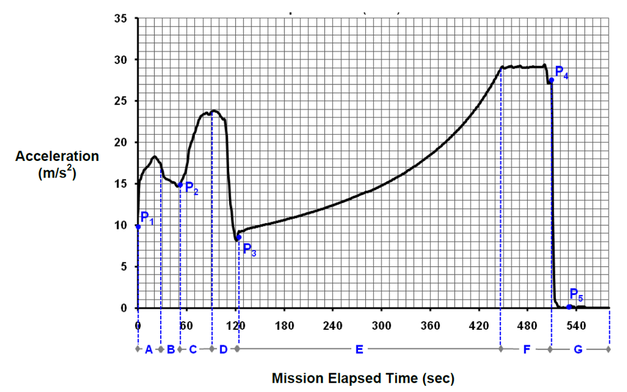
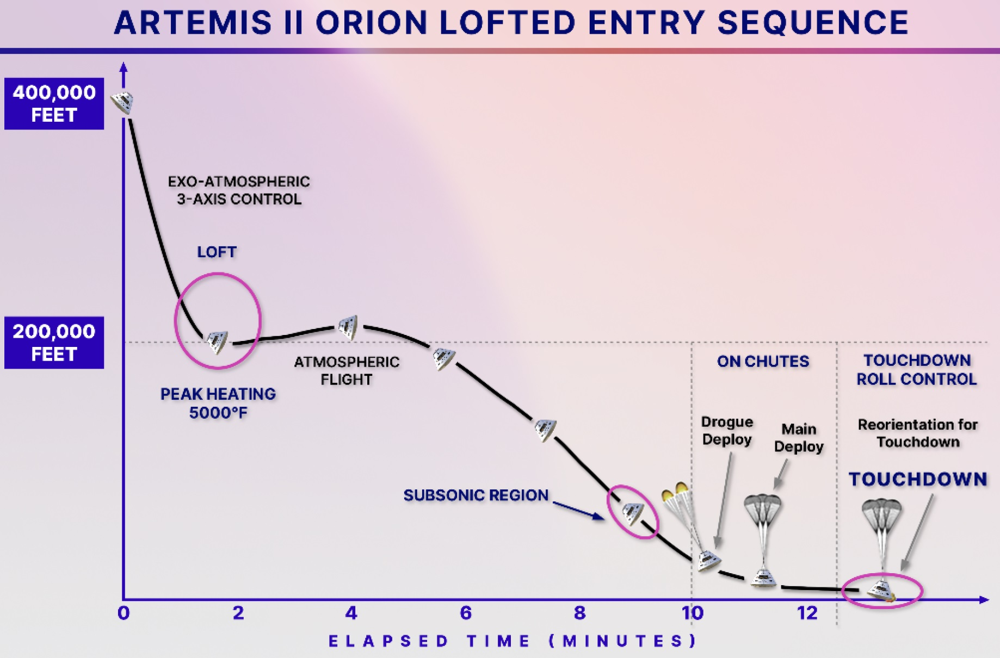

# Bonus Applications

With Artemis 11 landing last week - I wanted to use the flight as a way to apply some of the concepts we have been covering in class.

I know I promised no (low) physics in this class. But I think we can all agree that going to the moon and back is a special case.


## Section 1: Artemis Takeoff 🚀 (Simplified Model)

### Context

During the first two minutes of the Artemis II launch, the rocket accelerates upward and reaches tens of kilometers above Earth.

To study this motion, we’ll use a simplified model for the rocket’s height.

---

### Model

\[
h(t) = 0.00333\, t^2
\]

where:

- \(t\) = time (seconds after liftoff)  
- \(h(t)\) = height (kilometers)  
- \(0 \le t \le 120\)

---

### Part A: Understanding the Function

1. What does \(h(0)\) represent in this context?

2. Compute:

   - \(h(60)\)
   - \(h(120)\)

3. What are the **units** of:

   - \(h(t)\)?
   - \(t\)?

---

### Part B: Average Rate of Change (AROC)

4. Compute the average rate of change of height:

a) From \(t=0\) to \(t=60\)  
b) From \(t=60\) to \(t=120\)

---

5. Interpretation:

- What does the average rate of change represent physically?  
- Is the rocket moving at constant speed or speeding up? Explain.

---

### Part C: Zooming In (Toward Instantaneous Velocity)

6. Estimate the velocity at \(t=60\) using smaller intervals:

- From \(t=60\) to \(t=61\)  
- From \(t=60\) to \(t=60.5\)

---

7. What value are these results approaching?

👉 What does this represent physically?

---

### Part D: Derivative (Velocity Function)

8. The derivative of a function can be defined using limits:

\[
f'(x)=\lim_{h\to 0}\frac{f(x+h)-f(x)}{h}
\]

Use this definition to find \(h'(t)\) for:

\[
h(t) = 0.00333\, t^2
\]

- First compute \(h(t+h)\)  
- Form the difference quotient  
- Simplify  
- Take the limit as \(h \to 0\)

---

9. Write your final expression for \(h'(t)\).

---

10. Now compute:

- \(h'(60)\)  
- \(h'(120)\)

---

11. Interpretation:

- What does \(h'(t)\) represent in this context?  
- How is the rocket’s velocity changing over time?

---

### Part E: Acceleration (Second Derivative)

12. The second derivative can also be defined using limits:

\[
f''(x)=\lim_{h\to 0}\frac{f'(x+h)-f'(x)}{h}
\]

Use this definition to find \(h''(t)\).

---

13. Write your final expression for \(h''(t)\).

---

14. What does this value represent physically?

---

15. Is the acceleration increasing, decreasing, or constant?

---

### Part F: Graphical Thinking


```{r, echo=FALSE, message=FALSE, error=FALSE, warning=FALSE}

# Load library
library(ggplot2)

# Define the function
h <- function(t) {
  0.00333 * t^2
}

# Create time values
t_vals <- seq(0, 150, by = 1)

# Create data frame
df <- data.frame(
  t = t_vals,
  h = h(t_vals)
)


# --- Plot ---
ggplot(df, aes(x = t, y = h)) +
  geom_line(size = 1.2) +
  labs(
    title = "Artemis Takeoff: Height vs Time",
    x = "Time (seconds)",
    y = "Height (km)"
  ) +
  theme_minimal()

```

  

16. On your graph:

- Draw a **secant line** from \(t=0\) to \(t=120\)  
  - What does that line represent?
- Draw a **tangent line** at \(t=25\) and \(t=125\)
  - What do those lines represent?

---

17. Describe:

- How the slope changes over time  
- Whether the graph is concave up or down  

---

18.Below is an image of g forcing testing that measured the actual g-forces felt by astronauts during the first 10mins of a mission.

{fig.alt="line graph showing acceleration (in meters per second squared) versus mission elapsed time (in seconds) for a rocket launch. The x-axis runs from 0 to about 540 seconds, and the y-axis ranges from 0 to about 35 m/s². The acceleration starts around 10 m/s² at launch (P1), increases with small fluctuations to about 18 m/s², then dips slightly (P2). It rises sharply to a peak near 24 m/s² before dropping suddenly to around 9 m/s² at about 120 seconds (P3). After this drop, acceleration gradually increases over time, forming a smooth upward curve, reaching about 29–30 m/s² near 450–480 seconds. It then levels off briefly before dropping abruptly to near 0 m/s² around 520 seconds (P5). Several vertical dashed lines mark key time points labeled A through G along the timeline, and specific points on the curve are labeled P1 through P5."}
Describe:

- Describe the concavity of this plot/

Sketch the derivative of this graph.
Challenge: 

- Can you take a guess at which might be happening at P2 and P3?
- At P5, why does the acceleration the astronauts feel drop to zero? Any idea why?

19.

Below is the height above the earth's surface of the re-entry vehicle over time. 

{fig.alt="A diagram showing a spacecraft’s descent profile over time, with altitude (in feet) on the vertical axis up to 400,000 feet and elapsed time (in minutes) on the horizontal axis from 0 to about 13 minutes. The trajectory begins at high altitude (around 400,000 feet) and descends steeply. Early in the descent, the spacecraft enters an “exo-atmospheric 3-axis control” phase, followed by a curved “loft” maneuver near 200,000 feet, where peak heating of about 5000°F occurs. The path then flattens briefly during “atmospheric flight” before continuing downward more gradually. Around 8–9 minutes, the spacecraft enters the “subsonic region.” Near 10 minutes, parachutes deploy in stages: first drogue chutes, then main chutes, slowing the descent significantly.In the final phase, labeled “touchdown roll control,” the spacecraft reorients before landing. The trajectory ends at ground level around 12–13 minutes with “touchdown,” shown with parachutes still attached.Several key phases are labeled along the path, and small capsule icons mark the vehicle’s position at different times."}
- Sketch the derivative of this function
  - What does this derivative represent?
-Sketch the second derivative?
  - What does this derivative represent?


### Part G: Reflection

20. In your own words:

- What is the difference between **average rate of change** and **instantaneous rate of change**?  


<details><summary><strong>Solution</strong></summary>

**Answer Key: Bonus Applications — Artemis Takeoff**

Given

\[
h(t)=0.00333t^2
\]

where \(t\) is in seconds and \(h(t)\) is in kilometers.

---

**Part A: Understanding the Function**

**1.**

\[
h(0)=0
\]

Interpretation: The rocket is on the launch pad at \(t=0\).

---

**2.**

\[
h(60)=0.00333(3600)=11.988 \approx 11.99 \text{ km}
\]

\[
h(120)=0.00333(14400)=47.952 \approx 47.95 \text{ km}
\]

---

**3.**

- \(h(t)\): kilometers  
- \(t\): seconds  

---

**Part B: Average Rate of Change (AROC)**

**4a.**

\[
\frac{11.988-0}{60}=0.1998 \text{ km/s}
\]

**4b.**

\[
\frac{47.952-11.988}{60}=0.5994 \text{ km/s}
\]

---

**5.**

Represents **average velocity**.

Since the value increases, the rocket is **speeding up**.

---

**Part C: Zooming In (Toward Instantaneous Velocity)**

**6a.**

\[
h(61)=12.39093
\]

\[
\frac{12.39093-11.988}{1}=0.40293 \text{ km/s}
\]

---

**6b.**

\[
h(60.5)=12.1886325
\]

\[
\frac{12.1886325-11.988}{0.5}=0.401265 \text{ km/s}
\]

---

**7.**

Approaching:

\[
0.3996 \text{ km/s}
\]

Interpretation: **instantaneous velocity at \(t=60\)**.

---

**Part D: Derivative (Velocity Function)**

**8.**

\[
h(t)=0.00333t^2
\]

\[
h(t+h)=0.00333(t+h)^2
\]

\[
=0.00333t^2+0.00666th+0.00333h^2
\]

\[
\frac{h(t+h)-h(t)}{h}
=\frac{0.00666th+0.00333h^2}{h}
=0.00666t+0.00333h
\]

\[
h'(t)=\lim_{h\to 0}(0.00666t+0.00333h)
=0.00666t
\]

---

**9.**

\[
h'(t)=0.00666t
\]

---

**10.**

\[
h'(60)=0.3996 \text{ km/s}
\]

\[
h'(120)=0.7992 \text{ km/s}
\]

---

**11.**

Represents **instantaneous velocity**.

Velocity increases over time → rocket is accelerating.

---

**Part E: Acceleration (Second Derivative)**

**12.**

\[
h'(t)=0.00666t
\]

\[
h'(t+h)=0.00666t+0.00666h
\]

\[
\frac{h'(t+h)-h'(t)}{h}
=\frac{0.00666h}{h}=0.00666
\]

\[
h''(t)=0.00666
\]

---

**13.**

\[
h''(t)=0.00666
\]

---

**14.**

Represents **acceleration**.

---

**15.**

Acceleration is **constant**.

---

**Part F: Graphical Thinking**

**16.**

- Secant line → **average velocity** over the interval  
- Tangent line → **instantaneous velocity** at a point  

\[
h'(25)=0.1665 \text{ km/s}
\]

\[
h'(125)=0.8325 \text{ km/s}
\]

---

**17.**

- Slope increases over time  
- Graph is **concave up**

---

**18. G-force graph**

- Concavity changes throughout  
- Derivative represents **rate of change of acceleration (jerk)**  

**P2/P3:** likely staging or thrust changes  
**P5:** astronauts experience **weightlessness (free fall)**  

---

**19. Re-entry graph**

- First derivative → **velocity (negative during descent)**  
- Second derivative → **acceleration**

---

**Part G: Reflection**

**20.**

- Average rate of change = change over an interval  
- Instantaneous rate of change = rate at a single point  

In this context:

- AROC = average velocity  
- IROC = instantaneous velocity

</details>
