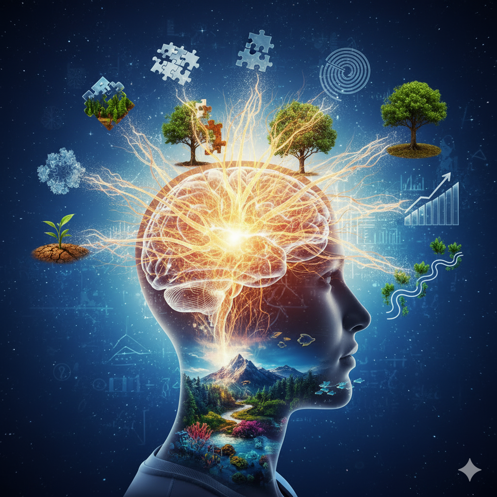

--- 
title: "Environmental Calculus - Active Learning with Case Studies"
author: "Gaj Sivandran"
date: "`r Sys.Date()`"
site: bookdown::bookdown_site
lang: en-US
output: bookdown::gitbook
documentclass: book     
bibliography: [book.bib]  
biblio-style: apalike
link-citations: yes
github-repo: rstudio/bookdown-demo
description: "A textbook companion to the Univeristy of Washington QSci 291 class"
---

# Why Calculus?

Welcome to *Calculus for Environmental Science*. 🌱  

This book is your companion for exploring the natural world through the lens of calculus—especially the powerful ideas of **change** and **accumulation**. You’ll find that calculus is not just about symbols on a page—it’s about asking meaningful questions, interpreting patterns, and making sense of complex environmental systems. And along the way, you’ll see that you are absolutely capable of mastering these ideas.  

---

## Why This Book?

Most calculus textbooks lean heavily on physics examples—motion, velocity, and acceleration—because calculus was originally developed to solve physics problems. Those examples are powerful, and we’ll use them from time to time because they give us an intuitive “feel” for how change works.  

But today, calculus is a tool used across many disciplines: biology, ecology, environmental science, economics, engineering, and beyond. In this book, we’ll focus on examples that resonate with your studies and your interests as an environmental scientist.  

Environmental scientists face some of the most urgent and complex challenges of our time—climate change, biodiversity loss, resource management, and pollution. Calculus gives us tools to:

- Predict how systems evolve over time  
- Estimate impacts and risks  
- Model natural and human systems with differential equations  
- Analyze rates of change and long-term accumulation  

Throughout this book, you’ll work with **real environmental data**, use **visual and conceptual approaches**, and practice skills that matter for sustainability. Our goal is not just to “get through calculus,” but to see how these mathematical ideas open doors for discovery and problem-solving in the real world.  

---

## What Is Calculus?

At its heart, calculus is the mathematics of **change** and **accumulation**. These two ideas are everywhere in science:  

- The **rate of CO₂ increase** in the atmosphere is a derivative.  
- The **total added CO₂** over a year is an integral.  

Traditionally, calculus is first introduced through physics examples like velocity (rate of change of position) and acceleration (rate of change of velocity). These are helpful because most of us can *feel* what it means to move faster or slower. We’ll use those examples when they make ideas clearer.  

But throughout this book, our main goal is to connect calculus directly to the environment you are studying. You’ll see derivatives and integrals applied to population growth, forest carbon storage, water flow in rivers, and other natural systems.  

We’ll build your understanding of these concepts step by step, supported by graphs, data, and hands-on examples. And if it’s been a while since your last math class, that’s completely okay—you’ll find plenty of support here. We’ll meet you where you are and grow your skills together.  

::: promptbox

**Change is Everywhere**

In a small group, discuss where  *change* could be happening in this image?

      
:::

---

## How This Book Works

Each chapter is designed to support you as a learner. You’ll find:

- Clear explanations of key concepts  
- Environmental examples to connect math with meaning  
- Practice problems to strengthen your skills  
- Reflection prompts to help you think about what you’re learning  

---

## Success in This Class

{fig.alt="Artistic illustration of a human head in profile with a glowing brain at the center. Branching connections extend outward from the brain to various environmental elements including trees, clouds, water, and landscapes, symbolizing connections between human thinking and natural systems. Additional icons such as graphs, waves, and molecules are faintly visible in the background, suggesting links between cognition, data, and environmental processes."}

First and foremost, know this: **we believe in your ability to learn and grow.** You bring unique strengths and perspectives, and your effort matters here.  

Mistakes are not a setback—they are the very heart of learning. When you get something wrong, you uncover where your thinking needs refinement, and that creates the space for real growth. Struggle is not a sign you don’t belong; it’s proof that your brain is stretching and building new connections.  

Just like in science, learning calculus is about **iteration**—trying, testing, revising, and improving. That process is what makes your understanding deeper and more durable.  

Assessments in this class are snapshots of your thinking at a particular moment in time. They are not final judgments about your intelligence, your worth, or your potential. You will have chances to revisit concepts, refine your understanding, and demonstrate what you’ve learned. Growth comes from re-engaging with the material, not from perfection on the first try.  

So give yourself permission to be imperfect. Keep engaging, reflecting, and asking questions. We’ll be here to support you every step of the way. 

---

## Looking Ahead

By the end of this course, you will be able to:

- Apply calculus concepts to natural systems  
- Analyze environmental data with confidence  
- Interpret and communicate your results to others  

But even more important than any specific skill, you’ll leave this course with a stronger belief in your ability to *learn mathematics*.  

Calculus is not just a hurdle to clear—it’s a tool that expands how you see and understand the world. Our hope is that by connecting it to the environment you care about, you’ll discover both its usefulness and its beauty.  

Most importantly, you’ll leave with the confidence to keep growing—using mathematics as a tool to explore, protect, and better understand the natural world around you.  

---

## ⚠️ A Big Disclaimer ⚠️

I started writing this textbook to create a calculus resource that speaks directly to your interests as environmental scientists. My goal is to make calculus feel relevant, supportive, and connected to the systems you care about.  

That said, this is very much a **work in progress**. This draft will have typos, rough edges, and the occasional mistake. But here’s the good news: it’s also **free**. 🎉  

If you come across an error—big or small—please let me know so I can fix it for you and for future students. Your feedback is not just welcome, it’s essential to making this a better resource.  

Thanks for your patience, your sharp eyes, and your willingness to learn from (and with) an evolving text. Together, we’ll keep improving it.  
  

